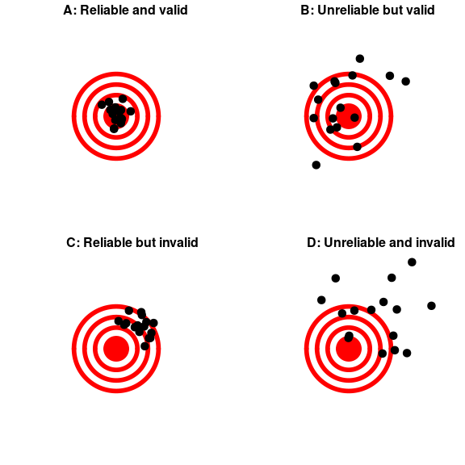

# 2 处理数据

## 2.1 什么是数据？

关于数据的第一个要点是，数据*是*——这意味着“数据”这个词是复数(尽管有些人不同意我的观点)。你可能还想知道如何读“数据”——我说“day-tah”，但我知道许多人说“dah-tah”，尽管如此，我还是能和他们保持朋友关系。现在，如果我听到他们说“数据是”，那么这将是一个更大的问题…

### 2.1.1 定性数据

数据由*个变量*组成，其中一个变量反映了一个独特的度量或数量。一些变量是*定性的*，这意味着它们描述的是质量而不是数字量。例如，在我的统计学课程中，我通常会做一个介绍性的调查，既为了获取课堂上使用的数据，也为了更多地了解学生。我问的一个问题是“你最喜欢的食物是什么？”答案是:蓝莓、巧克力、玉米粉蒸肉、意大利面、披萨和芒果。这些数据本质上不是数字；我们可以给每一个分配数字(1 =蓝莓，2 =巧克力，等等)，但是我们只是把数字作为标签，而不是真正的数字。这也限制了我们应该如何处理这些数字；例如，计算这些数字的平均值是没有意义的。然而，我们通常会使用数字对定性数据进行编码，以使它们更容易处理，稍后您将会看到这一点。

### 2.1.2 定量数据

更常见的是，在统计学中，我们将使用*定量*数据，即数字数据。例如，这里的表格 [2.1](#tab:WhyTakingClass) 显示了我在介绍性课程中提出的另一个问题的结果，即“你为什么要上这门课？”

<caption>Table 2.1: Counts of the prevalence of different responses to the question “Why are you taking this class?”</caption> <colgroup><col style="width: 73%"> <col style="width: 26%"></colgroup> 
| 你为什么要上这门课？ | 学生人数 |
| --- | --- |
| 它满足学位计划的要求 | One hundred and five |
| 它满足了一般教育的广度要求 | Thirty-two |
| 这不是必需的，但我对这个话题感兴趣 | Eleven |
| 其他的 | four |

请注意，学生的答案是定性的，但是我们通过计算每个答案有多少学生给出，生成了定量的总结。

#### 2.1.2.1 数字的种类

在统计学中，我们使用几种不同类型的数字。理解这些差异很重要，部分原因是统计分析语言(比如 R)经常区分它们。

**二进制数字**。最简单的是二进制数，即 0 或 1。我们会经常用二进制数来表示某事物是真还是假，是存在还是不存在。例如，我可能会问 10 个人他们是否经历过偏头痛，记录他们的回答是“是”还是“不是”。使用*逻辑*值通常是有用的，它接受`TRUE`或`FALSE`的值。当我们开始使用像 R 这样的编程语言来分析我们的数据时，这可能特别有用，因为这些语言已经理解了真和假的概念。事实上，大多数编程语言都同等对待真值和二进制数。数字 1 等于逻辑值`TRUE`，数字 0 等于逻辑值`FALSE`。

**整数**。整数是没有分数或小数部分的整数。我们在计数时最常遇到整数，但它们也经常出现在心理测量中。例如，在我的介绍性调查中，我提出了一系列关于对统计学的态度的问题(例如“统计学对我来说似乎很神秘。”)，学生们用 1(“强烈反对”)到 7(“强烈同意”)之间的数字来回答。

**实数**。在统计学中，我们最常见的是处理实数，它有一个分数/小数部分。例如，我们可以测量某人的体重，这可以测量到任意精度水平，从千克到微克。

## 2.2 离散与连续测量

*离散*测量是取特定值的有限集合中的一个。这些可以是定性值(例如，不同品种的狗)或数值(例如，一个人在脸书上有多少朋友)。重要的是，在测量之间没有中间地带；说一个人有 33.7 个朋友没有意义。

*连续*测量是根据实数定义的测量。它可以落在特定值范围内的任何地方，尽管通常我们的测量工具会限制我们测量它的精度；例如，尽管理论上可以更精确地测量重量，但地秤可能会精确到千克。

在统计学课程中，更详细地介绍不同的测量“尺度”是很常见的，这将在本章的附录中更详细地讨论。由此得出的最重要的一点是，某些类型的统计对某些类型的数据没有意义。例如，假设我们要从许多个人那里收集邮政编码数据。这些数字被表示为整数，但它们实际上并不表示一个数值范围；每个邮政编码基本上是不同地区的标签。因此，举例来说，谈论平均邮政编码是没有意义的。

## 2.3 什么是好的测量？

在心理学等许多领域，我们测量的东西不是一个物理特征，而是一个不可观测的理论概念，我们通常称之为*结构*。例如，假设我想测试你对上述不同类型的数字之间的区别的理解程度。我可以给你一个突击测验，问你几个关于这些概念的问题，然后数你答对了几个。这个测试可能是也可能不是一个很好的测量你实际知识的方法——例如，如果我以一种混乱的方式写测试或者使用你不理解的语言，那么这个测试可能会暗示你不理解这些概念，而实际上你是理解的。另一方面，如果我给了一个有明显错误答案的选择题，那么即使你实际上并不理解材料，你也可能在测试中表现良好。

通常不可能测量一个结构而没有一定的误差。在上面的例子中，你可能知道答案，但你可能会错意了问题，答错了。在其他情况下，被测量的事物存在固有误差，例如当我们测量一个人在一个简单的反应时间测试中需要多长时间做出反应时，由于许多原因，每次测试都会有所不同。我们通常希望我们的测量误差尽可能低，这可以通过提高测量质量(例如，使用更好的时间来测量反应时间)或通过对大量的个体测量进行平均来实现。

有时有一个标准可以用来测试其他测量，我们可能会称之为“黄金标准”——例如，睡眠的测量可以使用许多不同的设备来完成(如测量床上运动的设备)，但它们通常被认为不如多导睡眠图的黄金标准(使用脑电波的测量来量化一个人在每个睡眠阶段花费的时间)。通常情况下，金本位制执行起来更困难或更昂贵，尽管可能会有更大的误差，还是会使用更便宜的方法。

当我们思考什么是好的度量时，我们通常区分好的度量的两个不同方面:它应该是*可靠的*，它应该是*有效的*。

### 2.3.1 可靠性

可靠性是指我们测量的一致性。一种常见的可靠性形式，被称为“测试-再测试可靠性”，衡量如果相同的测量被执行两次，测量结果有多一致。例如，我可能今天给你一份关于你对统计的态度的问卷，明天重复这份相同的问卷，并比较两天的答案；我们希望它们彼此非常相似，除非在两个测试之间发生了一些事情，改变了你对统计学的看法(比如阅读这本书！).

另一种评估可靠性的方法是在数据包含主观判断的情况下。例如，假设一名研究人员想要确定一种治疗是否会改变自闭症儿童与其他儿童的互动，这是通过让专家观察儿童并对他们与其他儿童的互动进行评级来衡量的。在这种情况下，我们希望确保答案不依赖于单个评定者，也就是说，我们希望有较高的*评定者间可靠性*。这可以通过让一个以上的评定者进行评定，然后比较他们的评定，以确保他们彼此一致。

如果我们想要将一个测量值与另一个测量值进行比较，可靠性是很重要的，因为两个不同变量之间的关系不会比任何一个变量与其自身之间的关系(即其可靠性)更强。这意味着一个不可靠的度量永远不会与任何其他度量有很强的统计关系。出于这个原因，研究人员在开发一种新的测量方法(比如一项新的调查)时，通常会不遗余力地建立和提高其可靠性。

图 2.1:一个展示信度和效度区别的图，使用靶心射击。可靠性指的是射击位置的一致性，而有效性指的是射击相对于靶心中心的准确性。

### 2.3.2 有效期

可靠性很重要，但光靠它是不够的:毕竟，我可以通过使用相同的数字对每个答案重新编码来创建一个完全可靠的人格测试测量，而不管这个人实际上是如何回答的。我们希望我们的度量也是*有效的*——也就是说，我们希望确保我们确实在度量我们认为我们正在度量的结构(图 [2.1](#fig:ReliabilityValidity) )。通常讨论的有效性有许多不同的类型；我们将集中讨论其中的三种。

*票面有效期*。从表面上看，这种测量有意义吗？如果我告诉你，我要通过观察一个人舌头的颜色来测量他的血压，你可能会认为从表面上看这不是一个有效的测量方法。另一方面，使用血压袖带将具有面部有效性。在我们深入更复杂的有效性方面之前，这通常是第一个现实检查。

*结构效度*。该测量是否以适当的方式与其他测量相关联？这往往细分为两个方面。*收敛有效性*意味着测量应该与被认为反映相同结构的其他测量密切相关。比方说，我感兴趣的是用问卷或面试来衡量一个人的外向程度。如果这两种不同的测量方法彼此密切相关，就可以证明收敛的有效性。另一方面，被认为反映不同结构的测量应该是不相关的，被称为*差异效度*。如果我的人格理论说外向性和责任心是两个不同的概念，那么我也应该看到我对外向性的测量与责任心的测量是不相关的。

*预测效度*。如果我们的测量真的有效，那么它们也应该可以预测其他结果。例如，假设我们认为寻求感觉的心理特质(对新体验的渴望)与现实世界中的冒险有关。为了测试感觉寻求测量的预测有效性，我们将测试该测试的分数在多大程度上预测另一项测量现实世界冒险行为的调查的分数。

## 2.4 学习目标

阅读完本章后，您应该能够:

*   区分不同类型的变量(定量/定性、二进制/整数/实数、离散/连续),并给出每种变量的例子
*   区分可靠性和有效性的概念，并将每个概念应用于特定的数据集

## 2.5 建议读数

*   心理测量理论介绍及其在 R 中的应用——关于心理测量的免费在线教材

## 2.6 附录

### 2.6.1 测量尺度

所有变量必须至少有两个不同的可能值(否则它们将是一个*常数*而不是一个变量)，但是变量的不同值可以以不同的方式相互关联，我们称之为*度量尺度*。变量的不同值有四种不同的方式。

*   *恒等式*:变量的每个值都有唯一的意义。

*   *量级*:变量的值反映了不同的量级，并且彼此之间具有有序的关系——也就是说，一些值较大，一些值较小。
*   *等间距*:测量刻度上的单位彼此相等。这意味着，例如，1 和 2 之间的差在数量上等于 19 和 20 之间的差。
*   *绝对零点*:秤有一个真正有意义的零点。例如，对于许多物理量的测量，如身高或体重，这是完全没有被测量的东西。

有四种不同的测量尺度，伴随着变量值的不同方式。

*标称刻度*。名义变量满足恒等式的标准，因此变量的每个值都代表不同的东西，但是数字只是作为上面讨论的定性标签。例如，我们可能会询问人们的政党归属，然后用数字编码:1 =“共和党”，2 =“民主党”，3 =“自由主义者”，等等。然而，不同的数字彼此之间没有任何有序的关系。

*序数刻度*。序数变量满足同一性和大小的标准，因此值可以根据它们的大小排序。例如，我们可能会要求一个患有慢性疼痛的人每天填写一份表格，使用 1-7 的数字量表评估他们的疼痛程度。请注意，虽然人们在报告 6 分的一天比报告 3 分的一天可能感觉到更多的疼痛，但说他们在前一天比后一天疼痛两倍是没有意义的；排序为我们提供了关于相对大小的信息，但是值之间的差异不一定在大小上相等。

*区间刻度*。区间标尺具有顺序标尺的所有特征，但是除此之外，度量标尺上单位之间的区间可以被视为相等。一个标准的例子是用摄氏度或华氏度测量的物理温度；10 度和 20 度之间的物理差异与 90 度和 100 度之间的物理差异相同，但是每个标度也可以取负值。

*比例刻度*。比率标度变量具有上述所有四个特征:同一性、量值、等间隔和绝对零度。比率标度变量和间隔标度变量的区别在于比率标度变量有一个真正的零点。比例变量的例子包括身体高度和体重，以及以开尔文测量的温度。

有两个重要的原因使我们必须注意衡量一个变量的尺度。首先，标度决定了我们可以对数据应用什么样的数学运算(见表 [2.2](#tab:MeasurementTypes) )。一个名义变量只能进行相等性比较；也就是说，对那个变量的两次观察有相同的数值吗？对一个名义变量应用其他数学运算是没有意义的，因为它们在名义变量中并不真正起到数字的作用，而是起到标签的作用。对于顺序变量，我们也可以测试一个值是大于还是小于另一个值，但是我们不能做任何算术。区间和比值变量允许我们进行算术运算；对于区间变量，我们只能加或减数值，而对于比值变量，我们还可以乘或除数值。

<caption>Table 2.2: Different scales of measurement admit different types of numeric operations</caption>
|  | 相等/不相等 | >/< | +/- | 乘/除 |
| --- | --- | --- | --- | --- |
| 名义上的 | 好 |  |  |  |
| 序数 | 好 | 好 |  |  |
| 间隔 | 好 | 好 | 好 |  |
| 比例 | 好 | 好 | 好 | 好 |

这些限制也意味着我们可以对每种类型的变量计算某些种类的统计数据。简单地涉及不同值的计数的统计(例如最常见的值，称为*模式*)，可以在任何变量类型上计算。其他统计基于值的排序或排名(如*中值*，当所有值按大小排序时，它是中间值)，这些要求值至少在序数范围内。最后，涉及累加值的统计(如平均值，或*均值*)，要求变量至少在一个区间尺度上。话虽如此，我们应该注意到，研究人员计算只有序数的变量的平均值是很常见的(如个性测试的回答)，但这有时会有问题。

