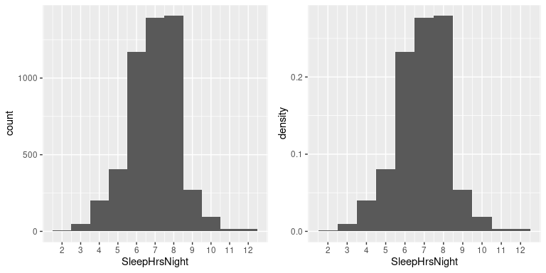
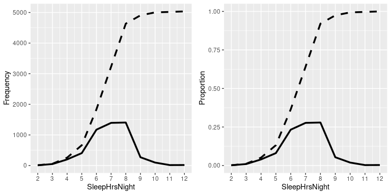
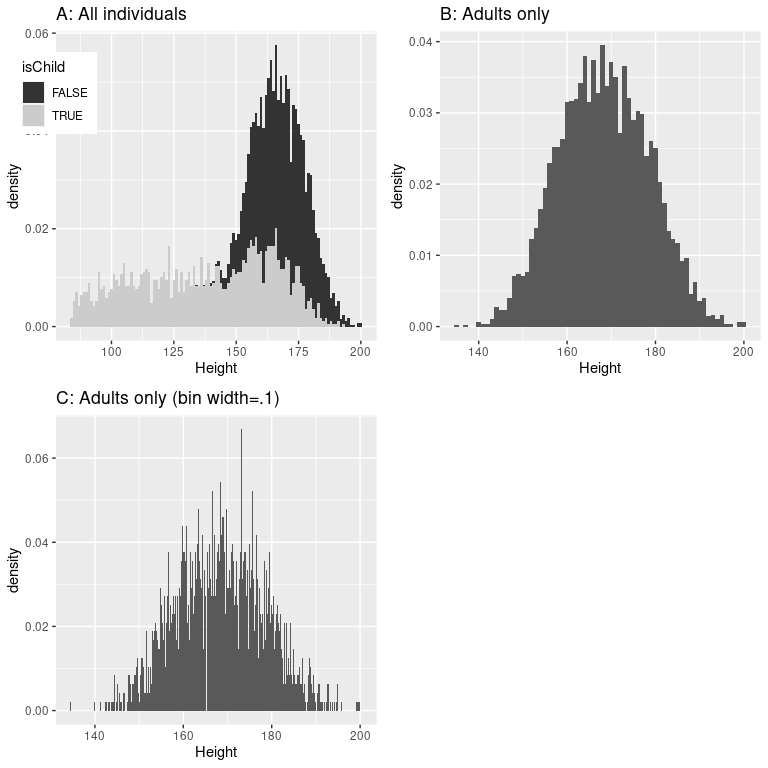
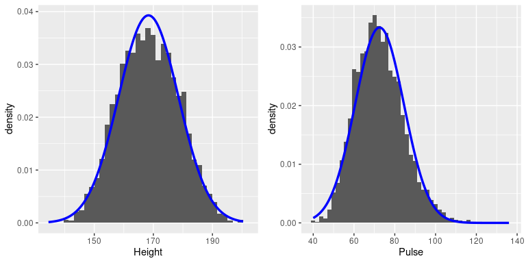

# 3 汇总数据

我在引言中提到，统计学的一个重大发现是，我们可以通过扔掉信息来更好地理解世界，这正是我们在总结一个数据集时所做的。在本章中，我们将讨论为什么以及如何汇总数据。

## 3.1 为什么要汇总数据？

当我们总结数据时，我们必然会丢弃信息，有人可能会反对这一点。作为一个例子，让我们回到我们在第一章中讨论的纯研究。难道我们不应该相信除了数据集中总结的那些细节之外，关于每个个体的所有细节吗？数据是如何收集的具体细节呢，比如一天中的时间或者参与者的情绪？当我们汇总数据时，所有这些细节都丢失了。

我们总结数据的一个原因是，它为我们提供了一种概括的方式——也就是说，做出超越具体观察的一般性陈述。作家豪尔赫·路易斯·博尔赫斯在他的短篇小说《纪念的Funes》中强调了概括的重要性，该小说描述了一个失去遗忘能力的人。博尔赫斯关注概括(即丢弃数据)和思考之间的关系:“思考就是忘记差异、概括、抽象。在这个充满乐趣的世界里，除了细节什么都没有。”

心理学家长期以来一直在研究概括对思维至关重要的所有方式。一个例子是分类:我们能够很容易地识别“鸟类”类别的不同例子，即使单个例子的表面特征可能非常不同(如鸵鸟、知更鸟和鸡)。重要的是，概括让我们对这些个体做出预测——在鸟类的例子中，我们可以预测它们会飞，会吃种子，可能不会开车，也不会说英语。这些预测并不总是正确的，但它们往往足够好，对世界有用。

## 3.2 使用表格汇总数据

汇总数据的一个简单方法是生成一个表，表示各种类型的观察值的计数。这种类型的桌子已经使用了几千年(见图 [3.1](#fig:salesContract) )。

图3.1:一块来自卢浮宫的苏美尔石碑，显示了一份房屋和田地的销售合同。公共领域，通过维基共享。

让我们用一个更真实的数据集来看一些使用表的例子。在本书中，我们将使用[国家健康和营养调查(NHANES)](https://www.cdc.gov/nchs/nhanes/index.htm) 数据集。这是一项正在进行的研究，它根据许多不同的变量评估了美国个体样本的健康和营养状况。我们将使用可用于R统计软件包的数据集版本。对于这个例子，我们将看一个简单的变量，在数据集中称为 *PhysActive* 。此变量包含三个不同值中的一个:“是”或“否”(表示此人是否报告从事“中等或剧烈强度的运动、健身或娱乐活动”)，如果此人的数据缺失，则为“不”。数据可能丢失有不同的原因；例如，这个问题不是向12岁以下的儿童提出的，而在其他情况下，成年人可能拒绝在访谈中回答这个问题，或者访谈者在他们的表格上记录的答案可能无法阅读。

### 3.2.1 频率分布

*分布*描述了数据如何在不同的可能值之间划分。对于这个例子，让我们看看有多少人属于每一种体育活动类别。

<caption>Table 3.1: Frequency distribution for PhysActive variable</caption>
| 物理活性的 | 绝对频率 |
| --- | --- |
| 不 | Two thousand four hundred and seventy-three |
| 是 | Two thousand nine hundred and seventy-two |
| 钠 | One thousand three hundred and thirty-four |

表 [3.1](#tab:PhysActiveTable) 显示了每个不同值的频率；有2473人对该问题回答“否”，2972人回答“是”，1334人没有回答。我们称之为*频率分布*，因为它告诉我们每个可能值在样本中出现的频率。

这向我们展示了两个回答的绝对频率，对于每个实际给出回答的人来说。由此我们可以看出，说“是”的人比说“不是”的人多，但从绝对数字上很难看出相对数字上的差别有多大。出于这个原因，我们通常宁愿使用*相对频率*来表示数据，相对频率是通过将每个频率除以所有频率的总和而获得的:

<math xmlns:epub="http://www.idpf.org/2007/ops" display="block"><semantics><mrow><mi>r</mi><mi>e</mi><mi>l</mi><mi>a</mi><mi>t</mi><mi>I</mi><mi>v</mi><mi>e</mi><mi>f</mi><mi>r</mi><mi>e</mi><mi>q</mi><mi>u<mi>e</mi><mi>n</mi> u</mi><mi>t</mi><mi>e</mi><mi>f</mi><mi>r</mi><mi>e</mi><mi>q</mi><mi>u</mi><mi>e</mi><mi>N</mi><mi>c</mi><msub><mi>y</mi><mi>I</mi> t<mi>e</mi><mi>f</mi><mi>r</mi><mi>e</mi><mi>q</mi><mi>u</mi><mi>e</mi><mi>n</mi><mi>c</mi><msub><mi>y</mi><mi>j</mi> 我们也可以将相对频率乘以100，解释为百分比。在本例中，我们也将去掉NA值，因为我们希望能够解释活跃人群与不活跃人群的相对频率。然而，为了使这有意义，我们必须假设NA值是“随机”缺失的，这意味着它们的存在与否与该人变量的真实值无关。例如，如果不活跃的参与者比活跃的参与者更有可能拒绝回答问题，那么这将使我们对身体活动频率的估计产生偏差，这意味着我们的估计将与真实值不同。</msub></msub></mrow></semantics></math>

<caption>Table 3.2: Absolute and relative frequencies and percentages for PhysActive variable</caption>
| 物理活性的 | 绝对频率 | 相对频率 | 百分率 |
| --- | --- | --- | --- |
| 不 | Two thousand four hundred and seventy-three | Zero point four five | Forty-five |
| 是 | Two thousand nine hundred and seventy-two | Zero point five five | Fifty-five |

表 [3.2](#tab:PhysActiveTableFiltered) 让我们看到，NHANES样本中45.4%的人回答“否”，54.6%的人回答“是”。

### 3.2.2 累积分布

我们上面检查的*physical active*变量只有两个可能的值，但我们通常希望汇总具有更多可能值的数据。当这些值是定量的时，那么总结它们的一个有用的方法是通过我们所谓的*累积*频率表示:不是问有多少观察值具有特定值，而是问有多少具有某个特定值*或更少*。

让我们看看NHANES数据集中的另一个变量，名为 *SleepHrsNight* ，它记录了参与者报告在平常工作日睡眠的时间。表 [3.3](#tab:sleepTable) 显示了我们如上所述创建的频率表，在此问题中删除了任何缺失数据。我们已经可以通过查看表格来总结数据集；例如，我们可以看到大多数人报告的睡眠时间在6到8小时之间。为了更清楚地看到这一点，我们可以绘制一个*直方图*，它显示了具有不同值的情况的数量；见图 [3.2](#fig:sleepHist) 左图。我们还可以绘制相对频率，我们通常称之为*密度* -参见图 [3.2](#fig:sleepHist) 的右图。

<caption>Table 3.3: Frequency distribution for number of hours of sleep per night in the NHANES dataset</caption>
| 睡眠之夜 | 绝对频率 | 相对频率 | 百分率 |
| --- | --- | --- | --- |
| Two | nine | Zero | Zero point one eight |
| three | forty-nine | Zero point zero one | Zero point nine seven |
| four | Two hundred | Zero point zero four | Three point nine seven |
| five | Four hundred and six | Zero point zero eight | Eight point zero six |
| six | One thousand one hundred and seventy-two | Zero point two three | Twenty-three point two eight |
| seven | One thousand three hundred and ninety-four | Zero point two eight | Twenty-seven point six nine |
| eight | One thousand four hundred and five | Zero point two eight | Twenty-seven point nine |
| nine | Two hundred and seventy-one | Zero point zero five | Five point three eight |
| Ten | Ninety-seven | Zero point zero two | One point nine three |
| Eleven | Fifteen | Zero | Zero point three |
| Twelve | Seventeen | Zero | Zero point three four |

图3.2:左:显示报告SleepHrsNight变量的每个可能值的人数(左)和比例(右)的直方图。

如果我们想知道有多少人报告睡眠时间为5小时或更少呢？为了找到这一点，我们可以计算一个*累积分布*。为了计算某个值j的累积频率，我们将j之前(包括j)的所有值的频率相加:

<semantics><mrow><mi>【c】</mi><mi>【u】</mi><mi>【m】</mi><mi>【u】<mi><mi>【a】 1</mi></mi></mi></mrow><mi>【j】</mi><mrow><mi>【a】</mi><mi>【b】</mi><mi><mi>或</mi></mi></mrow></semantics>

<caption>Table 3.4: Absolute and cumulative frequency distributions for SleepHrsNight variable</caption>
| 睡眠之夜 | 绝对频率 | 累积频率 |
| --- | --- | --- |
| Two | nine | nine |
| three | forty-nine | Fifty-eight |
| four | Two hundred | Two hundred and fifty-eight |
| five | Four hundred and six | Six hundred and sixty-four |
| six | One thousand one hundred and seventy-two | One thousand eight hundred and thirty-six |
| seven | One thousand three hundred and ninety-four | Three thousand two hundred and thirty |
| eight | One thousand four hundred and five | Four thousand six hundred and thirty-five |
| nine | Two hundred and seventy-one | Four thousand nine hundred and six |
| Ten | Ninety-seven | Five thousand and three |
| Eleven | Fifteen | Five thousand and eighteen |
| Twelve | Seventeen | Five thousand and thirty-five |

让我们为我们的睡眠变量这样做，计算绝对和累积频率。在图 [3.3](#fig:sleepAbsCumulRelFreq) 的左图中，我们绘制了数据，看看这些表示是什么样子；绝对频率值用实线绘制，累积频率用虚线绘制。我们看到，累积频率是*单调增加的*——也就是说，它只能上升或保持不变，但永远不会下降。同样，我们通常发现相对频率比绝对频率更有用；这些绘制在图 [3.3](#fig:sleepAbsCumulRelFreq) 的右侧面板中。重要的是，相对频率图的形状与绝对频率图完全相同，只是数值的大小发生了变化。

图3.3:sleep hrs night可能值的频率(左)和比例(右)的相对值(实线)和累积相对值(虚线)图。

### 3.2.3 绘制直方图

图3.4:NHANES中年龄(左)和身高(右)变量的直方图。

我们上面检查的变量相当简单，只有几个可能的值。现在我们来看一个更复杂的变量:年龄。首先让我们绘制NHANES数据集中所有个体的*年龄*变量(见图 [3.4](#fig:ageHist) 的左图)。你在那里看到了什么？首先，你应该注意到，随着时间的推移，每个年龄组的人数都在下降。这是有道理的，因为人口是随机抽样的，因此随着时间的推移，死亡导致越来越少的人进入老年范围。第二，你可能会注意到在80岁时图表中有一个很大的峰值。你觉得这是怎么回事？

如果我们要查找关于NHANES数据集的信息，我们会看到对*年龄*变量的如下定义:“研究参与者筛选时的年龄。注:80岁以上的受试者记录为80岁。这样做的原因是，如果您知道数据集中特定人的确切年龄，那么相对较少的年龄很大的人可能更容易识别他们；研究人员通常向他们的参与者承诺对他们的身份保密，这是他们可以帮助保护他们的研究对象的事情之一。这也强调了这样一个事实，即知道一个人的数据来自哪里以及它们是如何被处理的总是很重要的；否则我们可能会不恰当地解释它们，认为80岁的人在样本中不知何故被过多地代表了。

让我们看看NHANES数据集中另一个更复杂的变量:Height。在图 [3.4](#fig:ageHist) 的右侧面板中绘制了高度值的直方图。关于这个分布，你应该注意到的第一件事是，它的密度大部分集中在170 cm左右，但分布在左侧有一个“尾巴”；有少数个体的高度要小得多。你认为这是怎么回事？

您可能凭直觉认为小的高度来自数据集中的孩子。检验这一点的一种方法是用儿童和成人的不同颜色绘制直方图(图 [3.5](#fig:heightHistSep) 的左图)。这表明所有非常矮的身高确实来自样本中的儿童。让我们创建一个新版本的NHANES，它只包含成年人，然后为他们绘制直方图(图 [3.5](#fig:heightHistSep) 的右面板)。在那张图中，分布看起来更加对称。正如我们将在后面看到的，这是一个很好的*正态*(或*高斯*)分布的例子。

图3.5:NHANES的高度直方图。答:分别为儿童(灰色)和成人(黑色)绘制的值。b:仅供成人使用。c:与B相同，但箱宽度= 0.1

### 3.2.4 柱状图箱

在我们之前关于睡眠变量的例子中，数据是以整数报告的，我们简单地计算了报告每个可能值的人数。但是，如果您查看NHANES中Height变量的几个值(如表 [3.5](#tab:heightVals) 所示)，您会发现它是以厘米为单位测量的，精确到第一个小数位。

<caption>Table 3.5: A few values of Height from the NHANES data frame.</caption>
| 高度 |
| --- |
| One hundred and sixty-nine point six |
| One hundred and sixty-nine point eight |
| One hundred and sixty-seven point five |
| One hundred and fifty-five point two |
| One hundred and seventy-three point eight |
| One hundred and seventy-four point five |

图 [3.5](#fig:heightHistSep) 的面板C显示了一个直方图，该直方图计算了第一个小数位以下的每个可能值的密度。该直方图看起来确实参差不齐，这是因为特定小数位值的可变性。例如，值173.2出现32次，而值173.3只出现15次。我们大概不会认为这两种身高的患病率真的有这么大的差别；更有可能的是，这只是由于我们的样本中的随机可变性。

一般来说，当我们创建一个连续的或有许多可能值的数据直方图时，我们将对这些值进行*分类*,这样我们就不会对每个特定值的频率进行计数和绘图，而是对落在特定范围内的值的频率进行计数和绘图。这就是为什么上面的 [3.5](#fig:heightHistSep) 的B画面中剧情看起来没那么参差不齐；在此面板中，我们将面元宽度设置为1，这意味着通过组合宽度为1的面元内的值来计算直方图；因此，值1.3、1.5和1.6都将计入同一频段的频率，该频段的值从等于1一直到小于2。

请注意，一旦选择了箱的大小，箱的数量就由数据决定:

<semantics><mrow><mi>【n】</mi><mi>【u】</mi>【m】<mi>【b】<mi>【e】<mi>【r】 <mi>e</mi><mi>【s】</mi></mi></mi></mi></mrow><mrow><mi>【b】</mi><mi>【I】</mi><mi>【n】</mi><mi>【w】</mi></mrow></semantics>

对于如何选择最佳箱宽度，没有硬性规定。有时这是显而易见的(当只有几个可能的值时)，但在许多情况下，这需要反复试验。有一些方法试图自动找到一个最佳的bin大小，比如我们将在后面的例子中使用的Freedman-Diaconis方法。

## 3.3 分布的理想化表示

数据集就像雪花一样，每一个都是不同的，但尽管如此，在不同类型的数据中还是有一些常见的模式。这允许我们使用数据的理想化表示来进一步总结它们。让我们将成人身高数据绘制在 [3.5](#fig:heightHistSep) 中，并将它们与一个非常不同的变量一起绘制:脉率(每分钟心跳数)，也是用NHANES测量的(见图 [3.6](#fig:NormalDistPlotsWithDist) )。

图3.6:NHANES数据集中高度(左)和脉搏(右)的直方图，每个数据集都覆盖了正态分布。

虽然这些图看起来肯定不完全相同，但两者都具有围绕中间圆形峰值相对对称的一般特征。这个形状实际上是我们收集数据时常见的分布形状之一，我们称之为*正态*(或*高斯*)分布。该分布由两个值定义(我们称之为分布的*参数*):中心峰值的位置(我们称之为*均值*)和分布的宽度(用称为*标准差*的参数描述)。图 [3.6](#fig:NormalDistPlotsWithDist) 显示了绘制在每个历史程序顶部的适当正态分布。你可以看到，虽然曲线不完全符合数据，但它们很好地描述了分布的特征——只有两个数字！

正如我们将在后面讨论中心极限定理时看到的，世界上许多变量呈现正态分布的形式有其深刻的数学原因。

### 3.3.1 偏斜度

图 [3.6](#fig:NormalDistPlotsWithDist) 中的示例很好地遵循了正态分布，但在许多情况下，数据会以系统的方式偏离正态分布。数据可能偏离的一种方式是当它们不对称时，例如分布的一个尾部比另一个更密集。我们称之为“偏斜度”。当度量被约束为非负时，通常会出现偏斜，例如当我们计算事物或测量经过的时间时(因此变量不能呈现负值)。

图 [3.7](#fig:SFOWaitTimes) 的左图显示了旧金山国际机场安检线的平均等待时间，这是一个相对轻微偏斜的例子。您可以看到，虽然大多数等待时间不到20分钟，但也有很多情况下等待时间要长得多，超过60分钟！这是一个“右偏”分布的例子，右尾比左尾长；当查看计数或测量时间时，这些是常见的，它们不能小于零。“左偏”分布不太常见，但可能会发生，例如在查看值不能大于1的小数值时。

图3.7:右偏和长尾分布的例子。左图:SFO终端A的平均安检等待时间(2017年1月至10月)，从[https://awt.cbp.gov/](https://awt.cbp.gov/)获得。右图:从斯坦福大学大型网络数据库获得的3663个人中脸书朋友数量的直方图。菱形表示拥有最多朋友的人。

### 3.3.2 长尾分布

从历史上看，统计学主要关注正态分布的数据，但是有许多数据类型看起来一点也不像正态分布。特别是，许多现实世界的分布是“长尾”的，这意味着右尾远远超出了分布中最典型的成员；也就是说，它们是极度倾斜的。出现长尾分布的最有趣的数据类型之一来自于对社交网络的分析。举个例子，让我们看看来自[斯坦福大型网络数据库](https://snap.stanford.edu/data/egonets-Facebook.html)的脸书朋友数据，并绘制数据库中3663人的朋友数量直方图(见图 [3.7](#fig:SFOWaitTimes) 的右图)。正如我们所看到的，这个分布有一个很长的右尾巴——平均每个人有24.09个朋友，而拥有最多朋友的人(用蓝点表示)有1043个！

长尾分布在现实世界中越来越被认可。特别是，复杂系统的许多特征都是由这些分布来表征的，从文本中单词的频率，到进出不同机场的航班数量，到大脑网络的连通性。长尾分布有许多不同的方式，但一个常见的方式是基督教圣经中所谓的“马太效应”:

> 因为凡有的，还要加给他，叫他有馀。没有的，连他所有的也要夺去。——马太福音25:29，修订标准版

这通常被解释为“富人越来越富”。在这种情况下，优势是复合的，有更多朋友的人可以结交更多的新朋友，有更多钱的人有能力做更多的事情来增加他们的财富。

随着课程的进行，我们将看到几个长尾分布的例子，我们应该记住，当面对长尾数据时，许多统计工具可能会失败。正如纳西姆·尼古拉斯·塔勒布在他的著作《黑天鹅》中指出的，这种长尾分布在2008年金融危机中发挥了关键作用，因为交易员使用的许多金融模型都假设金融系统将遵循正态分布，而事实显然并非如此。

## 3.4 学习目标

阅读完本章后，您应该能够:

*   计算给定数据集的绝对、相对和累积频率分布
*   生成频率分布的图形表示
*   描述正态分布和长尾分布的区别，并描述通常导致这两种分布的情况

## 3.5 建议读数

*   《黑天鹅:极不可能事件的影响》，作者纳西姆·尼古拉斯·塔勒布

