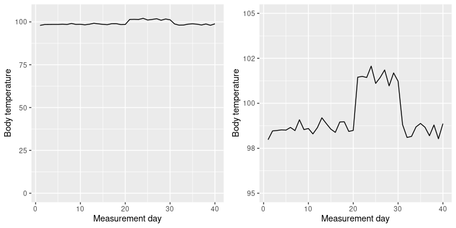
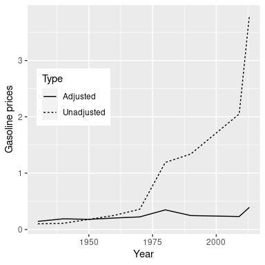

# 4 数据可视化

1986 年 1 月 28 日，挑战者号航天飞机在起飞后 73 秒爆炸，机上 7 名宇航员全部遇难。正如任何此类灾难发生时一样，官方对事故原因进行了调查，发现连接固体火箭助推器两段的 O 型环泄漏，导致接头失效和大型液体燃料箱爆炸(见图 [4.1](#fig:srbLeak) )。

![An image of the solid rocket booster leaking fuel, seconds before the explosion. The small flame visible on the side of the rocket is the site of the O-ring failure. By NASA (Great Images in NASA Description) [Public domain], via Wikimedia Commons](img/file9.jpg)

图 4.1:爆炸前几秒钟，固体火箭助推器泄漏燃料的图像。火箭侧面可见的小火焰就是 O 型圈失效的地方。由 NASA(NASA 描述中的放大图像)，通过维基共享提供该图片。

调查发现，美国宇航局决策过程的许多方面都存在缺陷，尤其是美国宇航局工作人员与建造固体火箭助推器的承包商 Morton Thiokol 的工程师之间的会议。这些工程师特别担心，因为预计发射当天早上的温度会非常低，而且他们从以前的发射中获得的数据显示，O 形圈的性能在较低的温度下会受到影响。在发射前一天晚上的一次会议上，工程师们向美国国家航空航天局的管理人员展示了他们的数据，但无法说服他们推迟发射。他们的证据是一组手写的幻灯片，显示了过去各次发射的数据。

可视化专家爱德华·塔夫特认为，如果恰当地展示所有数据，工程师们会更有说服力。特别是，他们可以展示类似于图 [4.2](#fig:challengerTemps) 中的图，这强调了两个重要的事实。首先，它表明 O 形环的受损程度(由在以前的飞行中从海洋中回收固体火箭助推器后在环外发现的腐蚀和烧焦的程度来定义)与起飞时的温度密切相关。第二，它显示了 1 月 28 日早晨的预测温度范围(显示在阴影区域)远远超出了所有先前发射的范围。虽然我们不能确定，但至少看起来这可能更有说服力。

图 4.2:Tufte 损坏指数数据的重新绘制。这条线显示了数据的趋势，阴影部分显示了发射当天早上的预计温度。

## 4.1 可视化剖析

绘制数据的目的是以二维(有时是三维)形式呈现数据集的摘要信息。我们将维度称为*轴*——横轴称为 *X 轴*，纵轴称为 *Y 轴*。我们可以沿着轴排列数据，突出显示数据值。这些值可以是连续的，也可以是离散的。

有许多不同可视化手段供我们可以使用，它们有不同的优点和缺点。假设我们对 NHANES 数据集中描述男女身高差异感兴趣。图 [4.3](#fig:plotHeight) 显示了绘制这些数据的四种不同方式。

1.  面板 A 中的条形图显示了平均值的差异，但没有向我们显示这些平均值周围的数据分布情况——正如我们稍后将看到的，认识到这一点对于确定我们是否认为两组之间的差异是否足够大而至关重要的。

2.  第二张图显示了所有数据点重叠的条形图——这使得男性和女性的身高分布重叠变得更加清晰，但由于数据点的数量很大，我们看的仍然不是很清楚。

总的来说，我们更喜欢使用一种绘图技术，这种技术可以提供数据点分布的更清晰的视图。

3.  在面板 C 中，我们看到一个*小提琴图*的例子，它绘制了每种条件下的数据分布(稍微平滑后)。

4.  另一个选项是面板 D 中显示的*盒图*，它显示了中位数(中心线)、可变性的度量(盒的宽度，基于称为四分位距的度量)和任何异常值(由线末端的点标注)。这些都是显示数据的有效方法，为数据的分布提供了良好的感觉。

![Four different ways of plotting the difference in height between men and women in the NHANES dataset.  Panel A plots the means of the two groups, which gives no way to assess the relative overlap of the two distributions.  Panel B shows the same bars, but also overlays the data points, jittering them so that we can see their overall distribution.  Panel C shows a violin plot, which shows the distribution of the datasets for each group.  Panel D shows a box plot, which highlights the spread of the distribution along with any outliers (which are shown as individual points).](img/file11.png)

图 4.3:绘制 NHANES 数据集中男女身高差异的四种不同方法。图 A 绘出了两组的平均值，这没有给出评估两个分布的相对重叠的方法。图 B 显示了相同的条形，但也覆盖了数据点，使它们抖动，以便我们可以看到它们的总体分布。面板 C 显示了小提琴图，其显示了每个组的数据集的分布。图 D 显示了一个箱形图，该图突出显示了分布范围以及任何异常值(显示为单个点)。

## 4.2 良好可视化的原则

许多书籍都在教授如何对数据进行有效可视化展示。这些书籍大同小异。这里我们总结了一些通用的原则；如果你想了解更多，那么本章末尾的*建议阅读*部分列出了一些好的资源。

### 4.2.1 显示数据并使其突出

假设我进行了一项研究，调查了牙齿健康和使用牙线时间之间的关系，我想将我的数据可视化。如图 [4.4](#fig:dentalFigs)所示， 显示了这些数据的四种可能呈现方式。

1.  在面板 A 中，我们实际上没有显示数据，只是用一条线来表示数据之间的关系。这显然不是最优的，因为我们实际上看不到底层数据是什么样的。

面板 B-D 显示了绘制实际数据的三种可能的结果，其中每个图显示了数据可能出现的不同方式。

2.  如果我们看到面板 B 中的图，我们可能会怀疑——真实数据很少遵循如此精确的模式。

3.  另一方面，C 图中的数据看起来像真实的数据——它们显示了总体趋势，但它们是杂乱的，真实的数据通常是这样。

4.  面板 D 中的数据向我们展示了这两个变量之间的明显关系完全是由一个个体引起的，我们称为*异常值*，因为他们远远落在主要数据分布的模式之外。应该清楚的是，我们可能不想从一个数据点驱动的效应中得出太多结论。这个数字强调了为什么*总是*在过于相信任何数据摘要之前查看原始数据是重要的。

图 4.4:牙齿健康示例的四种不同的可能数据表示。散点图中的每个点代表数据集中的一个数据点，每个图中的线条代表数据中的线性趋势。

### 4.2.2 最大化数据/油墨比

爱德华·塔夫特提出了一个叫做数据/墨水比率的想法:

<math xmlns:epub="http://www.idpf.org/2007/ops" display="block"><semantics><mrow>T3】dT5】a<mi>t</mi><mi>a</mi><mi>/</mi> <mi>I</mi><mi>n<mi>k</mi><mspace width="0.222em"><mi>r</mi><mi>a</mi><mi>t</mi><mi>I</mi><mi>o</mi><mo>=</mo><mfrac><mrow><mi>a</mi><mi>m</mi><mi>o<mi><mi>n</mi> <mi>o</mi><mi>n</mi><mspace width="0.167em"><mi>d</mi><mi>a</mi><mi>t</mi><mi>a</mi></mspace></mi></mi></mrow><mrow><mi>t</mi><mi>o</mi><mi>t</mi><mi>a</mi><mi>l</mi><mspace width="0.167em"><mi>a</mi> <mi>used\，on\，data}{total\，amount\，of\，ink}</mi></mspace></mrow></mfrac></mspace></mi></mrow></semantics></math> 这样做的目的是尽量减少视觉上的杂乱，让数据透显出来。 例如，以图 [4.5](#fig:dataInkExample) 中牙齿健康数据的两个展示为例。两个面板显示相同的数据，但面板 A 更容易理解，因为它的数据/油墨比率相对较高。

图 4.5:用两种不同的数据/油墨比例绘制的相同数据的示例。

### 避免图表垃圾

在流行媒体上看到的数据可视化展示中，有许多与内容主题相关但与实际数据无关的视觉元素，这种情况尤其常见。这就是所谓的 *垃圾图表* ，应该不惜一切代价避免这种情况的发生。

避免图表垃圾的一个好方法是避免使用流行的电子表格程序来绘制数据。例如，图 [4.6](#fig:chartJunk) (使用 Microsoft Excel 创建)中的图表绘制了不同宗教在美国的相对受欢迎程度。这个数字至少有三个问题:

*   它有图形覆盖在每个条上，与实际数据无关
*   它有一个令人分心的背景纹理
*   它使用三维条形图，这会扭曲数据

图 4.6:图表垃圾的一个例子。

### 避免扭曲数据

通常可以使用可视化来扭曲数据集的信息。一个非常常见的方法是使用不同的轴缩放来放大或隐藏数据模式。例如，我们想知道美国的暴力犯罪率是否发生了变化。在图 [4.7](#fig:crimePlotAxes) 中，我们可以看到这些数据的绘制方式要么让犯罪率看起来保持不变，要么让犯罪率直线下降。同样的数据，却能说出截然不同的两个故事！

图 4.7:1990 年至 2014 年的犯罪数据随时间的变化。图 A 和 B 显示了相同的数据，但是沿 Y 轴的数值范围不同。数据来源于[https://www . ucrdatool . gov/Search/Crime/State/runcrimestatebystate . cfm](https://www.ucrdatatool.gov/Search/Crime/State/RunCrimeStatebyState.cfm)

统计数据可视化中的一个主要争议是如何选择 Y 轴，特别是它是否应该总是包含零。在他的名著《如何用统计数据撒谎》中，达雷尔·赫夫强烈主张人们应该总是把零点放在 Y 轴上。另一方面，爱德华·塔夫特对此进行了反驳:

> “一般来说，在时间序列中，使用显示数据的基线，而不是零点；不要以隐藏数据线本身的情况为代价，花费大量空的垂直空间试图向下到达零点。”(来自[https://qz . com/418083/its-ok-not-to-start-your-y-axis-at-zero/](https://qz.com/418083/its-ok-not-to-start-your-y-axis-at-zero/))

肯定有使用零点毫无意义的情况。假设我们对绘制一段时间样本的体温。在图 [4.8](#fig:bodyTempAxis) 中，我们绘制了 Y 轴上有零或没有零的相同(模拟)数据。显而易见的是，通过将这些数据标绘为 Y 轴上的零点(图 A ),我们在图中浪费了大量的空间，因为一个活人的体温不可能达到零点！通过将零度包括在内，我们也使第 21-30 天的温度明显上升变得不那么明显。一般来说，我倾向于使用线图和散点图中的所有空间，除非零点真的非常重要。

图 4.8:体温随时间的变化，在 Y 轴上有或没有零点的情况下绘制。

爱德华·塔夫特引入了*寿命因子*的概念来描述可视化中的物理差异对应于数据差异的程度。如果图形的李氏因子接近 1，那么它可以恰当地表示数据，而李氏因子远离 1 则反映了基础数据的失真。

在许多情况下，谎言学派支持应该在条形图中包含零点的论点。在图 [4.9](#fig:barCharLieFactor) 中，我们绘制了 Y 轴上有无零点的相同数据。在图 A 中，两个条形之间的面积比例差与数值之间的面积比例差完全相同(即 lie 因子= 1)，而在图 B 中(其中不包括零)，两个条形之间的面积比例差大约是数值比例差的 2.8 倍，因此在视觉上夸大了差异的大小。

图 4.9:两个带有相关寿命因子的条形图。

## 4.3 适应人的局限性

人类在感知和认知方面都有局限性，这使得一些可视化变得非常难以理解。在构建可视化时，记住这些总是很重要的。

### 4.3.1 感知限制

许多人(包括我自己)都有一个重要的感知限制，那就是色觉感知有限。这使得在元素之间只有颜色对比而没有亮度对比的图形(如图 [4.10](#fig:badColors) 中的图形)中很难感知信息。除了颜色之外，使用亮度和/或纹理差异很大的图形元素总是很有帮助的。还有[“色盲友好”调色板](http://www.cookbook-r.com/Graphs/Colors_(ggplot2)/#a-colorblind-friendly-palette)可用于许多可视化工具。

图 4.10:仅仅依靠颜色对比的坏图的例子。

即使是色觉完美的人，也有感知上的局限，也有老司机翻车的时候。这就是为什么统计学家从不使用饼状图的原因之一:人类很难准确感知形状体积的差异。图 [4.11](#fig:pieChart) 中的饼状图(展示了我们上面展示的相同的宗教信仰数据)显示了这有多棘手。

图 4.11:一个饼图的例子，突出了理解不同饼图切片的相对体积的困难。

这个情节很可怕，有几个原因。首先，它需要从图形底部非常小的斑块中区分大量的颜色。第二，视觉视角扭曲了相对数字，因此天主教派的饼图体积看起来比无宗教派系的饼图体积大得多，而事实上无宗教派的数字略大(22.8%比 20.8%)，如图 [4.6](#fig:chartJunk) 所示。第三，通过将图例从图形中分离出来，它要求观察者将信息保存在他们的工作记忆中，以便在图形和图例之间进行映射，并且进行许多“表格查找”,以便持续地将图例标签与可视化相匹配。最后，它使用的文本太小，不放大就无法阅读。

使用更合理的方法绘制数据(图 [4.12](#fig:religionBars) )，我们可以更清楚地看到模式。该图可能看起来不像使用 Excel 生成的饼图那样华丽，但它是更有效、更准确的数据表示。

图 4.12:宗教归属数据的更清晰展示(从[http://www.pewforum.org/religious-landscape-study/](http://www.pewforum.org/religious-landscape-study/)获得)。

该图允许观察者基于沿公共刻度(y 轴)的条形长度进行比较。当基于这些感知元素解码差异时，人类往往比基于面积或颜色更准确。

## 4.4 其他因素校正

通常我们感兴趣的是绘制数据，其中感兴趣的变量常常受我们感兴趣的因素之外的其他因素影响。例如，假设我们想了解汽油价格是如何随着时间的推移而变化的。图 [4.13](#fig:gasPrices) 显示了历史天然气价格数据，绘制时考虑或不考虑通货膨胀调整。虽然未经调整的数据显示了巨大的增长，但调整后的数据显示这主要只是通货膨胀的反映。需要根据其他因素调整数据的其他例子包括人口规模和不同季节收集的数据。

图 4.13:1930 年至 2013 年美国汽油价格(从[http://www.thepeoplehistory.com/70yearsofpricechange.html](http://www.thepeoplehistory.com/70yearsofpricechange.html)获得)，有无通货膨胀修正(基于消费者价格指数)。

## 4.5 学习目标

阅读完本章后，您应该能够做到一下几点:

*   描述区分好图和坏图的通用原则，并用它们来区分好图和坏图。
*   理解为了制作有效的图表而必须适应的人类局限性。
*   承诺永远不创建饼图。*永不*。

## 4.6 建议阅读和视频

*   *数据可视化基础，Claus Wilke*
**   视觉解说，爱德华·塔夫特*   *可视化数据*，作者威廉·s·克利夫兰*   Stephen M. Kosslyn 的《眼睛和心灵的图形设计》*   [*人类如何看待数据*](https://www.youtube.com/watch?v=fSgEeI2Xpdc&feature=youtu.be) ，作者约翰·劳瑟*

