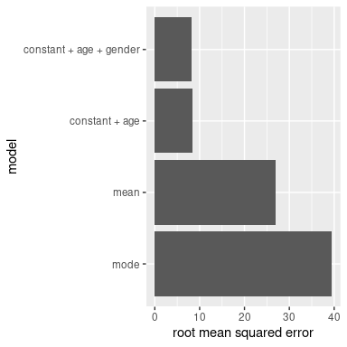
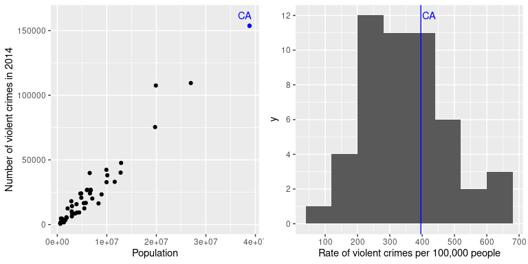
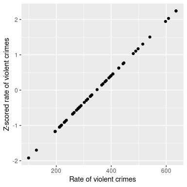
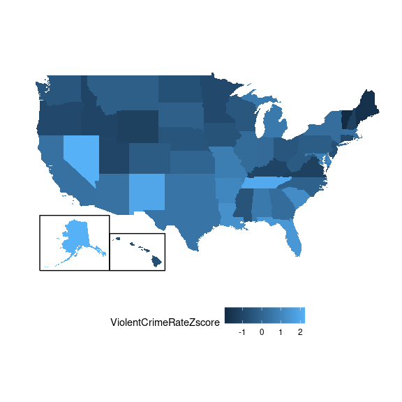
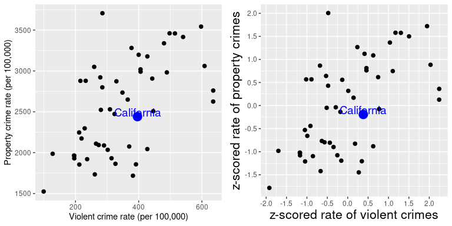

# 5 根据数据拟合模型

统计学中的最基本工作之一就是创建模型，这些模型可以使用一小组数字来汇总数据，从而提供数据的简洁描述。在本章中，我们将讨论统计模型的概念以及如何用它来描述数据。


## 5.1 什么是模型？

在物理世界中，“模型”通常是对现实世界中事物的简化，但却传达了被建模事物的本质。一个建筑物的模型，在传达建筑结构的同时，又足够小巧轻便，可以用手拿起来；生物学中的细胞模型比实际的东西要大得多，但同样传达了细胞的主要部分及其关系。

在统计学中，模型旨在提供类似的压缩描述，但针对数据而非物理结构。像物理模型一样，统计模型通常比描述的数据简单得多；这意味着尽可能简单地捕捉数据的结构。在这两种情况下，我们都意识到模型是一种便利的虚构，它必然掩盖了被建模的实际事物的一些细节。正如统计学家乔治·博克斯的名言:“所有的模型都是错的，但有些是有用的。”将统计模型视为所观察到的数据是如何产生的理论依据，这也是可以的；然后，我们的目标就变成了找到最有效、最准确地总结数据实际生成方式的模型。但是，正如我们将在下面看到的，效率和准确性往往不可能同时兼顾——鱼和熊掌不可兼得。

统计模型的基本结构是:

$$
data = model + error
$$


这个公式描述了数据是由两个部分组成的想法:一部分由统计模型提供，它表达了我们根据我们的知识，预计样本应该被观测到的值，另一部分我们称为*偏差*，它反映了模型预测和观察数据之间的差异。

本质上，我们希望使用我们的模型来预测任何给定观察的数据值。我们可以这样写这个等式:

$$
\widehat{data_i} = model_i
$$


这意味着观察数据的预测值等于该观察模型的值。一旦我们有了模型的预测，我们就可以计算误差:


$$
error_i = data_i - \widehat{data_i}
$$

也就是说，任何观测值的误差都是数据的观测值与模型数据的预测值之间的差值。


## 5.2 统计建模:示例

让我们来看一个使用 NHANES 中的数据集构建数据模型的例子。特别需要说明的是，我们将尝试在 NHANES 样本中建立一个儿童身高模型。首先，让我们加载数据并绘制它们(见图 [5.1](#fig:childHeight) )。


图 5.1:NHANES 儿童身高直方图。

请记住，我们希望尽可能简单地描述数据，同时仍然捕获它们的重要特征。我们所能想象到的最简单的模型只包含一个数字；也就是说，该模型将为每个观察值预测相同的值，而不管我们对这些观察值还知道什么。我们通常根据模型的*参数*来描述模型，这些参数是我们可以改变的值，以便修改模型的预测。在整本书中我们将引用这些使用希腊字母β；当模型有多个参数时，我们将使用带下标的数字来表示不同的贝塔系数(例如$\beta_1$))。习惯上也是用字母y来指代数据的观测值，用带下标的方式$y_I$来指代样本的观察值。

我们一般不知道参数的真实值，所以我们必须从数据中估计它们。为此，我们一般会在$\beta$符号上盖一个“帽子”，表示我们使用的是参数值的估计值，而不是它的真实值(一般人是不知道的，除非开了上帝视角)。因此，我们使用单一参数的简单高度模型是:

$$
y_i = \beta + \epsilon
$$

下标<math xmlns:epub="http://www.idpf.org/2007/ops" display="inline"><semantics><mi>I</mi><annotation encoding="application/x-tex">I</annotation></semantics></math>并没有出现在方程的右侧，这意味着模型的预测并不取决于我们在看哪一个观测值——对它们都是一样的。问题就变成了:我们如何估计模型中参数的最佳值？在这种特殊情况下，<math xmlns:epub="http://www.idpf.org/2007/ops" display="inline"><semantics><mi>β</mi><annotation encoding="application/x-tex">\β</annotation></semantics></math>的最佳估计值是什么？更重要的是，我们如何定义最好的？

我们可以想象的一个非常简单的估计器是*模式*，它只是数据集中众数。这用一个数字重新描述了 1691 个孩子的全部集合。如果我们想预测任何新生儿的身高，那么我们的预测值将是相同的数字:

$$
\hat{y_i} = 166.5
$$

那么每个个体的误差就是预测值之间的差

$$
error_i = y_i - \hat{y_i}
$$


这个模型有多好？一般来说，我们根据误差的大小来定义模型的好坏，误差代表数据偏离模型预测的程度；在所有条件相同的情况下，产生较低误差的模型是较好的模型。(尽管我们将在后面看到，所有的事情通常都不相等……)我们在这种情况下发现，当我们使用该模型作为我们对<math display="inline"><semantics><mi>【β】</mi><annotation encoding="application/x-tex">\ beta</annotation></semantics></math>的估计值时，平均个体有相当大的误差-28.8 厘米，从这个模型的表现来看，它似乎不太好。

那么该如何为我们的模型参数找到一个更好的估计量？我们可以从寻找一个平均误差为零的估计量开始。一个很好的选择是算术平均值(即*平均值*，通常用在变量上加一个横线表示，如<math display="inline"><semantics><mover><mi>x</mi><mo accent="true">‾</mo></mover><annotation encoding="application/x-tex">\ bar { x }</annotation></semantics></math>)，计算过程为所有值的总和除以值的个数。从数学角度描述，我们用公式将其表达为:

$$
\bar{X} = \frac{\sum_{i=1}^{n}x_i}{n}
$$


事实证明，如果我们使用算术平均值作为我们的估计量，那么平均误差将确实为零(如果您感兴趣，请参见本章末尾的简单证明)。即使平均值的平均误差为零，我们也可以从图 [5.2](#fig:meanError) 的直方图中看到，每个个体仍有一定程度的误差；有些是正的，有些是负的，它们相互抵消，平均误差为零。


图 5.2:平均值的误差分布。

负误差和正误差相互抵消的事实意味着两个不同的模型可能具有绝对值非常不同的误差，但仍然具有相同的平均误差。这正是为什么平均误差不是我们估计量的一个好标准；我们希望有一个标准，无论误差方向如何，都能尽量减小总误差。出于这个原因，我们通常根据某种度量来总结错误，这种度量将正错误和负错误都算作是不好的。我们可以使用每个误差值的绝对值，但更常见的是使用平方误差，原因我们将在本书后面看到。

有几种常见的方法来总结你将在本书的不同点上遇到的平方误差，所以理解它们之间的关系是很重要的。首先，我们可以简单地将它们相加；这被称为*误差平方和*。我们通常不使用它的原因是，它的大小取决于数据点的数量，因此它可能很难解释，除非我们正在查看相同数量的观察值。第二，我们可以取平方误差值的平均值，这被称为*均方误差(MSE)* 。然而，因为我们在取平均值之前对这些值进行了平方，所以它们与原始数据不在同一尺度上；他们分别是$centimeters^2$.出于这个原因，通常也取 MSE 的平方根，我们称之为</math>*均方根误差(RMSE)* ，这样误差的测量单位与原始值相同(本例中为厘米)。

平均值有相当大的误差——任何单独的数据点平均距离平均值约 27 厘米——但它仍然比模式好得多，后者的均方根误差约为 39 厘米。


### 5.2.1 改进我们的模型

我们能想象出更好的模式吗？请记住，这些数据来自 NHANES 样本中的所有儿童，年龄从 2 岁到 17 岁不等。考虑到这一广泛的年龄范围，我们可能期望我们的身高模型也应该包括年龄。让我们把身高和年龄的数据画出来，看看这种关系是否真的存在。


图 5.3:NHANES 儿童的身高，绘制时未使用模型(A)，线性模型仅包含年龄(B)或年龄和常数(C)，线性模型适用于男性和女性的不同年龄效应(D)。

图 [5.3](#fig:childHeightLine) 面板 A 中的黑点显示了数据集中的个体，正如我们所料，身高和年龄之间似乎有很强的关系。因此，我们可以建立一个将身高和年龄联系起来的模型:

$$
\hat{y_i} =  \hat{\beta} * age_i
$$


其中$\hat{\beta}$是我们乘以年龄生成模型预测的参数估计值。


你可能记得代数中的一条线是这样定义的:

$$
y = slope*x + intercept
$$


如果年龄是<math display="inline"><semantics><mi>X</mi><annotation encoding="application/x-tex">X</annotation></semantics></math>变量，那么这意味着我们根据年龄对身高的预测将是一条斜率为<math display="inline"><semantics><mi>β</mi><annotation encoding="application/x-tex">\β</annotation></semantics></math>且截距为零的线——为了更好的看清楚这一点，让我们在数据顶部用蓝色绘制最佳拟合线(图 [5.3](#fig:childHeightLine) 中的 B 图)。这个模型显然有问题，因为这条线似乎没有很好地遵循数据。事实上，该模型的 RMSE(39.16)实际上高于仅包括平均值的模型！问题在于我们的模型只包括年龄，这意味着当年龄为零时，模型预测的身高值必须为零。即使数据不包括任何年龄为零的孩子，当 x 为零时，该线在数学上需要具有为零的 y 值，这解释了为什么该线被下拉到较年轻的数据点之下。我们可以通过在我们的模型中添加一个截距来解决这个问题，截距基本上代表年龄等于零时的估计身高；尽管零年龄在该数据集中是不合理的，但这是一个数学技巧，允许模型考虑数据的总体大小。模型是:

$$
\widehat{y_i} = \hat{\beta_0} + \hat{\beta_1} * age_i
$$


其中<math display="inline"><semantics><mover><msub><mi>β</mi><mn>0</mn></msub><mo accent="true">̂</mo></mover><annotation encoding="application/x-tex">\ hat { \ beta _ 0 }</annotation></semantics></math>是我们对*截距*的估计值，它是一个常数值，加到对每个个体的预测中；我们称之为截距，因为它映射到直线方程的截距上。我们将在后面了解我们实际上是如何为一个特定的数据集估计这些参数值的；现在，我们将使用我们的统计软件来估计参数值，使我们对这些特定数据的误差最小。图 [5.3](#fig:childHeightLine) 中的子图 C 显示了应用于 NHANES 数据的模型，其中我们看到该线比没有常数的线更好地匹配了数据。

使用这个模型，我们的误差要小得多——平均只有 8.36 厘米。你能想到其他可能与身高有关的变量吗？比如说性别会影响身高么？在图 [5.3](#fig:childHeightLine) 的 D 图中，我们用分别适合男性和女性的线绘制数据。从分布上看，似乎是有男女之分的，但比较小，只在过了青春期年龄后才比较明显。在图 [5.4](#fig:msePlot) 中，我们绘制了不同模型的均方根误差值，包括一个带有模拟性别影响的附加参数的模型。从这里我们可以看到，从众数到平均数，模型变得更好了一点，从平均数到平均数+年龄，模型变得更好了一点，并且通过包括性别也变得稍微好了一点。



图 5.4:上面测试的每个模型的均方误差图。


## 5.3 是什么让一个模型变得“好”？

我们希望从统计模型中得到两种不同的东西。首先，我们希望它能很好地描述我们的数据；也就是说，我们希望它在对我们的数据建模时具有尽可能低的误差。第二，我们希望它能很好地推广到新的数据集；也就是说，当我们将其应用于新的数据集以进行预测时，我们希望其误差尽可能低。事实证明，这两个特性经常会发生冲突。

为了理解这一点，我们来考虑一下误差来自哪里。首先，如果我们的模型是错误的，它就会发生；例如，如果我们不准确地说身高随着年龄的增长而下降，而不是上升，那么我们的误差将高于正确模型的误差。类似地，如果我们的模型中缺少了一个重要的因素，这也会增加我们的误差(就像我们在身高模型中忽略年龄时一样)。然而，由于数据中的随机变化，即使模型是正确的，也可能出现误差，我们通常称之为“测量误差”或“噪声”。有时这真的是由于我们的测量中的误差——例如，当测量依赖于人时，比如使用秒表来测量赛跑中所用的时间。在其他情况下，我们的测量设备是高度精确的(就像测量体重的数字秤)，但被测量的东西受到许多不同因素的影响，导致它是可变的。如果我们知道所有这些因素，那么我们可以建立一个更准确的模型，但在现实中这几乎是不可能的。

让我们用一个例子来说明这一点。我们将使用计算机模拟来生成一些数据，而不是使用真实的数据(关于这一点，我们将在下面几章中详细介绍)。假设我们想要了解一个人的血液酒精含量(BAC)与他们在模拟驾驶测试中的反应时间之间的关系。我们可以生成一些模拟数据并绘制关系图(见图 [5.5](#fig:BACrt) 的 A 图)。


图 5.5:驾驶测试中血液酒精含量和反应时间之间的模拟关系，最佳拟合线性模型用直线表示。A:线性关系，测量误差小。B:线性关系，测量误差较高。C:具有低测量误差和(不正确的)线性模型的非线性关系

在本例中，反应时间随着血液酒精含量的增加而有系统地增加——这条线显示了最佳拟合模型，我们可以看到误差非常小，这一点在所有的点都非常接近这条线这一事实中是显而易见的。

我们也可以想象数据显示同样的线性关系，但有更多的误差，如图 [5.5](#fig:BACrt) 的 B 图所示。在这里，我们看到对 BAC 的反应时间仍有系统性的增加，但个体之间的差异更大。

在这两个例子中，两个变量之间的关系似乎是线性的，误差反映了我们测量中的噪声。另一方面，在其他情况下，变量之间的关系不是线性的，并且由于没有适当地指定模型，误差会增加。假设我们对咖啡因摄入量和测试成绩之间的关系感兴趣。像咖啡因这样的兴奋剂和测试表现之间的关系通常是非线性的，也就是说，它并不遵循一条直线。这是因为咖啡因用量越少，人的表现越好(因为这个人变得更加警觉)，但用量越大，表现就越差(会让人变得紧张不安)。我们可以模拟这种形式的数据，然后用线性模型拟合数据(见图 [5.5](#fig:BACrt) 的子图 C)。蓝线表示最符合这些数据的直线；很明显，这里有很大的误差。尽管在测试成绩和咖啡因摄入量之间有一个非常合法的关系，它遵循一条曲线而不是一条直线。假设线性关系的模型具有很高的误差，因为它对于这些数据是错误的模型。


## 5.4 模型会不会好过头了？

误差听起来是一件坏事，通常我们更喜欢误差较小的模型，而不是误差较大的模型。但是，我们在上面提到过，模型精确拟合当前数据集的能力和概化到新数据集的能力之间存在矛盾，事实证明，误差最低的模型往往在在新数据集的泛化能力上要表现的差劲的多！

为了说明这一点，让我们再次生成一些数据，以便我们知道变量之间的真实关系。我们将创建两个模拟数据集，它们以完全相同的方式生成，只是添加了不同的随机噪声。数据是通过下面的方程式生成的 $y = \beta * X + \epsilon$;唯一的区别是不同的随机噪声被用于<math xmlns:epub="http://www.idpf.org/2007/ops" display="inline"><semantics><mi>ϵ</mi><annotation encoding="application/x-tex">\ε</annotation></semantics></math>不同情况下。

![An example of overfitting. Both datasets were generated using the same model, with different random noise added to generate each set.  The left panel shows the data used to fit the model, with a simple linear fit in blue and a complex (8th order polynomial) fit in red.  The root mean square error (RMSE) values for each model are shown in the figure; in this case, the complex model has a lower RMSE than the simple model.  The right panel shows the second dataset, with the same model overlaid on it and the RMSE values computed using the model obtained from the first dataset.  Here we see that the simpler model actually fits the new dataset better than the more complex model, which was overfitted to the first dataset.](img/file27.png)

图 5.6:过拟合的例子。两个数据集都是使用相同的模型生成的，每个数据集都添加了不同的随机噪声。左图显示了用于拟合模型的数据，简单的线性拟合用蓝色表示，复杂的(8 阶多项式)拟合用红色表示。每个模型的均方根误差(RMSE)值如图所示；在这种情况下，复杂模型的 RMSE 低于简单模型。右侧面板显示了第二个数据集，其上覆盖了相同的模型，并且使用从第一个数据集获得的模型计算了 RMSE 值。在这里，我们看到更简单的模型实际上比更复杂的模型更适合新的数据集，更复杂的模型过度拟合了原始数据集。

图 [5.6](#fig:Overfitting) 中的左图显示，更复杂的模型(红色)比更简单的模型(蓝色)更符合数据。然而，当相同的模型应用于以相同方式生成的新数据集时，我们看到了相反的情况——在这里，我们看到较简单的模型比较复杂的模型更适合新数据。直观地，我们可以看到，更复杂的模型受第一个数据集中离群数据点的影响很大；由于这些数据点的确切位置是由随机噪声驱动的，这导致更复杂的模型不适合新数据集。这就是我们所说的*过拟合*现象。现在重要的是要记住我们的模型需要很好，但不能太好。正如艾伯特·爱因斯坦(1933 年)所说:“几乎不能否认，所有理论的最高目标是在不放弃一个经验数据的充分表示的情况下，使不可约的基本元素尽可能简单和少。”这句话经常被解释为:“简约而不简单。”


## 5.5 使用平均值汇总数据

我们已经遇到了上面的均值(或平均值)，事实上大多数人即使没有上过统计课也知道平均值。它通常用于描述我们所说的数据集的“集中趋势”,即数据以什么值为中心？大多数人并不认为计算平均值就是用数据拟合模型。然而，这正是我们在计算平均值时所做的。

我们已经看到了计算样本数据平均值的公式:

$$
\bar{X} = \frac{\sum_{i=1}^{n}x_i}{n}
$$

请注意，我说过这个公式是专门针对数据的*样本*的，它是从一个更大的总体中选择的一组数据点。使用一个样本，我们希望代表一个更大的群体——我们感兴趣的全部个体。例如，如果我们是一个政治民意调查专家，我们感兴趣的人群可能是所有注册选民，而我们的样本可能只包括从这个人群中抽样的几千人。在第 7 章中，我们将更详细地讨论抽样，但现在重要的一点是，统计学家通常喜欢使用不同的符号来区分描述样本值的*统计*和描述总体真实值的*参数*；在这种情况下，总体平均值(表示为$\mu$)的公式为:

$$
\mu = \frac{\sum_{i=1}^{N}x_i}{N}
$$


我们已经看到，均值是保证给我们零平均误差的估计量，但我们也知道平均误差不是最好的标准；相反，我们需要一个能给出最低误差平方和(SSE)的估计量，均值也是如此。我们可以用微积分来证明这一点，但我们将在图 [5.7](#fig:MinSSE) 中用图形来演示。


图 5.7:显示了最小化误差平方和的统计平均值。使用 NHANES 儿童身高数据，我们计算平均值(用蓝色条表示)。然后，我们测试一系列可能的参数估计值，对于每一个估计值，我们根据该值计算每个数据点的误差平方和，用黑色曲线表示。我们看到平均值落在平方误差图的最小值处。

SSE 的最小化是一个很好的特性，这也是为什么平均值是最常用的汇总数据的统计量。然而，滥用均值也有不好的一面。假设五个人在一个酒吧，我们考察每个人的收入(Table [5.1](#tab:income1) ):

<caption>Table 5.1: Income for our five bar patrons</caption>

| 收入 | 人名 |
| --- | --- |
| Forty-eight thousand | 乔 |
| Sixty-four thousand | 克伦人 |
| Fifty-eight thousand | 标记 |
| Seventy-two thousand | 安德里亚 |
| Sixty-six thousand | 轻拍 |

均值(61600.00)似乎是那五个人收入的一个相当不错的总结。现在让我们看看如果碧昂斯·诺尔斯走进酒吧会发生什么(表 [5.2](#tab:income2) )。

<caption>Table 5.2: Income for our five bar patrons plus Beyoncé Knowles.</caption>


| 收入 | 人名 |
| --- | --- |
| Forty-eight thousand | 乔 |
| Sixty-four thousand | 克伦人 |
| Fifty-eight thousand | 标记 |
| Seventy-two thousand | 安德里亚 |
| Sixty-six thousand | 轻拍 |
| Fifty-four million | 碧昂丝（美国女歌手） |

现在的平均值几乎是 1000 万美元，这和酒吧里任何一个人的收入都差之甚远——特别是，它在很大程度上是由碧昂斯的收入所决定的。一般来说，平均值对极值非常敏感，这就是为什么在使用平均值汇总数据时确保没有极值很重要的原因。


### 5.5.1 使用中值稳健地汇总数据

如果我们想以一种对异常值不太敏感的方式来总结数据，我们可以使用另一种称为*中位数*的方式来统计数据。如果我们将所有的值按大小排序，那么中值就是中间的值。如果有偶数个值，那么将有两个值并列在中间位置，在这种情况下，我们取这两个值的平均值(即中点)。

让我们看一个例子。假设我们要统计汇总下面的数据:

```
8  6  3 14 12  7  6  4  9
```

如果我们对这些值进行排序:

```
3  4  6  6  7  8  9 12 14
```

那么中值就是中间值，在这种情况下，是 9 个值中的第 5 个。

平均值最小化误差的平方和，而中值最小化一个稍微不同的量:误差的绝对值之和。这解释了为什么它对异常值不太敏感——与取绝对值相比，平方会加剧大误差的影响。我们可以在收入的例子中看到这一点:中值收入(65，000 美元)比平均值(9，051，333 美元)更能代表整个群体，而且对一个大的异常值不太敏感。

有鉴于此，我们为什么要使用平均值呢？正如我们将在后面的章节中看到的，均值是“最好的”估计量，因为与其他估计量相比，它在样本间的变化较小。这取决于统计时我们是否对潜在的异常值敏感——统计学就是关于权衡利弊的学科。


## 5.6 模式

有时我们希望描述一个非数值数据集的中心趋势。比如说，我们想知道 iPhone 的哪些型号最常用。为了测试这一点，我们可以询问一大群 iPhone 用户，每个人拥有哪种型号。如果我们取这些值的平均值，我们可能会看到平均 iPhone 型号为 9.51，这显然是无意义的，因为 iPhone 型号并不意味着定量测量。在这种情况下，更合适的集中趋势度量是众数，这是数据集中最常见的值，正如我们上面讨论的那样。


## 方差:平均值与数据的吻合程度如何？

一旦我们描述了数据的中心趋势，我们通常还想描述数据的可变性——这有时也称为“分散”,反映了它描述了数据的分散程度。

我们已经在上面遇到了误差平方和，这是最常用的可变性测量的基础:*方差*和*标准差*。总体的方差(称为$\sigma^2$)就是误差平方和除以观察次数——也就是说，它与您之前遇到的*均方差*完全相同:

$$
\sigma^2 = \frac{SSE}{N} = \frac{\sum_{i=1}^n (x_i - \mu)^2}{N}
$$

其中$\ mu$为整体平均数。总体标准差就是这个的平方根——也就是我们之前看到的*均方根误差*。标准差很有用，因为误差与原始数据的计量单位是相同的(抵消了我们对误差应用的平方)。

我们通常无法访问所有样本，所以我们必须使用样本来计算方差，我们称之为<math xmlns:epub="http://www.idpf.org/2007/ops" display="inline"><semantics><msup><mover><mi>【σ】</mi><mo accent="true">̂</mo></mover><mn>2</mn></msup><annotation encoding="application/x-tex">\hat{\sigma}^2</annotation></semantics></math>，“帽子”表示这是基于样本的估计值。<math xmlns:epub="http://www.idpf.org/2007/ops" display="inline"><semantics><msup><mover><mi>σ</mi></mover><mn>̂</mn></msup><annotation encoding="application/x-tex">\hat{\sigma}^2</annotation></semantics></math>的方程式与<math xmlns:epub="http://www.idpf.org/2007/ops" display="inline"><semantics><msup><mi>σ</mi><mn>2</mn></msup><annotation encoding="application/x-tex">\sigma^2</annotation></semantics></math>的方程式相似:


$$
\hat{\sigma}^2 = \frac{\sum_{i=1}^n (x_i - \bar{X})^2}{n-1}
$$

这两个方程的唯一区别是我们除以 n - 1，而不是 n。这涉及到一个基本的统计概念:*自由度*。记住，为了计算样本方差，我们首先必须估计样本均值<math xmlns:epub="http://www.idpf.org/2007/ops" display="inline"><semantics><mover><mi>x</mi><mo accent="true">‾</mo></mover><annotation encoding="application/x-tex">\ bar { x }</annotation></semantics></math>。估计了这一点之后，数据中的一个值就不能再自由变化了。例如，假设我们有变量<math xmlns:epub="http://www.idpf.org/2007/ops" display="inline"><semantics><mi>x</mi><annotation encoding="application/x-tex">x</annotation></semantics></math>的以下数据点:[3，5，7，9，11]，其平均值为 7。因为我们知道这个数据集的平均值是 7，所以我们可以计算出任何一个特定的值在它丢失的情况下会是多少。例如，假设我们要隐藏第一个值(3)。做了这些，我们仍然知道它的值必须是 3， 因为 7 的平均值意味着所有值的总和是<math xmlns:epub="http://www.idpf.org/2007/ops" display="inline"><semantics><mrow><mn>7</mn><mi>n</mi><mo>=</mo><mn>35</mn></mrow><annotation encoding="application/x-tex">7 * n = 35</annotation></semantics></math>和<math xmlns:epub="http://www.idpf.org/2007/ops" display="inline"><semantics><mrow><mn>35</mn><mrow><mo stretchy="true" form="prefix">(</mo></mrow> <mo>=</mo><mn>3</mn></mrow><annotation encoding="application/x-tex">35-(5+7+9+11)= 3</annotation></semantics></math>。

所以当我们说我们“失去了”一个自由度时，意思是有一个值在拟合模型后不能自由变化。在样本方差的背景下，如果我们不考虑失去的自由度，那么我们对样本方差的估计将*有偏*，导致我们低估了对均值估计的不确定性。


## 5.8 使用模拟来理解统计数据

我坚信使用计算机模拟来理解统计概念，在后面的章节中，我们将更深入地挖掘它们的用途。在这里，我们将通过询问是否可以确认在计算样本方差时需要从样本量中减去 1 来介绍这一思想。

让我们将 NHANES 数据中的整个儿童样本视为我们的“总体”，并看看在分母中使用<math display="inline"><semantics><mi>n</mi><annotation encoding="application/x-tex">n</annotation></semantics></math>或<math display="inline"><semantics><mrow><mi>n</mi><mn>1</mn></mrow><annotation encoding="application/x-tex">n-1</annotation></semantics></math>的样本方差计算有多好，将跨来自数据的大量模拟随机样本来估计该总体的方差。我们将在后面的章节中回到如何做到这一点的细节。

<caption>Table 5.3: Variance estimates using n versus n-1; the estimate using n-1 is closer to the population value</caption>

| 估计 | 值 |
| --- | --- |
| 总体方差 | Seven hundred and twenty-five |
| 使用 n 的方差估计 | Seven hundred and ten |
| 使用 n-1 的方差估计 | Seven hundred and twenty-five |

[5.3](#tab:varsim) 中的结果向我们表明，上面概述的理论是正确的:使用<math xmlns:epub="http://www.idpf.org/2007/ops" display="inline"><semantics><mrow><mi>n</mi><mn>1</mn></mrow><annotation encoding="application/x-tex">n-1</annotation></semantics></math>作为分母的方差估计值非常接近于根据完整数据(即总体)计算的方差，而使用<math xmlns:epub="http://www.idpf.org/2007/ops" display="inline"><semantics><mi>n</mi><annotation encoding="application/x-tex">n</annotation></semantics>计算的方差</math>


## 5.9 Z 分数

根据集中趋势和可变性描述了分布的特征后，根据各个分数相对于总体分布的位置来表示它们通常是有用的。假设我们感兴趣的是描述不同州之间犯罪的相对水平，以确定加州是否是一个特别危险的地方。我们可以使用来自联邦调查局统一犯罪报告网站的 2014 年数据来问这个问题。图 [5.8](#fig:crimeHist) 的左面显示了各州暴力犯罪数量的直方图，将加利福尼亚州的犯罪数据特别标注了出来。看着这些数据，加州似乎非常危险，那一年有 153709 起犯罪。我们可以通过生成一个显示变量在各州分布的图来可视化这些数据，该图显示在图 [5.8](#fig:crimeHist) 的右侧面板中。


图 5.8:左图:暴力犯罪数量直方图。CA 的值用蓝色标出。右图:相同数据的地图，用彩色标出了每个州的犯罪数量(以千计)。

然而，你可能已经想到，加州也是美国人口最多的州，所以它也有更多的犯罪是合理的。如果我们针对每个州的一个人口绘制犯罪数量图(见图 [5.9](#fig:popVsCrime) 的左图)，我们会看到两个变量之间存在直接关系。



图 5.9:左图:各州暴力犯罪数量与人口的关系图。右图:人均暴力犯罪率直方图，以每 10 万人的犯罪率表示。

我们不应该使用犯罪案件的数量，而应该使用人均暴力犯罪率，这是通过将每个州的犯罪数量除以每个州的人口数量得到的。美国联邦调查局的数据集已经包含了这一数值(以每 100，000 人的比率表示)。看一下图 [5.9](#fig:popVsCrime) 的右图，我们会发现加州并不那么危险——它的犯罪率为每 10 万人中 396.10 人，略高于各州平均水平 346.81 人，但仍在许多其他州的范围之内。但是如果我们想更清楚地了解它离分布的其他部分有多远呢？

Z 值允许我们以一种方式表达数据，这种方式描述了对每个数据点与总体分布更深入的关系。假设我们知道总体平均值<math display="inline"><semantics><annotation encoding="application/x-tex">【mu】</annotation></semantics></math>和标准差<math display="inline"><semantics><mi>【σ</mi><annotation encoding="application/x-tex">【σ</annotation></semantics></math>的值，则计算单个数据点的 Z 值的公式为:

<semantics><mrow><mi>【z】</mi><mrow><mo stretchy="true" form="prefix">(</mo><mi><mo stretchy="true" form="postfix">)</mo><mo>=</mo></mi></mrow></mrow></semantics>

通俗的讲，您可以将 Z 值视为告诉您任何数据点离平均值有多远，以标准差为单位。我们可以对犯罪率数据进行计算，如图 [5.10](#fig:crimeZplot) 所示，该图绘制了 Z 分数与原始分数的关系。



图 5.10:原始犯罪率数据与 Z 得分数据的散点图。

散点图向我们展示了 Z 计分的过程并没有改变数据点的相对分布(从原始数据和 Z 计分的数据在相互标绘时落在一条直线上的事实中可以看出)，它只是将它们移动到平均值为 0，标准偏差为 1。图 [5.11](#fig:crimeZmap) 显示了使用地理视图的 Z 得分犯罪数据。



图 5.11:呈现在美国地图上的犯罪数据，以 Z 分数表示。

这为我们提供了一个更容易理解的数据视图。例如，我们可以看到内华达州、田纳西州和新墨西哥州的犯罪率都比平均值高出大约两个标准差。


### 5.9.1 解释 Z 分数

“Z-score”中的“Z”来自于标准正态分布(即均值为零、标准差为 1 的正态分布)通常被称为“Z”分布。我们可以使用标准正态分布来帮助我们理解特定的 Z 分数告诉我们关于数据点相对于分布的其余部分的位置。


图 5.12:标准正态分布的密度(上图)和累积分布(下图)，截止值在平均值之上/之下的一个标准差处。

图 [5.12](#fig:zDensityCDF) 中的上图显示，我们预计约有 16%的值落在<math xmlns:epub="http://www.idpf.org/2007/ops" display="inline"><semantics><mrow><mi>Z</mi><mo>≥</mo><mn>1</mn></mrow><annotation encoding="application/x-tex">Z \ ge 1</annotation></semantics></math>中，同样比例的值落在<math xmlns:epub="http://www.idpf.org/2007/ops" display="inline"><semantics><mrow><mi>Z</mi><mo>≤</mo><mn>1</mn></mrow></semantics></math>


图 5.13:标准正态分布的密度(上图)和累积分布(下图)，在高于/低于平均值的两个标准差处有截止值

图 [5.13](#fig:zDensity2SD) 显示了两个标准差的相同曲线。这里我们看到只有大约 2.3%的值落在<math xmlns:epub="http://www.idpf.org/2007/ops" display="inline"><semantics><mrow><mi>Z</mi><mo>≤</mo><mo>—</mo>—T11】2</mrow><annotation encoding="application/x-tex">Z \ le-2</annotation></semantics></math>和<math xmlns:epub="http://www.idpf.org/2007/ops" display="inline"><semantics><mrow><mi>Z</mi><mo>≥</mo><mn>2</mn></mrow><annotation encoding="application/x-tex">Z \ ge 2</annotation></semantics>中因此，如果我们知道特定数据点的 Z 分数，我们可以估计找到至少与该值一样极端的值的可能性有多大，这使我们可以将值放入更好的上下文中。就犯罪率而言，我们看到加利福尼亚州的人均暴力犯罪率的 Z 值为 0.38，这表明它非常接近其他州的平均值，大约 35%的州具有较高的犯罪率，65%的州具有较低的犯罪率。</math>


### 5.9.2 标准化分数

假设我们想要生成平均值为 100、标准差为 10 的标准化犯罪分数，而不是 Z 分数。这类似于用智力测验的分数来产生智商(IQ)的标准化。我们可以通过简单地将 Z 分数乘以 10，然后加上 100 来实现。


图 5.14:犯罪数据显示为标准化分数，平均值为 100，标准差为 10。


#### 5.9.2.1 使用 Z 分数比较分布

Z 分数的一个有用的应用是比较不同变量的分布。假设我们想观测比较暴力犯罪和财产犯罪在各州的分布情况。在图 [5.15](#fig:crimeTypePlot) 的左图中，我们用蓝色标出 CA。如你所见，财产犯罪的原始比率远远高于暴力犯罪的原始比率，所以我们不能直接比较数字。然而，我们可以绘制这些数据彼此之间的 Z 分数(图 [5.15](#fig:crimeTypePlot) 的右图)——我们再次看到数据的分布没有变化。将数据放入每个变量的 Z 分数中，使它们具有可比性，并让我们看到，就暴力犯罪和财产犯罪而言，加州实际上位于分布的中间。



图 5.15:暴力与财产犯罪率(左)和 Z 得分率(右)。

我们再给统计分析加一个因素:人口。在图 [5.16](#fig:crimeTypePopPlot) 的左侧面板中，我们使用绘图符号的大小显示了这一点，这通常是向绘图添加信息的有用方式。


图 5.16:左图:暴力犯罪率与财产犯罪率的对比图，人口数量通过绘图符号的大小表示；加州以蓝色呈现。右图:暴力犯罪与财产犯罪的得分差异，与人口相对照。

因为 Z 分数是直接可比的，所以我们也可以计算一个*差异分数*，它表示各州暴力与非暴力(财产)犯罪的相对比率。然后，我们可以绘制这些分数与人口的关系图(见图 [5.16](#fig:crimeTypePopPlot) )。这显示了我们如何使用 Z 分数将不同的变量放在一个共同的尺度上。

值得注意的是，最小的州似乎在两个方向上的差异最大。虽然看每个州并试图确定为什么它有高或低的差异分数可能是诱人的，但这可能反映了这样一个事实，即从较小的样本中获得的估计必然会更易变，正如我们将在第 7 章中讨论的那样。


## 5.10 学习目标

*   描述统计模型的基本方程(数据=模型+误差)
*   描述集中趋势和分散的不同度量，它们是如何计算的，以及在什么情况下适合。
*   计算 Z 分数并描述它们为什么有用。


## 5.11 附录


### 5.11.1 证明平均值的误差总和为零

$$
error = \sum_{i=1}^{n}(x_i - \bar{X}) = 0
$$


$$
\sum_{i=1}^{n}x_i - \sum_{i=1}^{n}\bar{X}=0
$$

$$
\sum_{i=1}^{n}x_i = \sum_{i=1}^{n}\bar{X}
$$

$$
\sum_{i=1}^{n}x_i = n\bar{X}
$$

$$
\sum_{i=1}^{n}x_i = \sum_{i=1}^{n}x_i
$$
