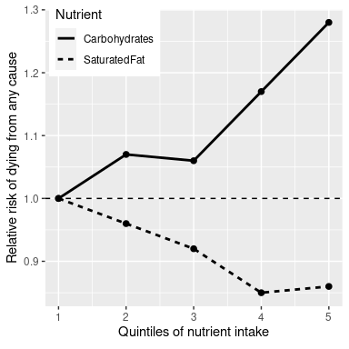

# 一、引言

“有朝一日，统计思维对于有效的公民身份和读写能力同样重要。”—H.G.威尔斯

## 1.1 什么是统计思维？

统计思维是理解一个复杂世界的一种方式，它用相对简单的术语来描述这个世界，尽管如此，它捕捉到了这个世界结构的基本方面，同时也为我们提供了一些关于我们的知识有多不确定的概念。统计思维的基础主要来自数学和统计学，也来自计算机科学、心理学和其他研究领域。

我们可以区分统计思维和其他不太可能准确描述世界的思维方式。特别是，人类的直觉经常试图回答我们可以用统计思维回答的相同问题，但往往得到错误的答案。例如，近年来，大多数美国人报告说，他们认为暴力犯罪比前一年更严重（[pew 研究中心](http://www.pewresearch.org/fact-tank/2018/01/30/5-facts-about-crime-in-the-u-s/)）。然而，对实际犯罪数据的统计分析表明，事实上，暴力犯罪自 20 世纪 90 年代以来一直在稳步下降（htg2）。直觉让我们失望，因为我们依赖于最好的猜测（心理学家称之为 _ 启发式 _），而这种猜测往往会出错。例如，人类通常使用 _ 可用性启发式 _ 来判断某些事件（如暴力犯罪）的流行率——也就是说，我们如何容易想到暴力犯罪的例子。因此，我们对提高犯罪率的判断可能更能反映新闻报道的增加，尽管犯罪率实际有所下降。统计思维为我们提供了更准确地理解世界和克服人类直觉错误的工具。

## 1.2 统计数据能为我们做什么？

我们可以用统计数据做三件主要的事情：

*   _ 描述 _：这个世界是复杂的，我们经常需要用我们能够理解的简单方式来描述它。

*   _ 决定 _：我们通常需要根据数据做出决定，通常是在面临不确定性的情况下。
*   _ 预测 _：我们经常希望根据我们对以前情况的了解来预测新的情况。

让我们来看一个实际的例子，集中在一个我们很多人都感兴趣的问题上：我们如何决定吃什么是健康的？
有许多不同的指导来源，从政府饮食指南到饮食书籍，再到博客。
让我们专注于一个特定的问题：我们饮食中的饱和脂肪是不是一件坏事？

我们回答这个问题的一种方法是常识。
如果我们吃脂肪，那么它会在我们的身体里直接变成脂肪，对吗？
我们都看过脂肪堵塞动脉的照片，所以吃脂肪会阻塞动脉，对吗？

我们回答这个问题的另一种方法是听取权威人士的意见。美国食品药品监督管理局的饮食指南作为其关键建议之一，“健康的饮食模式限制饱和脂肪的摄入”。你可能希望这些指南是基于良好的科学，在某些情况下是这样的，但正如尼娜·泰克罗兹在她的书中概述的那样。”大脂肪惊喜”（Teicholz，2014 年），这一特别建议似乎更多地基于营养研究人员的教条，而不是实际证据。

最后，我们可以看看实际的科学研究。让我们先看一个名为“纯粹研究”的大型研究，该研究对 18 个不同国家的 135000 多人的饮食和健康结果（包括死亡）进行了调查。在该数据集的一项分析中（发表于 2017 年的《柳叶刀》（The Lancet）（HTG1））；Dehghan 等人（2017 年）），纯研究人员报告了一项分析，分析了不同种类的宏量营养素（包括饱和脂肪和碳水化合物）的摄入与跟踪调查期间死亡的可能性之间的关系。对受试者进行了中位数为 7.4 年的跟踪调查，这意味着研究中一半受试者的跟踪调查时间不足，一半受试者的跟踪调查时间超过 7.4 年。图[1.1](#fig:PureDeathSatFat)描绘了研究中的一些数据（摘自论文），显示了饱和脂肪和碳水化合物摄入与任何原因死亡风险之间的关系。

图 1.1 纯研究的数据图，显示了任何原因导致的死亡与饱和脂肪和碳水化合物的相对摄入量之间的关系。

这个图是以十个数字为基础的。为了获得这些数据，研究人员将 135335 名研究参与者（我们称之为“样本”）分成 5 组（“五分位数”），根据他们对任何一种营养素的摄入量对其进行排序；第一个五分位数包含 20%的最低摄入量的人，第五个五分位数包含 20%的最低摄入量的人。五分位数含有最高摄入量的 20%。然后，研究人员计算了在被跟踪期间，每个研究小组中的人死亡的频率。这个数字用死亡的相对风险（与最低五分位数相比）来表示这一点：如果这个数字大于 1，这意味着这个群体中的人比最低五分位数中的人死亡的可能性高 _，而如果这个数字小于 1，这意味着死亡的可能性比最低五分位数中的人高 _。也就是说，小组中的人死亡的可能性要小一些。这个数字非常清楚：在研究过程中，摄入饱和脂肪越多的人死亡的可能性就越小，而且吃得越多，这种影响就越大。碳水化合物的情况正好相反，一个人吃的碳水化合物越多，他们在研究中死亡的可能性就越大。这个例子显示了我们如何使用统计数据来描述复杂的数据集，用一组简单得多的数字来描述；如果我们必须同时查看来自每个研究参与者的数据，我们将被数据超载，很难看到 EME 当它们被更简单地描述时。

图[1.1](#fig:PureDeathSatFat)中的数字似乎表明，随着饱和脂肪的摄入，死亡人数减少，而随着碳水化合物的摄入，死亡人数增加，但我们也知道，数据中存在很多不确定性；有些人即使吃低碳水化合物的饮食，也会过早死亡，同样，有些人甚至会因摄入低碳水化合物的食物而死亡。他吃了很多碳水化合物，但活到了成熟的老年。考虑到这种变异性，我们想 _ 决定 _ 我们在数据中看到的关系是否足够大，如果饮食和寿命之间没有真正的关系，我们就不会期望它们随机发生。统计数据为我们提供了做出这些决定的工具，通常外界认为这是统计数据的主要目的。但正如我们将在书中看到的，基于模糊证据的黑白决策的需要常常导致研究人员误入歧途。

基于这些数据，我们还想对未来的结果做出预测。例如，一家人寿保险公司可能想利用某个人摄入脂肪和碳水化合物的数据来预测他们的寿命。预测的一个重要方面是，它要求我们将已有的数据归纳为其他情况，通常是在将来；如果我们的结论仅限于某一特定时间研究中的特定人员，那么该研究就不会非常有用。一般来说，研究人员必须假设他们的特定样本代表了更大的（htg0）群体（htg1），这要求他们以无偏见的方式获采样本。例如，如果纯研究从信奉素食主义的宗教派别中招募了所有参与者，那么我们可能不想将结果推广到遵循不同饮食标准的人身上。

## 1.3 统计学的基本概念

有许多非常基本的思想贯穿了统计思维的几乎所有方面。斯蒂格勒（2016）在他的杰出著作《统计智慧的七大支柱》中概述了其中的几点，我在这里对此进行了补充。

#

## 1.3.1 从数据中学习

统计的一种方法是作为一组工具，使我们能够从数据中学习。在任何情况下，我们都从一组关于可能发生的情况的想法或假设开始。在这项纯粹的研究中，研究人员可能已经开始期望，吃更多的脂肪会导致更高的死亡率，鉴于目前关于饱和脂肪的消极教条。在本课程的后面，我们将介绍 _ 先验知识 _ 的概念，它旨在反映我们所带来的知识。这种先前的知识可能在其强度上有所不同，通常是基于我们的经验；如果我第一次去一家餐馆，我可能对它有多好的期望值很低，但是如果我去一家以前吃过 10 次的餐馆，我的期望值会更高。同样地，如果我在一个餐馆评论网站上看到一家餐馆的平均四星级评价仅仅基于三个评论，那么我的期望就比基于 300 个评论的期望要弱。

统计学为我们提供了一种方法来描述如何最好地利用新的数据来更新我们的信仰，并且统计学和心理学之间有着深刻的联系。事实上，许多心理学中的人和动物学习理论与机器学习（htg0）这一新领域的思想紧密相连。机器学习是统计学和计算机科学的接口领域，主要研究如何建立可以从经验中学习的计算机算法。虽然统计和机器学习经常试图解决相同的问题，但来自这些领域的研究人员往往采取非常不同的方法；著名的统计学家 Leo Breiman 曾将它们称为“两种文化”，以反映它们的方法有多不同（Breiman 2001 年）。在这本书中，我将尝试将这两种文化融合在一起，因为这两种方法都为思考数据提供了有用的工具。

#

## 1.3.2 聚合

另一种统计方法是“丢弃数据的科学”。在上面的纯研究的例子中，我们取了 100000 多个数字并将它们压缩成 10 个。正是这种 _ 聚合 _ 是统计学中最重要的概念之一。当它第一次被推进时，这是革命性的：如果我们把每一个参与者的所有细节都抛开了，那么我们怎么能确定我们没有遗漏重要的东西呢？

正如我们将看到的，统计学为我们提供了描述数据集合结构的方法，并提供了解释为什么这种方法通常工作得很好的理论基础。但是，还必须记住，聚合可能会走得太远，稍后我们将遇到这样的情况：摘要可能会对正在汇总的数据提供误导性的图片。

#

## 1.3.3 不确定性

世界是一个不确定的地方。我们现在知道吸烟会导致肺癌，但这种原因是概率性的：在过去 50 年里，一个 68 岁的男人每天抽两包烟，并且继续吸烟，他患肺癌的风险是 15%（7 分之一），比不吸烟的人患肺癌的风险要高很多。然而，这也意味着会有很多人终生吸烟，永远不会得肺癌。统计学为我们提供了工具来描述不确定性，在不确定性下做出决定，并做出我们可以量化的不确定性预测。

人们经常看到记者写道，科学研究人员已经“证明”了一些假设。但是统计分析永远不能“证明”一个假设，在证明它一定是真的意义上（就像在数学证明中一样）。统计数据可以为我们提供证据，但它总是试探性的，并且受制于现实世界中总是存在的不确定性。

#

## 1.3.4 采样

聚合的概念意味着我们可以通过跨数据折叠来获得有用的洞察力——但是我们需要多少数据呢？（htg0）抽样（htg1）的思想是，只要以正确的方式获得样本，我们就可以根据人口中的少量样本来总结整个人口。例如，这项纯粹的研究招募了大约 13.5 万人的样本，但其目的是提供有关数十亿人的见解，这些人是从这些人中采样的。正如我们前面讨论过的，获得研究样本的方法是至关重要的，因为它决定了我们可以多广泛地概括结果。从有关抽样的统计数据中得出的另一个基本观点是，尽管较大的样本总是更好（就它们准确地代表整个群体的能力而言），但随着样本越来越大，回报会减少。事实上，大样本收益减少的速度遵循一个简单的数学规则，随着样本大小的平方根增长。

## 1.4 因果关系与统计

这项纯粹的研究似乎为摄入饱和脂肪和长寿之间的积极关系提供了有力的证据，但这并不能说明我们真正想知道的是：如果我们摄入更多的饱和脂肪，这会导致我们长寿吗？这是因为我们不知道吃饱和脂肪和长寿之间是否存在直接的因果关系。这些数据与这种关系是一致的，但它们与其他一些导致饱和脂肪含量高和寿命长的因素同样一致。例如，富有的人很可能吃更多饱和脂肪，富有的人往往寿命更长，但他们的长寿并不一定是因为脂肪的摄入——相反，这可能是由于更好的保健、心理压力的降低、更好的食物质量或许多其他因素。纯粹的研究人员试图解释这些因素，但我们不能确定他们的努力完全消除了其他变量的影响。其他因素可以解释饱和脂肪摄入与死亡之间的关系，这一事实就是为什么统计学入门课程经常教导“相关性并不意味着因果关系”，尽管著名的数据可视化专家 Edward Tufte 补充道，“但这确实是一个提示。”

虽然观察性研究（如纯研究）不能决定性地证明因果关系，但我们一般认为因果关系可以通过实验控制和操纵特定因素的研究来证明。在医学上，这种研究被称为 _ 随机对照试验 _（RCT）。假设我们想做一个随机对照试验来检验增加饱和脂肪摄入量是否会延长寿命。为了做到这一点，我们将对一组人进行抽样，然后将他们分配到一个治疗组（会被告知增加饱和脂肪摄入量）或一个对照组（会被告知保持和以前一样的饮食）。我们必须将个体随机分配给这些群体。否则，选择治疗的人可能在某种程度上与选择对照组的人有所不同——例如，他们也可能更倾向于从事其他健康行为。然后我们会随着时间的推移跟踪参与者，看看每组有多少人死亡。因为我们将受试者随机分为治疗组或对照组，我们可以合理地确信，两组之间没有其他会混淆治疗效果的差异；然而，我们仍然不能确定，因为有时随机分组会产生治疗效果。对照组 _ 确实 _ 在某些重要方面有所不同。研究人员经常试图通过统计分析来解决这些混淆问题，但从数据中消除混淆的影响可能非常困难。

许多随机对照试验研究了改变饱和脂肪摄入量是否能改善健康和延长寿命的问题。这些试验集中在减少（htg0）饱和脂肪，因为营养学研究人员认为饱和脂肪是致命的，这是一个强有力的教条；这些研究人员中的大多数可能会争辩说，让人们多吃（htg2）饱和脂肪是不道德的！然而，随机对照试验显示出一个非常一致的模式：总的来说，减少饱和脂肪摄入对死亡率没有明显的影响。

## 1.5 阅读建议

*   _ 统计智慧的七大支柱 _，斯蒂芬·斯蒂格勒著
*   _ 品尝女士茶：统计学如何在 20 世纪彻底改变科学 _，作者：大卫·萨尔斯堡
*   _ 赤裸裸的统计：从数据中剥离恐惧 _，查尔斯·惠兰