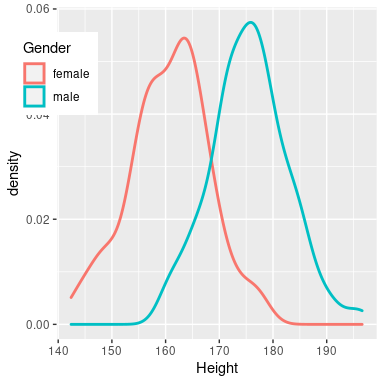

# 10 量化效果和设计研究

在前一章中，我们讨论了如何利用数据来检验假设。这些方法让我们在两个答案中二选一:我们要么拒绝零假设，要么同意零假设。然而，这种策略忽略了几个重要的问题。首先，我们想知道我们对答案有多不确定(不管最终是哪个答案)。此外，有时我们没有明确的零假设，所以我们希望看到什么范围的估计与数据一致。第二，我们想知道这种影响实际上有多大，因为正如我们在前一章的减肥例子中所看到的，在统计上效果明显的在实际情况中效果不一定明显。

在这一章中，我们将讨论解决这两个问题的方法:置信区间为我们提供了对不确定性的一种度量，效应大小提供了一种理解效应有多大的标准化方法。我们还将讨论统计功效的概念，它告诉我们有多大可能找到真实存在的效应。


## 10.1 置信区间

到目前为止，在本书中，我们一直专注于估计单值统计。例如，假设我们想要估计 NHANES 数据集中成年人的平均体重，那么我们从数据集中抽取一个样本并估计平均值。在这个样本中，平均重量是 79.92 千克。我们称之为*点估计*，因为它为我们提供了一个数字来描述我们对总体参数的估计。然而，从我们先前对抽样误差的讨论中我们知道，这个估计值有一些不确定性，用标准误差来描述。您还应该记住，标准误差由两个部分决定:总体标准偏差(分子)和样本大小的平方根(分母)。总体标准差是一个通常未知但固定的参数，不在我们的控制之下，而样本量*是*在我们的控制之下。因此，我们可以通过增加样本量来降低估计值的不确定性——直到达到整个人口规模的极限，此时根本不存在不确定性，因为我们可以直接从整个人口的数据中计算人口参数。

我们经常希望有一种方法可以更直接地描述统计估计的不确定性，这可以通过使用*置信区间*来实现。大多数人通过政治民意测验的“误差幅度”概念来熟悉置信区间。这些民意调查通常试图提供一个精确度在+/-3%以内的答案。例如，当候选人被估计以 9 个百分点的优势赢得选举，误差幅度为 3 时，他们将赢得的百分比被估计在 6-12 个百分点之内。在统计学中，我们将这种数值范围称为置信区间，它为我们的参数估计提供了一个与样本数据一致的数值范围，而不仅仅是基于数据给出一个估计值。置信区间越宽，我们对参数估计的不确定性就越大。

众所周知，置信区间令人困惑，主要是因为它们并不意味着我们直觉上认为它们意味着什么。如果我告诉你，我已经为我的统计量计算了一个“95%的置信区间”,那么很自然地认为我们可以有 95%的信心认为真实的参数值落在这个区间内。然而，正如我们将在整个课程中看到的，统计学中的概念通常并不意味着我们认为它们应该意味着什么。在置信区间的情况下，我们不能以这种方式解释它们，因为总体参数有一个固定的值——它要么在区间内，要么不在区间内，所以谈论发生的概率是没有意义的。置信区间的发明者杰吉·内曼说:

> "这个参数是一个未知的常数，不可能对它的值作出概率陈述." ( [J .内曼 1937](19.html#ref-Neyman37) )

相反，我们必须从我们看待假设检验的同一立场来看待置信区间过程:从长远来看，这一过程将允许我们以特定的概率做出正确的陈述。因此，对 95%置信区间的正确解释是，它是一个包含 95%时间的真实总体均值的区间，事实上，我们可以使用模拟来证实这一点，如下文所示。

平均值的置信区间计算方式为:
置信区间 = 点估计 ± 临界值*标准差

其中临界值由估计值的抽样分布决定。那么，重要问题是，我们如何获得抽样分布的估计值。


### 10.1.1 使用正态分布的置信区间

如果我们知道总体标准偏差，那么我们可以使用正态分布来计算置信区间。我们通常不这样做，但是在 NHANES 数据集的例子中，我们这样做了，因为我们将整个数据集视为总体(权重为 21.3)。

假设我们想要计算平均值的 95%置信区间。临界值将是标准正态分布的值，该值占分布的 95%；这些只是分布的第 2.5 百分位和第 97.5 百分位，我们可以使用我们的统计软件进行计算，得出


使用样本的估计平均值(79.92)和已知的总体标准差，我们可以计算出置信区间为[77.28，82.56]。


### 10.1.2 使用 t 分布的置信区间

如上所述，如果我们知道总体标准偏差，那么我们可以使用正态分布来计算我们的置信区间。然而，一般来说我们不会这样做, 因为*t* 分布更适合作为抽样分布。请记住，t分布比正态分布略宽，尤其是对于较小的样本，这意味着置信区间将比使用正态分布时略宽。这包含了当我们基于小样本估计参数时产生的额外不确定性。

我们可以以类似于上述正态分布示例的方式计算 95%的置信区间，但临界值由具有适当自由度的 *t* 分布的 2.5%和 97.5%决定。因此，均值x的置信区间为:


其中t_crit为临界t值。对于 NHANES砝码示例(样本量为250)，置信区间为 79.92 +/- 1.97 * 1.41 [77.15 - 82.69]。

请记住，这并不能告诉我们任何关于真实总体值落在该区间内的概率，因为它是一个固定参数(我们知道它是 81.77，因为在这种情况下我们有整个总体)，并且它要么落在这个特定区间内，要么不落在这个特定区间内(在这种情况下，它落在这个特定区间内)。相反，它告诉我们，从长远来看，如果我们使用这个过程计算置信区间，95%的时间置信区间将捕获真实的总体参数。

我们用 NHANES 的数据作为我们的整体可以看到这一点；在这种情况下，我们知道总体参数的真实值，因此我们可以看到置信区间在许多不同样本中捕获该值的频率。图 [10.1](#fig:CIcoverage) 显示了 NHANES 数据集中 100 个样本的估计平均重量的置信区间。其中，95 个获得了真实的人口平均体重，表明置信区间程序的表现，因为它应该。


图 10.1:从 NHANES 数据集中重复提取样本，并计算每个样本平均值的 95%置信区间。以红色显示的区间没有捕捉到真实的总体平均值(如虚线所示)。


### 10.1.3 置信区间和样本量

因为标准误差随着样本量的增加而减小，所以置信区间应该随着样本量的增加而变窄，从而为我们的估计提供越来越窄的界限。图 [10.2](#fig:CISampSize) 显示了置信区间是如何作为权重示例的样本大小的变化而变化的示例。从图中可以明显看出，随着样本量的增加，置信区间变得越来越窄，但样本量的增加会带来收益递减，这与置信区间项的分母与样本量的平方根成比例的事实相一致。


图 10.2:样本大小对均值置信区间宽度影响的例子。


### 10.1.4 使用自举计算置信区间

在某些情况下，我们不能假设正态分布，或者我们不知道统计的抽样分布。在这些情况下，我们可以使用 bootstrap(我们在第 [8](#resampling-and-simulation) 章中介绍过)。提醒一下，bootstrap 包括用替换数据重复重新采样数据，然后使用在这些样本上计算的统计分布作为统计抽样分布的替代。当我们使用 R 中内置的 bootstrapping 函数来计算 NHANES 样本中权重的置信区间时，结果如下:

```
## BOOTSTRAP CONFIDENCE INTERVAL CALCULATIONS
## Based on 1000 bootstrap replicates
## 
## CALL : 
## boot.ci(boot.out = bs, type = "perc")
## 
## Intervals : 
## Level     Percentile     
## 95%   (78, 84 )  
## Calculations and Intervals on Original Scale
```

这些值非常接近使用上述 t 分布获得的值，尽管不完全相同。


### 10.1.5 置信区间与假设检验的关系

置信区间和假设检验之间有密切的关系。特别是，如果置信区间不包括零假设，那么相关的统计检验将具有统计显著性。例如，如果您使用<math display="inline"><semantics><mrow><mi>α</mi><mo>=</mo><mn>0.05</mn></mrow><annotation encoding="application/x-tex">\α= 0.05</annotation></semantics></math>来测试样本的平均值是否大于零，您可以简单地检查零是否包含在平均值的 95%置信区间内。

如果我们想要比较两个条件的平均值 ( [申克尔和绅士 2001](ch020.xhtml#ref-sche:gent:2001) ) ，事情就变得更棘手了。有几种情况很明显。首先，如果每个平均值都包含在另一个平均值的置信区间内，那么在选定的置信水平上肯定没有显著差异。第二，如果置信区间之间没有重叠，那么在选定的水平上肯定有显著差异；事实上，这个测试基本上是*保守的*，这样实际的错误率将低于选择的水平。但是，如果置信区间彼此重叠，但不包含另一组的均值，该怎么办呢？在这种情况下，答案取决于两个变量的相对可变性，没有通用的答案。然而，人们通常应该避免使用重叠置信区间的“眼球测试”。


## 10.2 效果尺寸

> “统计显著性是结果中最无聊的地方。你应该用数量级来描述结果——不仅仅看疗效，而是它对人们的影响有多大。”吉恩·格拉斯，引自 ( [沙利文和费恩 2012](ch020.xhtml#ref-Sullivan:2012ta) )

在前一章，我们讨论了统计意义不一定反映实际意义的观点。为了讨论实际意义，我们需要一种标准的方法来描述实际数据中效应的大小，我们称之为*效应大小*。在本节中，我们将介绍这一概念，并讨论计算效应大小的各种方法。

效应大小是一种标准化的度量，它将某些统计效应的大小与参考量(如统计的可变性)进行比较。在一些科学和工程领域，这种想法被称为“信噪比”。有许多不同的方法可以量化影响大小，这取决于数据的性质。


### 10.2.1 科恩医生

最常见的效应大小测量方法之一被称为*科恩的 d* ，以统计学家雅各布·科恩(Jacob Cohen)的名字命名(他因 1994 年题为“地球是圆的(p < .05)”的论文而闻名)。它用于量化两个平均值之间的差异，即它们的标准偏差:


其中 X̄1 和 X̄2 是两个组的均值，s 是池化的标准差（是两个样本，按样本大小加权）

<caption>Table 10.1: Interpetation of Cohen’s D</caption>

| D | 解释 |
| --- | --- |
| 0.0 - 0.2 | 微不足道的 |
| 0.2 - 0.5 | 小的 |
| 0.5 - 0.8 | 媒介 |
| 0.8 - | 大的 |

根据 Cohen's d，有一个解释效果大小的常用尺度，如表 [10.1](#tab:dInterp) 所示。查看基础的判定规则有助于理解这些解释。例如，参照我们上面的表格，成人身高性别差异的影响大小(d = 2.05)非常大。我们也可以通过观察 NHANES 数据集样本中男性和女性身高的分布来了解这一点。图 [10.3](#fig:genderHist) 显示这两种分布很好地分开，尽管仍然重叠，这突出了一个事实，即使两组之间的差异有很大的影响大小，每个组中也会有更像另一组的个体。



图 10.3:NHANES 数据集中男性和女性身高的平滑直方图，显示了明显不同但也明显重叠的分布。

同样值得注意的是，我们很少在科学中遇到这种量级的影响，部分原因是它们的影响如此明显，以至于我们不需要科学研究来发现它们。正如我们将在关于再现性的第 [18](#doing-reproducible-research) 章中看到的，科学研究中报道的非常大的效应通常反映了可疑研究实践的使用，而不是自然界中真正巨大的效应。同样值得注意的是，即使是如此巨大的影响，两种分布仍然重叠——会有一些女性比一般男性高，反之亦然。对于大多数有趣的科学效应来说，重叠的程度要大得多，所以我们不应该根据一个很大的效应大小就立即对来自不同人群的个体做出主观性很强的结论。


### 10.2.2 皮尔森的 r

皮尔逊的 *r* ，也被称为*相关系数*，是衡量两个连续变量之间线性关系强度的指标。我们将在第 13 章[中更详细地讨论相关性，所以我们将把细节留到那一章；这里，我们简单地引入 *r* 作为一种量化两个变量之间关系的方法。](#modeling-continuous-relationships)

*r* 是一个从-1 到 1 变化的测度，其中值 1 代表变量之间完全正相关，0 代表不相关，-1 代表完全负相关。图 [10.4](#fig:corrFig) 显示了使用随机生成数据的各种相关水平的示例。


图 10.4:不同等级皮尔逊风险比的例子。


### 10.2.3 赔率

在我们之前关于概率的讨论中，我们讨论了几率的概念，即某个事件发生与不发生的相对可能性:


我们还讨论了*赔率*，简单来说就是两个赔率的比值。比值比是描述二元变量效应大小的一种有用方法。

例如，让我们以吸烟导致肺癌为例。2012 年发表在《国际癌症杂志》上的一项研究 ( [Pesch et al. 2012](ch020.xhtml#ref-pesc:kend:gust:2012) ) 综合了许多不同研究中关于吸烟者和从不吸烟者肺癌发生率的数据。请注意，这些数据来自病例对照研究，这意味着这些研究的参与者是因为他们患有或未患有癌症而被招募的；然后检查他们的吸烟状况。因此，这些数字(如表 [10.2](#tab:smokingData) 所示)并不代表普通人群中吸烟者的癌症患病率——但它们可以告诉我们癌症和吸烟之间的关系。

<caption>Table 10.2: Lung cancer occurrence separately for current smokers and those who have never smoked</caption>

| 状态 | 从不吸烟 | 正在吸烟者 |
| --- | --- | --- |
| 没有肺癌 | 2883| 3829| 
| 患有肺癌 | 220|  6784| 

我们可以将这些数字转换成每一组的优势比。不吸烟者患肺癌的几率为 0.08，而当前吸烟者患肺癌的几率为 1.77。这些比值比告诉我们两组之间患癌的相对可能性:比值比 23.22 告诉我们，吸烟者患肺癌的几率大约比不吸烟者高 23 倍。


## 10.3 统计的力量

请记住上一章的内容，在奈曼-皮尔森假设检验方法下，我们必须指定我们对两种错误的容忍度:假阳性(他们称之为*第一类错误*)和假阴性(他们称之为*第二类错误*)。人们经常把注意力集中在第一类错误上，因为做出一个错误的被认为是一件非常糟糕的事情；例如，韦克菲尔德( [1999](ch020.xhtml#ref-wake:1999) ) 声称自闭症与疫苗接种有关，这一不可信的说法导致了反疫苗情绪，导致麻疹等儿童疾病大幅增加。同样，我们也不想声称一种药物可以治愈一种疾病，但它实际又不能治愈疾病。这也是为什么 I 类误差的容差一般设置的相当低，通常为<math display="inline"><semantics><mrow><mi>α</mi><mo>=</mo><mn>0.05</mn></mrow><annotation encoding="application/x-tex">\α= 0.05</annotation></semantics></math>。但是第二类错误又是什么情况呢？

*统计功效*的概念是第二类错误的补充——也就是说，它是在假设存在的情况下找到阳性结果的可能性:


奈曼-皮尔逊模型我们之前没有讨论的另一个重要的模型，除了规定第一类和第二类错误的可接受水平，我们还必须描述一个具体的替代假设——即，我们希望检测的影响大小是多少？否则，我们无法解读<math display="inline"><semantics><mi>β</mi><annotation encoding="application/x-tex">\β</annotation></semantics></math>——发现大效应的可能性总是会高于发现小效应的可能性，因此<math display="inline"><semantics><mi>【β</mi><annotation encoding="application/x-tex">\β</annotation></semantics></math>会因我们试图检测的效应大小而有所不同。

有三个因素会影响统计能力:

*   样本量:样本越大，统计能力越强
*   效果大小:一个给定的设计总是比一个小的效果有更大的力量去发现大的效果(因为发现大的效果更容易)
*   I 型误差率:I 型误差和效果之间存在一种关系，即(在其他条件相同的情况下)降低 I 型误差也会降低效果。

我们可以通过模拟看到这一点。首先让我们模拟一个实验，在这个实验中，我们使用标准的 t 检验来比较两组的平均值。我们将改变影响的大小(根据 Cohen's d )、I 型错误率和样本大小，对于其中的每一项，我们将检查显著结果(即功效)的比例是如何受到影响的。图 [10.5](#fig:plotPowerSim) 显示了功率作为这些因素的函数如何变化的示例。


图 10.5:功率模拟的结果，显示功率作为样本大小的函数，效果大小显示为不同的颜色，alpha 显示为线型。80%功率的标准标准由黑色虚线表示。

这个模拟向我们表明，即使样本大小为 96，我们也只弱弱的来找到一个不明显效果(<math xmlns:epub="http://www.idpf.org/2007/ops" display="inline"><semantics><mrow><mi>d</mi><mo>=</mo><mn>0.2</mn></mrow><annotation encoding="application/x-tex">d = 0.2</annotation></semantics></math>)与<math xmlns:epub="http://www.idpf.org/2007/ops" display="inline"><semantics><mrow><mi>α</mi><mo>=</mo><mn>0.005</mn></mrow><annotation encoding="application/x-tex">\α= 0.005 这意味着一项为此而设计的研究将是徒劳的——也就是说，即使这种规模的效应确实存在，但我们无法找到。</annotation></semantics></math>

关注统计能力至少有两个重要原因。首先，如果你是一名研究人员，你可能不想把时间花在徒劳的实验上。进行一项驱动力不足的研究基本上是徒劳的，因为这意味着即使存在效果，人们发现效果的可能性也非常低。第二，事实证明，与有力的研究相比，来自力度不足的研究的任何积极发现更有可能是错误的，这一点我们将在第 [18](#doing-reproducible-research) 章中更详细地讨论。


### 10.3.1 功率分析

幸运的是，有工具可以让我们确定实验的统计能力。这些工具最常见的用途是在计划一个实验时，当我们想要确定我们的样本需要多大，以便有足够的能力找到我们感兴趣的效果。

比方说，我们有兴趣开展一项研究，探讨 iOS 设备用户和 Android 设备用户之间的特定个性特征有何不同。我们的计划是收集两组人，测量他们的个性特征，然后用 t 检验比较两组人。在这种情况下，我们会认为一个中等效应(<math display="inline"><semantics><mrow><mi>【d】</mi><mo>=</mo><mn>0.5</mn></mrow><annotation encoding="application/x-tex">d = 0.5</annotation></semantics></math>)是有科学意义的，因此我们将使用那个水平来进行我们的功率分析。为了确定必要的样本量，我们可以使用统计软件中的幂函数:

```
## 
##      Two-sample t test power calculation 
## 
##               n = 64
##           delta = 0.5
##              sd = 1
##       sig.level = 0.05
##           power = 0.8
##     alternative = two.sided
## 
## NOTE: n is number in *each* group
```

这告诉我们，每组至少需要 64 名受试者，才能有足够的力量发现中等大小的效应。在开始新的研究之前，进行功效分析总是很重要的，以确保研究不会因为样本太小而无效。

你可能会想到，如果效应大小足够大，那么所需的样本就会非常小。例如，如果我们运行相同的功效分析，效果大小为 d=2，那么我们将看到，我们只需要每组约 5 名受试者就有足够的功效来发现差异。

```
## 
##      Two-sample t test power calculation 
## 
##               n = 5.1
##               d = 2
##       sig.level = 0.05
##           power = 0.8
##     alternative = two.sided
## 
## NOTE: n is number in *each* group
```

然而，在科学界，我们很少会在实验中发现如此大的影响——就像我们不需要统计数据来告诉我们 16 岁的孩子比 6 岁的孩子高一样。当我们进行功效分析时，我们需要指定一个对我们的研究看似合理，而且科学上有趣的效应大小，这通常来自以前的研究。然而，在第 [18](#doing-reproducible-research) 章中，我们将讨论一种被称为“赢家的诅咒”的现象，这种现象可能会导致发现的效果尺寸大于真实的效果尺寸，因此这一点也应该记住。


## 10.4 学习目标

阅读完本章后，您应该能够:

*   正确的阐释置信区间的概念，并计算给定数据集平均值的置信区间。
*   定义效应大小的概念，并计算给定测试的效应大小。
*   描述统计能力的概念以及它对研究的重要性。


## 10.5 建议读物

*   [Hoekstra 等人对置信区间的错误理解](http://www.ejwagenmakers.com/inpress/HoekstraEtAlPBR.pdf)


