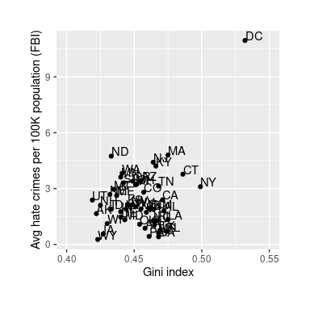
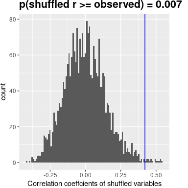
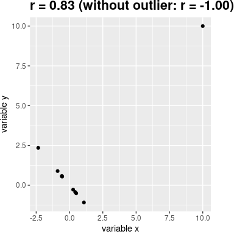
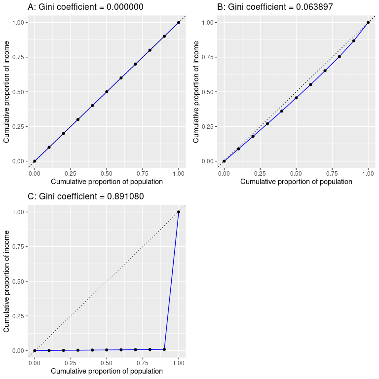
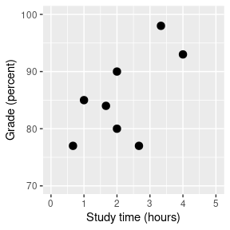

## 11.1 生成模型

假设你走在街上，你的一个朋友路过，但没有打招呼。你可能会试图决定为什么会发生这种事——他们没有看到你吗？他们生你的气吗？你突然被一个魔法隐身盾牌遮住了吗？贝叶斯统计背后的一个基本思想是，我们希望根据数据本身推断出数据是如何生成的细节。在这种情况下，您希望使用数据（即，您的朋友没有打招呼）来推断生成数据的过程（例如，他们是否真的看到您，他们对您的感觉如何等）。

生成模型背后的思想是，我们观察由 _ 潜在的 _（看不见）过程生成的数据，通常在过程中具有一定的随机性。事实上，当我们从一个群体中抽取一个数据样本，并从样本中估计一个参数时，我们所做的实质上是尝试学习一个潜在变量（群体平均值）的值，这个潜在变量是通过对观察到的数据（样本平均值）进行抽样而产生的。

如果我们知道潜在变量的值，那么很容易重建观测数据应该是什么样子。例如，假设我们在抛硬币，我们知道这是公平的。我们可以用 p=0.5 的二项式分布来描述硬币，然后我们可以从这种分布中生成随机样本，以观察观察到的数据应该是什么样的。然而，总的来说，我们处于相反的情况：我们不知道潜在的利益变量的价值，但我们有一些数据，我们想用来估计它。## 11.2 贝叶斯定理与逆推理

贝叶斯统计之所以有它的名字，是因为它利用了贝叶斯定理，从数据中作出推论，使之返回到生成数据的（潜在）模型的某些特征。假设我们想知道一枚硬币是否公平。为了测试这一点，我们将硬币翻转 10 次，然后拿出 7 个硬币头。在这个测试之前，我们很确定硬币是公平的（即），但是这些数据确实让我们停顿了一下。我们已经知道如何计算条件概率，如果硬币真的是公平的（htg1），我们会用二项分布从 10 中倒出 7 个或更多的头。

```r
# compute the conditional probability of 7 or more heads when p(heads)=0.5
sprintf(
  "p(7 or more heads | p(heads) = 0.5) = %.3f",
  pbinom(7, 10, .5, lower.tail = FALSE)
)
```

```r
## [1] "p(7 or more heads | p(heads) = 0.5) = 0.055"
```

这是一个相当小的数字，但这个数字并不能真正回答我们所问的问题——它告诉我们，考虑到头部的特定概率，7 个或更多头部的可能性，而我们真正想知道的是头部的概率。这听起来应该很熟悉，因为这正是我们进行无效假设测试的情况，它告诉我们数据的可能性，而不是假设的可能性。

记住，贝叶斯定理为我们提供了一个工具，我们需要它来反转条件概率：


我们可以认为这个定理有四个部分：

*   先验（）：我们在看到数据 D 之前对假设 H 的信任程度。
*   可能性（）：假设 h 下观察数据 d 的可能性有多大？
*   边际可能性（）：观察到的数据结合所有可能的假设的可能性有多大？
*   后验（）：我们对假设 h 的最新看法，给出了数据 d。

这里我们看到了频率主义和贝叶斯统计的主要区别之一。频率主义者不相信假设概率的概念（即我们对假设的信仰程度），对他们来说，假设要么是真的，要么不是真的。另一种说法是，对于频率主义者，假设是固定的，数据是随机的，这就是为什么频率主义者 ST 推理的重点是描述给定假设（即 P 值）的数据概率。另一方面，贝叶斯则乐于对数据和假设进行概率陈述。## 11.3 进行贝叶斯估计

我们最终希望使用贝叶斯统计来测试假设，但是在我们这样做之前，我们需要估计测试假设所需的参数。这里我们将介绍贝叶斯估计的过程。让我们用另一个筛选示例：机场安全筛选。如果你像我一样经常飞行，那么在随机爆炸物筛选结果恢复正常之前只是个时间问题；2001 年 9 月 11 日之后不久，当机场保安人员特别紧张时，我有过这种特别不幸的经历。

安全人员想知道的是，考虑到机器进行了正面测试，一个人携带爆炸物的可能性是多少。让我们来介绍一下如何使用贝叶斯分析计算这个值。

### 11.3.1 规定

为了使用贝叶斯定理，我们首先需要为假设指定先验概率。在这种情况下，我们不知道实数，但我们可以假设它很小。根据[联邦航空局](https://www.faa.gov/air_traffic/by_the_numbers/media/Air_Traffic_by_the_Numbers_2018.pdf)，2017 年美国有 971595898 名乘客。在这个例子中，假设有一个旅行者的包里装着炸药

```r
prior <- 1/971595898
```

### 11.3.2 收集一些数据

数据由炸药筛选试验结果组成。让我们假设安全人员通过他们的测试设备运行了 10 次袋子，它给出了 10 次测试中 9 次的正读数。

```r
nTests <- 10
nPositives <- 9
```

### 11.3.3 计算可能性

我们要在假设袋中有炸药的情况下计算数据的可能性。假设我们知道测试的灵敏度是 0.99——也就是说，当一个设备存在时，它将 99%的时间检测到它。为了确定在设备存在的假设下数据的可能性，我们可以将每个测试视为伯努利试验（即结果为真或假的试验），成功概率为 0.99，我们可以使用二项式分布来建模。

```r
likelihood <- dbinom(nPositives, nTests, 0.99)
likelihood
```

```r
## [1] 0.091
```

### 11.3.4 计算边际可能性

我们还需要知道数据的总体可能性——也就是说，在 10 个测试中找出 9 个阳性。计算边际似然性通常是贝叶斯分析中最困难的方面之一，但对于我们的例子来说，这很简单，因为我们可以利用我们在[3.7 节](#bayestheorem)中介绍的贝叶斯定理的具体形式：


在这种情况下，边际可能性是存在或不存在爆炸物时数据可能性的加权平均值，乘以存在爆炸物的概率（即先验概率）。在这种情况下，假设我们知道测试的特异性是 0.9，这样当没有爆炸物时，阳性结果的可能性是 0.1。

我们可以用 r 计算，如下所示：

```r
marginal_likelihood <- 
  dbinom(
    x = nPositives, 
    size = nTests, 
    prob = 0.99
  ) * prior + 
  dbinom(
    x = nPositives, 
    size = nTests, 
    prob = .1
  ) * 
  (1 - prior)

sprintf("marginal likelihood = %.3e", marginal_likelihood)
```

```r
## [1] "marginal likelihood = 9.094e-09"
```

### 11.3.5 计算后部

我们现在有了所有需要计算炸药存在后验概率的部分，假设在 10 个测试中观察到 9 个阳性结果。

```r
posterior <- (likelihood * prior) / marginal_likelihood
posterior
```

```r
## [1] 0.01
```

这一结果表明，袋中爆炸物的概率远高于之前的概率，但几乎不确定，再次强调了一个事实，即测试罕见事件几乎总是容易产生大量的假阳性。## 11.4 估计后验分布

在前一个例子中，只有两种可能的结果——爆炸物要么在那里，要么不在那里——我们想知道给出数据后，哪种结果最有可能。但是，在其他情况下，我们希望使用贝叶斯估计来估计参数的数值。比如说，我们想知道一种新的止痛药的有效性；为了测试这一点，我们可以给一组病人服用这种药物，然后询问他们服用这种药物后疼痛是否有所改善。我们可以使用贝叶斯分析来估计药物对谁有效的比例。

### 11.4.1 规定

在这种情况下，我们没有任何关于药物有效性的先验信息，因此我们将使用 _ 均匀分布 _ 作为先验值，因为所有值在均匀分布下都是相同的。为了简化示例，我们将只查看 99 个可能有效性值的子集（从.01 到.99，步骤为.01）。因此，每个可能值的先验概率为 1/99。

### 11.4.2 收集一些数据

我们需要一些数据来估计药物的效果。假设我们给 100 个人用药，结果如下：

```r
# create a table with results
nResponders <- 64
nTested <- 100

drugDf <- tibble(
  outcome = c("improved", "not improved"),
  number = c(nResponders, nTested - nResponders)
)
pander(drugDf)
```

<colgroup><col style="width: 20%"> <col style="width: 11%"></colgroup> 
| 结果 | 数 |
| --- | --- |
| 改进 | 64 个 |
| 没有改善 | 36 岁 |

### 11.4.3 计算可能性

我们可以使用 r 中的`dbinom()`函数计算有效性参数的任何特定值下的数据的可能性。在图[11.1](#fig:like2)中，您可以看到响应器数量对几个不同值的可能性曲线。从这一点来看，我们观察到的数据在假设下的可能性相对较大，在假设下的可能性相对较小，在假设下的可能性相对较小。贝叶斯推理的一个基本思想是，我们将试图找到我们感兴趣的参数的值，这使得数据最有可能，同时也考虑到我们的先验知识。



图 11.1 几个不同假设下每个可能数量的应答者的可能性（P（应答）=0.5（红色），0.7（绿色），0.3（黑色）。观察值以蓝色显示。

### 11.4.4 计算边际可能性

除了不同假设下数据的可能性外，我们还需要知道数据的总体可能性，并结合所有假设（即边际可能性）。这种边际可能性主要是重要的，因为它有助于确保后验值是真实概率。在这种情况下，我们使用一组离散的可能参数值使得计算边际似然变得容易，因为我们只需计算每个假设下每个参数值的似然，并将它们相加。

```r
# compute marginal likelihood
likeDf <- 
  likeDf %>%
  mutate(uniform_prior = array(1 / n()))

# multiply each likelihood by prior and add them up
marginal_likelihood <- 
  sum(
    dbinom(
      x = nResponders, # the number who responded to the drug
      size = 100, # the number tested
      likeDf$presp # the likelihood of each response 
    ) * likeDf$uniform_prior
  )

sprintf("marginal likelihood = %0.4f", marginal_likelihood)
```

```r
## [1] "marginal likelihood = 0.0100"
```

### 11.4.5 计算后部

我们现在有了所有需要计算所有可能值的后验概率分布的部分，如图[11.2](#fig:posteriorDist)所示。

```r
# Create data for use in figure
bayesDf <-
  tibble(
    steps = seq(from = 0.01, to = 0.99, by = 0.01)
  ) %>%
  mutate(
    likelihoods = dbinom(
      x = nResponders, 
      size = 100, 
      prob = steps
    ),
    priors = dunif(steps) / length(steps),
    posteriors = (likelihoods * priors) / marginal_likelihood
  )
```



图 11.2 蓝色后验概率分布图与均匀前验概率分布图（黑色虚线）。

### 11.4.6 最大后验概率（MAP）估计

根据我们的数据，我们希望获得样本的估计值。一种方法是找到后验概率最高的值，我们称之为后验概率（map）估计的 _ 最大值。我们可以从[11.2](#fig:posteriorDist)中的数据中找到：_

```r
# compute MAP estimate
MAP_estimate <- 
  bayesDf %>% 
  arrange(desc(posteriors)) %>% 
  slice(1) %>% 
  pull(steps)

sprintf("MAP estimate = %0.4f", MAP_estimate)
```

```r
## [1] "MAP estimate = 0.6400"
```

请注意，这只是样本中反应者的比例——这是因为之前的反应是一致的，因此没有影响我们的反应。

### 11.4.7 可信区间

通常我们想知道的不仅仅是对后位的单一估计，而是一个我们确信后位下降的间隔。我们之前讨论过频繁推理背景下的置信区间概念，您可能还记得，置信区间的解释特别复杂。我们真正想要的是一个区间，在这个区间中，我们确信真正的参数会下降，而贝叶斯统计可以给我们一个这样的区间，我们称之为 _ 可信区间 _。

在某些情况下，可信区间可以根据已知的分布用数字 _ 计算，但从后验分布中取样，然后计算样本的分位数更常见。当我们没有一个简单的方法来用数字表示后验分布时，这是特别有用的，在实际的贝叶斯数据分析中经常是这样。_

我们将使用一个简单的算法从我们的后验分布中生成样本，该算法被称为[_ 拒绝抽样 _](https://am207.github.io/2017/wiki/rejectionsampling.html)。我们的想法是从一个均匀分布中选择 x 的随机值（在本例中为）和 y 的随机值（在本例中为的后验概率）。然后，只有在—这种情况下，如果随机选择的 y 值小于 y 的实际后验概率，我们才接受样本。图[11.3](#fig:rejectionSampling)显示了使用拒绝抽样的样本的直方图示例，以及使用 th 获得的 95%可信区间。是方法。

```r
# Compute credible intervals for example

nsamples <- 100000

# create random uniform variates for x and y
x <- runif(nsamples)
y <- runif(nsamples)

# create f(x)
fx <- dbinom(x = nResponders, size = 100, prob = x)

# accept samples where y < f(x)
accept <- which(y < fx)
accepted_samples <- x[accept]

credible_interval <- quantile(x = accepted_samples, probs = c(0.025, 0.975))
pander(credible_interval)
```

<colgroup><col style="width: 9%"> <col style="width: 9%"></colgroup> 
| 2.5% | 98% |
| --- | --- |
| 0.54 分 | 0.72 分 |



图 11.3 拒绝抽样示例。黑线表示 P（响应）所有可能值的密度；蓝线表示分布的 2.5%和 97.5%，表示 P（响应）估计的 95%可信区间。

这个可信区间的解释更接近于我们希望从置信区间（但不能）中得到的结果：它告诉我们，95%的概率的值介于这两个值之间。重要的是，它表明我们对有很高的信心，这意味着该药物似乎有积极的效果。

### 11.4.8 不同先验的影响

在上一个例子中，我们在之前使用了 _ 平面，这意味着我们没有任何理由相信的任何特定值或多或少是可能的。然而，假设我们是从一些以前的数据开始的：在之前的一项研究中，研究人员测试了 20 个人，发现其中 10 个人的反应是积极的。这将引导我们从先前的信念开始，即治疗对 50%的人有效果。我们可以做与上面相同的计算，但是使用我们以前的研究中的信息来通知我们之前的研究（参见图[11.4](#fig:posteriorDistPrior)）。_

```r
# compute likelihoods for data under all values of p(heads) 
# using a flat or empirical prior.  
# here we use the quantized values from .01 to .99 in steps of 0.01

df <-
  tibble(
    steps = seq(from = 0.01, to = 0.99, by = 0.01)
  ) %>%
  mutate(
    likelihoods = dbinom(nResponders, 100, steps),
    priors_flat = dunif(steps) / sum(dunif(steps)),
    priors_empirical = dbinom(10, 20, steps) / sum(dbinom(10, 20, steps))
  )

marginal_likelihood_flat <- 
  sum(dbinom(nResponders, 100, df$steps) * df$priors_flat)

marginal_likelihood_empirical <- 
  sum(dbinom(nResponders, 100, df$steps) * df$priors_empirical)

df <- 
  df %>%
  mutate(
    posteriors_flat = 
      (likelihoods * priors_flat) / marginal_likelihood_flat,
    posteriors_empirical = 
      (likelihoods * priors_empirical) / marginal_likelihood_empirical
  )
```


图 11.4 先验对后验分布的影响。基于平坦先验的原始后验分布用蓝色绘制。根据对 20 人中 10 名反应者的观察，先验者被画成黑色虚线，后验者被画成红色。

注意，可能性和边际可能性并没有改变——只有先前的改变。手术前改变的效果是将后路拉近新手术前的质量，中心为 0.5。

现在，让我们看看如果我们以一个更强大的先验信念来进行分析会发生什么。假设之前的研究没有观察到 20 人中有 10 人有反应，而是测试了 500 人，发现 250 人有反应。原则上，这应该给我们一个更强大的先验，正如我们在图[11.5](#fig:strongPrior)中所看到的，这就是发生的事情：先验的集中度要高出 0.5 左右，后验的集中度也更接近先验。一般的观点是贝叶斯推理将先验信息和似然信息结合起来，并对每一种推理的相对强度进行加权。

```r
# compute likelihoods for data under all values of p(heads) using strong prior.

df <-
  df %>%
  mutate(
    priors_strong = dbinom(250, 500, steps) / sum(dbinom(250, 500, steps))
  )

marginal_likelihood_strong <- 
  sum(dbinom(nResponders, 100, df$steps) * df$priors_strong)

df <-
  df %>%
  mutate(
    posteriors_strongprior = (likelihoods * priors_strong) / marginal_likelihood_strong
  )
```


图 11.5：前向强度对后向分布的影响。蓝线显示了 100 人中 50 个人头使用先验图获得的后验图。虚线黑线显示的是 500 次翻转中 250 个头部的先验图像，红线显示的是基于先验图像的后验图像。

这个例子也突出了贝叶斯分析的顺序性——一个分析的后验可以成为下一个分析的前验。

最后，重要的是要认识到，如果先验足够强，它们可以完全压倒数据。假设你有一个绝对先验，它等于或大于 0.8，这样你就把所有其他值的先验概率设置为零。如果我们计算后验，会发生什么？

```r
# compute likelihoods for data under all values of p(respond) using absolute prior. 
df <-
  df %>%
  mutate(
    priors_absolute = array(data = 0, dim = length(steps)),
    priors_absolute = if_else(
      steps >= 0.8,
      1, priors_absolute
    ),
    priors_absolute = priors_absolute / sum(priors_absolute)
  )

marginal_likelihood_absolute <- 
  sum(dbinom(nResponders, 100, df$steps) * df$priors_absolute)

df <-
  df %>%
  mutate(
    posteriors_absolute = 
      (likelihoods * priors_absolute) / marginal_likelihood_absolute
  )
```



图 11.6：前向强度对后向分布的影响。蓝线表示使用绝对先验得到的后验值，表示 P（响应）大于等于 0.8。前面的内容显示在黑色虚线中。

在图[11.6](#fig:absolutePrior)中，我们发现，在先前设置为零的任何值的后面都存在零密度-数据被绝对先前覆盖。## 11.5 选择优先权

先验对结果推断的影响是贝叶斯统计中最具争议的方面。有很多种方法可以选择一个人的先验，这（如我们上面所看到的）会影响结果的推论。_ 非形成性先验 _ 试图尽可能少地偏倚产生的后验，正如我们在上述均匀先验的例子中看到的。使用 _ 弱信息先验 _（或 _ 默认先验 _）也很常见，这只会对结果产生很小的偏差。例如，如果我们使用基于两个硬币翻转中一个头的二项式分布，那么前面的硬币将集中在 0.5 左右，但相当平坦，只稍微偏向后面的硬币。

也可以根据科学文献或现有数据使用先验，我们称之为 _ 经验先验 _。然而，总的来说，我们将坚持使用不具形成性/信息不足的先验，因为它们对偏向我们的结果提出的关注最少。一般来说，使用多个合理先验来尝试任何贝叶斯分析都是一个好主意，并确保结果不会在基于先验的重要方面发生变化。## 11.6 贝叶斯假设检验

在学习了如何执行贝叶斯估计之后，我们现在转向使用贝叶斯方法进行假设检验。假设有两位政治家对公众是否支持死刑持不同的看法。史密斯参议员认为只有 40%的人支持死刑，而琼斯参议员认为 60%的人支持死刑。他们安排了一个民意测验来测试这一点，随机抽取 1000 人，询问他们是否支持死刑。调查结果显示，在接受调查的样本中，490 人支持死刑。基于这些数据，我们想知道：这些数据支持一位参议员对另一位参议员的主张吗？我们可以使用一个名为[贝叶斯因子](https://bayesfactor.blogspot.com/2014/02/the-bayesfactor-package-this-blog-is.html)的概念来测试这一点。

### 11.6.1 贝叶斯因子

贝叶斯因子表征了两种不同假设下数据的相对似然性。定义如下：


对于两个假设和。对于我们的两位参议员，我们知道如何使用二项分布计算每个假设下数据的可能性。我们将把史密斯参议员作为分子，琼斯参议员作为分母，这样一个大于一的值将为史密斯参议员反映出更多的证据，而一个小于一的值将为琼斯参议员反映出更多的证据。

```r
# compute Bayes factor for Smith vs. Jones

bf <-
  dbinom(
    x = 490,
    size = 1000,
    prob = 0.4 #Smith's hypothesis
  ) / dbinom(
    x = 490, 
    size = 1000, 
    prob = 0.6 #Jones' hypothesis
  )

sprintf("Bayes factor = %0.2f", bf)
```

```r
## [1] "Bayes factor = 3325.26"
```

这个数字提供了数据提供的关于两个假设的证据的度量——在本例中，它告诉我们数据支持史密斯参议员的力度是他们支持琼斯参议员的 3000 倍。

### 11.6.2 统计假设的贝叶斯因子

在前一个例子中，我们有来自每个参议员的具体预测，这些预测的可能性我们可以用二项分布来量化。然而，在实际数据分析中，我们通常必须处理参数的不确定性，这会使贝叶斯因子复杂化。然而，作为交换，我们获得了量化相对数量的证据的能力，支持无效假设与替代假设。

假设我们是一名医学研究人员，正在进行糖尿病治疗的临床试验，我们希望知道与安慰剂相比，某种药物是否能降低血糖。我们招募了一组志愿者，将他们随机分配到药物组或安慰剂组，并在给药或安慰剂期间测量各组血红蛋白 A1c（血糖水平的一个标记）的变化。我们想知道的是：药物和安慰剂之间有区别吗？

首先，让我们生成一些数据，并使用空假设测试对其进行分析（参见图[11.7](#fig:bayesTesting)）。

```r
# create simulated data for drug trial example

set.seed(123456)
nsubs <- 40
effect_size <- 0.1

# randomize indiviuals to drug (1) or placebo (0)
drugDf <-
  tibble(
    group = as.integer(runif(nsubs) > 0.5)
  ) %>%
  mutate(
    hbchange = rnorm(nsubs) - group * effect_size
  )
```



图 11.7 显示药物和安慰剂组数据的方框图。

让我们进行一个独立的样本 t 检验，这表明两组之间存在显著差异：

```r
# compute t-test for drug example
drugTT <- t.test(hbchange ~ group, alternative = "greater", data = drugDf)
print(drugTT)
```

```r
## 
##  Welch Two Sample t-test
## 
## data:  hbchange by group
## t = 2, df = 40, p-value = 0.03
## alternative hypothesis: true difference in means is greater than 0
## 95 percent confidence interval:
##  0.096   Inf
## sample estimates:
## mean in group 0 mean in group 1 
##            0.12           -0.48
```

这个测试告诉我们，两组之间存在显著的差异，但是它并不能量化证据支持无效假设和替代假设的强度。为了测量这一点，我们可以使用 r 中 bayes factor 包中的`ttestBF`函数计算贝叶斯因子：

```r
# compute Bayes factor for drug data
bf_drug <- ttestBF(
  formula = hbchange ~ group, data = drugDf,
  nullInterval = c(0, Inf)
)

bf_drug
```

```r
## Bayes factor analysis
## --------------
## [1] Alt., r=0.707 0<d<Inf    : 2.4  ±0%
## [2] Alt., r=0.707 !(0<d<Inf) : 0.12 ±0%
## 
## Against denominator:
##   Null, mu1-mu2 = 0 
## ---
## Bayes factor type: BFindepSample, JZS
```

这里的贝叶斯因子告诉我们，替代假设（即差异大于零）比给定数据的点零假设（即平均差为零）的可能性高出 2.4 倍。

#### 11.6.2.1 单侧试验

我们通常对针对特定点值（例如，平均差=0）的零假设进行测试的兴趣低于针对定向零假设（例如，差小于或等于零）进行测试的兴趣。我们也可以使用`ttestBF`分析的结果进行定向（或 _ 单边 _）测试，因为它提供了两个 Bayes 因素：一个是平均差大于零的替代假设，另一个是平均差为 l 的替代假设。小于零。如果我们想评估正效应的相对证据，我们可以通过简单地将返回的两个 Bayes 因子除以函数来计算 Bayes 因子，比较正效应和负效应的相对证据：

```r
bf_drug[1]/bf_drug[2]
```

```r
## Bayes factor analysis
## --------------
## [1] Alt., r=0.707 0<d<Inf : 20 ±0%
## 
## Against denominator:
##   Alternative, r = 0.707106781186548, mu =/= 0 !(0<d<Inf) 
## ---
## Bayes factor type: BFindepSample, JZS
```

现在我们看到，正效应和负效应的贝叶斯因子大得多（接近 20）。

#### 11.6.2.2 解释贝叶斯因子

我们如何知道 2 或 20 的贝叶斯因子是好是坏？[Kass&Rafferty（1995）](https://www.andrew.cmu.edu/user/kk3n/simplicity/KassRaftery1995.pdf)提出了一个解释 Bayes 因子的一般准则：

| 高炉 | 证据的效力 |
| --- | --- |
| 1 到 3 | 只值得一提 |
| 3 至 20 | 积极的 |
| 20 至 150 | 坚强的 |
| &150 英镑 | 非常强壮 |

在此基础上，尽管统计结果是显著的，但支持替代假设与点零假设的证据数量足够弱，甚至不值得一提，而方向假设的证据是积极的，但不太强。

### 11.6.3 评估无效假设的证据

因为 Bayes 因子正在比较两个假设的证据，它还允许我们评估是否有支持空假设的证据，而标准的空假设测试无法做到这一点（因为它从空值为真的假设开始）。这对于确定一个非重大的结果是否真的提供了有力的证据证明没有效果，或者只是反映了总体上的薄弱证据是非常有用的。## 11.7 阅读建议

*   _ 永不消亡的理论：拜耳法则是如何破解谜代码，追捕俄罗斯潜艇，并在两个世纪的争论中取得胜利的（HTG1），作者是莎朗·伯茨·麦格雷恩（Sharon Bertsch McGrayne）。_
*   _ 做贝叶斯数据分析：约翰·K·克鲁施克的 R_ 教程介绍