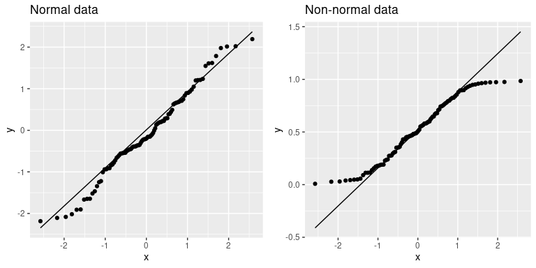

## 13.1 一个例子：仇恨犯罪和收入不平等

2017 年，网站 fivethirtyeight.com 发表了一篇题为“仇恨犯罪率上升与收入不平等（htg1）”的文章，讨论了 2016 年总统选举后仇恨犯罪率与收入不平等之间的关系。报道分析了来自联邦调查局和南方贫困法中心的仇恨犯罪数据，并据此报告：

> “我们发现，收入不平等是全美国调整人口仇恨犯罪和仇恨事件的最重要决定因素”。

此分析的数据包含在`fivethirtyeight`r 包中，这使得我们很容易访问它们。报道中的分析集中在收入不平等（定义为一个叫做 _ 基尼指数 _ 的量）与各州仇恨犯罪流行率之间的关系。

### 13.1.1 量化不平等：基尼指数

在我们查看报道中的分析之前，首先要了解如何使用基尼指数来量化不平等。基尼指数通常用一条曲线来定义，这条曲线描述了收入与收入水平等于或小于该水平的人口比例之间的关系，称为 _ 洛伦兹曲线 _。然而，另一种更直观的思考方式是：收入之间的相对平均绝对差异除以二（摘自[https://en.wikipedia.org/wiki/gini_coefficient](https://en.wikipedia.org/wiki/Gini_coefficient)）：


图 13.1 洛伦兹曲线表示 a）完全平等，b）正态分布收入，c）高度不平等（除一个非常富有的个人外，收入相等）。

图[13.1](#fig:gini0)显示了几种不同收入分配的洛伦兹曲线。左上方的面板（A）显示了一个例子，其中有 10 个人，每个人的收入完全相同。两个点之间的间隔长度相等，表明每个人在总收入中所占的份额相同。右上角的面板（B）显示了一个收入正态分布的例子。左下角的面板显示了一个不平等程度很高的例子：每个人的收入都是平等的（40000 美元），只有一个人的收入是 40000000 美元。根据美国人口普查，2010 年美国的基尼指数为 0.469，大约在我们的正态分布和最大不相等的例子之间下降了一半。## 13.2 收入不平等是否与仇恨犯罪有关？

现在我们了解了基尼指数，我们可以看看收入不平等与仇恨犯罪率之间的关系（见图[13.2](#fig:hateCrimeGini)）。

```r
hateCrimes <- 
  hate_crimes %>%
  mutate(state_abb = state.abb[match(state,state.name)]) %>%
  drop_na(avg_hatecrimes_per_100k_fbi)

hateCrimes$state_abb[hateCrimes$state=="District of Columbia"]='DC'

ggplot(hateCrimes,aes(gini_index,avg_hatecrimes_per_100k_fbi,label=state_abb)) +
  geom_point() + 
  geom_text(aes(label=state_abb),hjust=0, vjust=0) +
  theme(plot.title = element_text(size = 20, face = "bold")) +
  xlab('Gini index') + 
  ylab('Avg hate crimes per 100K population (FBI)') +
  theme(plot.margin = unit(c(1,1,1,1), "cm"))
```



图 13.2 仇恨犯罪率与基尼指数的关系图。

从数据来看，这两个变量之间似乎有一个正的关系。我们如何量化这种关系？## 13.3 协方差和相关性

量化两个变量之间关系的一种方法是 _ 协方差 _。记住，单个变量的方差计算如下：


这告诉我们每个观察值与平均值相差多远。协方差告诉我们两个不同的变量在观测值之间的偏差是否存在关系。定义如下：


当 x 和 y 都高度偏离平均值时，该值将远离零；如果它们在同一方向上偏离，则协方差为正，而如果它们在相反方向上偏离，则协方差为负。让我们先看一个玩具的例子。

```r
# create data for toy example of covariance
df <-
  tibble(x = c(3, 5, 8, 10, 12)) %>%
  mutate(y = x + round(rnorm(n = 5, mean = 0, sd = 2))) %>%
  mutate(
    y_dev = y - mean(y),
    x_dev = x - mean(x)
  ) %>%
  mutate(crossproduct = y_dev * x_dev)

pander(df)
```

<colgroup><col style="width: 6%"> <col style="width: 6%"> <col style="width: 11%"> <col style="width: 11%"> <col style="width: 19%"></colgroup> 
| X | 是 | Y 轴偏差 | X 轴偏差 | 叉乘 |
| --- | --- | --- | --- | --- |
| 三 | 1 个 | -6.6 条 | -4.6 节 | 30.36 天 |
| 5 个 | 3 | -4.6 | -第 2.6 条 | 11.96 年 |
| 8 个 | 8 | 0.4 倍 | 0.4 | 0.16 分 |
| 10 个 | 12 个 | 第 4.4 条 | 第 2.4 条 | 10.56 条 |
| 12 | 14 | 第 6.4 条 | 4.4 | 28.16 条 |

```r
# compute covariance

sprintf("sum of cross products = %.2f", sum(df$crossproduct))
```

```r
## [1] "sum of cross products = 81.20"
```

```r
covXY <- sum(df$crossproduct) / (nrow(df) - 1)
sprintf("covariance: %.2f", covXY)
```

```r
## [1] "covariance: 20.30"
```

我们通常不使用协方差来描述变量之间的关系，因为它随数据的总体方差水平而变化。相反，我们通常使用 _ 相关系数 _（通常在统计学家 Karl Pearson 之后称为 _Pearson 相关 _）。通过用两个变量的标准偏差缩放协方差来计算相关性：


```r
# compute the correlation coefficient

corXY <- sum(df$crossproduct) / ((nrow(df) - 1) * sd(df$x) * sd(df$y))
sprintf("correlation coefficient = %.2f", corXY)
```

```r
## [1] "correlation coefficient = 0.99"
```

我们还可以使用 r 中的`cor()`函数轻松计算相关值：

```r
# compute r using built-in function

c <- cor(df$x, df$y)
sprintf("correlation coefficient = %.2f", c)
```

```r
## [1] "correlation coefficient = 0.99"
```

相关系数是有用的，因为它在-1 和 1 之间变化，不管数据的性质如何-事实上，我们在讨论影响大小时已经讨论过相关系数。正如我们在上一章关于影响大小的内容中看到的，1 的相关性表示一个完美的线性关系，-1 的相关性表示一个完美的负关系，0 的相关性表示没有线性关系。

我们可以计算仇恨犯罪数据的相关系数：

```r
corGiniHC <-
  cor(
    hateCrimes$gini_index,
    hateCrimes$avg_hatecrimes_per_100k_fbi
  )
sprintf('correlation coefficient = %.2f',corGiniHC)
```

```r
## [1] "correlation coefficient = 0.42"
```

### 13.3.1 相关性假设检验

相关值 0.42 似乎表明两个变量之间的关系相当强，但我们也可以想象，即使没有关系，这种情况也可能是偶然发生的。我们可以使用一个简单的公式来测试相关性为零的空假设，该公式允许我们将相关性值转换为 _t_ 统计：


在零假设下，该统计量以自由度为 t 分布。我们可以使用 r 中的`cor.test()`函数计算：

```r
# perform correlation test on hate crime data
cor.test(
  hateCrimes$avg_hatecrimes_per_100k_fbi,
  hateCrimes$gini_index
)
```

```r
## 
##  Pearson's product-moment correlation
## 
## data:  hateCrimes$avg_hatecrimes_per_100k_fbi and hateCrimes$gini_index
## t = 3, df = 50, p-value = 0.002
## alternative hypothesis: true correlation is not equal to 0
## 95 percent confidence interval:
##  0.16 0.63
## sample estimates:
##  cor 
## 0.42
```

这个测试表明，R 值的可能性很低，这个极限或更高，所以我们将拒绝的无效假设。注意，这个测试假设两个变量都是正态分布的。

我们也可以通过随机化来检验这一点，在随机化中，我们重复地改变其中一个变量的值并计算相关性，然后将我们观察到的相关性值与这个零分布进行比较，以确定我们观察到的值在零假设下的可能性。结果如图[13.3](#fig:shuffleCorr)所示。使用随机化计算的 p 值与 t 检验给出的答案相当相似。

```r
# compute null distribution by shuffling order of variable values

# create a function to compute the correlation on the shuffled values 
shuffleCorr <- function(x, y) {
  xShuffled <- sample(x)
  return(cor(xShuffled, y))
}

# run this function 2500 times 
shuffleDist <- 
  replicate(
    2500, 
    shuffleCorr(hateCrimes$avg_hatecrimes_per_100k_fbi, hateCrimes$gini_index)
  )
```


图 13.3 零假设下相关值的柱状图，通过改变值获得。观测值用蓝线表示。

### 13.3.2 稳健相关性

在图[13.2](#fig:hateCrimeGini)中，您可能注意到了一些有点奇怪的地方——其中一个数据点（哥伦比亚特区的数据点）似乎与其他数据点非常不同。我们称之为 _ 离群值 _，标准相关系数对离群值非常敏感。例如，在图[13.4](#fig:outlierCorr)中，我们可以看到一个孤立的数据点是如何导致非常高的正相关值的，即使其他数据点之间的实际关系是完全负的。


图 13.4 异常值对相关性影响的模拟示例。如果没有离群值，其余数据点具有完全的负相关，但单个离群值将相关值更改为高度正相关。

解决离群值问题的一种方法是在排序后，在数据的列组上计算相关性，而不是在数据本身上计算相关性；这被称为 _ 斯皮尔曼相关性 _。图[13.4](#fig:outlierCorr)中的 Pearson 相关性为 0.83，而 Spearman 相关性为-0.45，表明等级相关性降低了异常值的影响。

我们可以使用`cor.test`函数计算仇恨犯罪数据的等级相关性：

```r
corTestSpearman <- cor.test( hateCrimes$avg_hatecrimes_per_100k_fbi,
  hateCrimes$gini_index,
  method = "spearman")
corTestSpearman
```

```r
## 
##  Spearman's rank correlation rho
## 
## data:  hateCrimes$avg_hatecrimes_per_100k_fbi and hateCrimes$gini_index
## S = 20000, p-value = 0.8
## alternative hypothesis: true rho is not equal to 0
## sample estimates:
##   rho 
## 0.033
```

现在我们看到相关性不再显著（实际上接近于零），这表明 Fivethirtyeight 博客帖子的声明可能由于离群值的影响而不正确。

### 13.3.3 贝叶斯相关分析

我们也可以使用贝叶斯分析来分析五个第八个数据，这有两个优点。首先，它为我们提供了一个后验概率——在本例中，相关值超过零的概率。其次，贝叶斯估计将观察到的证据与 _ 先验 _ 相结合，从而使相关估计 _ 正则化，有效地将其拉向零。在这里，我们可以使用 bayesmed 包中的`jzs_cor`函数来计算它。_

```r
bayesCor <- jzs_cor(
  hateCrimes$avg_hatecrimes_per_100k_fbi,
  hateCrimes$gini_index
)
```

```r
## Compiling model graph
##    Resolving undeclared variables
##    Allocating nodes
## Graph information:
##    Observed stochastic nodes: 50
##    Unobserved stochastic nodes: 4
##    Total graph size: 230
## 
## Initializing model
```

```r
bayesCor
```

```r
## $Correlation
## [1] 0.41
## 
## $BayesFactor
## [1] 11
## 
## $PosteriorProbability
## [1] 0.92
```

请注意，使用贝叶斯方法估计的相关性略小于使用标准相关系数估计的相关性，这是由于该估计基于证据和先验的组合，从而有效地将估计缩小到反渗透。但是，请注意，贝叶斯分析对异常值不具有鲁棒性，它仍然表示有相当强的证据表明相关性大于零。## 13.4 相关性和因果关系

当我们说一件事导致另一件事时，我们的意思是什么？关于因果关系意义的讨论在哲学上有着悠久的历史，但在统计学上，我们通常认为因果关系的一种方式是实验控制。也就是说，如果我们认为因子 x 导致因子 y，那么操纵 x 的值也应该操纵 y 的值。

在医学上，有一套被称为[_koch 的假设 _](https://en.wikipedia.org/wiki/Koch%27s_postulates)的观点，在历史上一直被用来确定一个特定的有机体是否引起疾病。基本思想是，有机体应该存在于有疾病的人身上，而不存在于没有疾病的人身上——因此，消除有机体的治疗也应该消除疾病。此外，感染有机体的人应使他们感染该疾病。巴里·马歇尔博士的工作就是一个例子，他假设胃溃疡是由一种细菌（_ 幽门螺杆菌 _）引起的。为了证明这一点，他感染了这种细菌，很快他的胃就出现了严重的炎症。然后他用抗生素治疗自己，他的胃很快就恢复了。他后来因这项工作获得了诺贝尔医学奖。

通常我们想测试因果假设，但实际上我们不能做实验，因为这是不可能的（“人类碳排放与地球气候之间的关系是什么？”）或不道德（“严重虐待对儿童大脑发育有什么影响？”）但是，我们仍然可以收集与这些问题相关的数据。例如，在后一个例子中，我们可以潜在地从遭受虐待的儿童和未遭受虐待的儿童那里收集数据，然后我们可以询问他们的大脑发育是否不同。

假设我们做了这样的分析，我们发现被虐待儿童的大脑发育比未被虐待儿童差。这是否表明虐待会导致大脑发育不良？不，当我们观察到两个变量之间的统计关联时，这两个变量中的一个肯定会引起另一个。然而，这两个变量都有可能受到第三个变量的影响；在这个例子中，虐待儿童可能与家庭压力有关，家庭压力也可能通过较少的智力投入、食物压力或许多其他可能导致大脑发育不良。大道。重点是，两个变量之间的相关性通常告诉我们有什么东西导致了其他事情，但它并不能告诉我们是什么导致了什么。正如统计学家 EdwardTufte 所说，“相关性并不意味着因果关系，但它是一个很好的提示。”

### 13.4.1 因果图

描述变量之间因果关系的一种有用方法是通过 _ 因果图 _，它将变量显示为圆，并将变量之间的因果关系显示为箭头。例如，图[13.5](#fig:simpleCausalGraph)显示了学习时间和我们认为应该受到影响的两个变量之间的因果关系：考试成绩和考试完成时间。

图 13.5 显示三个变量之间因果关系的图表：学习时间、考试成绩和考试结束时间。绿色箭头表示一种积极的关系（即学习时间越长，考试成绩越高），红色箭头表示一种消极的关系（即学习时间越长，考试完成越快）。

然而，事实上，对完成时间和成绩的影响并不是直接由花费在学习上的时间量造成的，而是由学生通过学习获得的知识量造成的。我们通常会说知识是一个潜在的（htg0）变量——也就是说，我们不能直接测量它，但是我们可以看到它反映在我们可以测量的变量中（比如成绩和完成时间）。图[13.6](#fig:latentCausalGraph)显示了这一点。

图 13.6 显示了与上述相同的因果关系的图，但现在也显示了使用平方框的潜在变量（知识）。

在这里，我们可以说知识（htg0）介导了学习时间和成绩/完成时间之间的关系。这意味着，如果我们能够保持知识的恒定性（例如，通过服用一种能立即引起遗忘的药物），那么学习时间的长短将不再对成绩和完成时间产生影响。

请注意，如果我们简单地测量考试成绩和完成时间，我们通常会看到他们之间的负面关系，因为完成考试最快的人通常得到最高的分数。然而，如果我们将这种相关性解释为因果关系，这将告诉我们，为了获得更好的成绩，我们实际上应该更快地完成考试！这个例子说明了从非实验数据推断因果关系是多么困难。

在统计学和机器学习领域，有一个非常活跃的研究团体，目前正在研究从非实验数据推断因果关系的时间和方式问题。然而，这些方法往往需要强有力的假设，通常必须谨慎使用。## 13.5 阅读建议

*   [朱迪亚·珀尔的《为什么》（htg1）一书-对因果推理背后的思想的极好介绍。](http://bayes.cs.ucla.edu/WHY/)