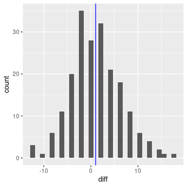
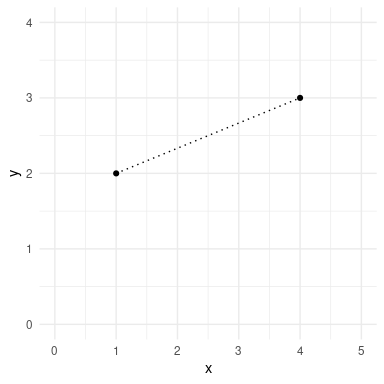

# 十四、一般线性模型

请记住，在本书的早期，我们描述了统计的基本模型：


其中，我们的一般目标是找到最大限度地减少错误的模型，并受一些其他约束（例如保持模型相对简单，以便我们可以在特定数据集之外进行归纳）。在本章中，我们将重点介绍这种方法的特殊实现，即 _ 一般线性模型 _（或 GLM）。您已经在前面一章中看到了将模型拟合到数据的一般线性模型，我们在 nhanes 数据集中将高度建模为年龄的函数；在这里，我们将更全面地介绍 GLM 的概念及其许多用途。

在讨论一般线性模型之前，我们先定义两个对我们的讨论很重要的术语：

*   _ 因变量 _：这是我们的模型要解释的结果变量（通常称为 _y_）
*   _ 自变量 _：这是一个我们希望用来解释因变量的变量（通常称为 _x_）。

可能有多个自变量，但对于本课程，我们的分析中只有一个因变量。

一般线性模型是由独立变量的 _ 线性组合 _ 组成的，每个独立变量乘以一个权重（通常称为希腊字母 beta-），确定相对贡献。模型预测的自变量。

作为一个例子，让我们为学习时间和考试成绩之间的关系生成一些模拟数据（参见图[14.1](#fig:StudytimeGrades)）。

```r
# create simulated data for example
set.seed(12345)

# the number of points that having a prior class increases grades
betas <- c(6, 5)

df <-
  tibble(
    studyTime = c(2, 3, 5, 6, 6, 8, 10, 12) / 3,
    priorClass = c(0, 1, 1, 0, 1, 0, 1, 0)
  ) %>%
  mutate(
    grade = 
      studyTime * betas[1] + 
      priorClass * betas[2] + 
      round(rnorm(8, mean = 70, sd = 5))
  )
```


图 14.1 学习时间与成绩的关系

鉴于这些数据，我们可能希望参与三项基本统计活动：

*   _ 描述一下 _：年级和学习时间之间的关系有多强？
*   _ 决定 _：年级和学习时间之间有统计学意义的关系吗？
*   _ 预测 _：给定特定的学习时间，我们期望达到什么级别？

在最后一章中，我们学习了如何使用相关系数来描述两个变量之间的关系，因此我们可以使用它来描述这里的关系，并测试相关性是否具有统计意义：

```r
# compute correlation between grades and study time
corTestResult <- cor.test(df$grade, df$studyTime, alternative = "greater")
corTestResult
```

```r
## 
##  Pearson's product-moment correlation
## 
## data:  df$grade and df$studyTime
## t = 2, df = 6, p-value = 0.05
## alternative hypothesis: true correlation is greater than 0
## 95 percent confidence interval:
##  0.014 1.000
## sample estimates:
##  cor 
## 0.63
```

相关性很高，但由于样本量很小，几乎没有达到统计显著性。

## 14.1 线性回归

我们还可以使用一般线性模型来描述两个变量之间的关系，并决定这种关系是否具有统计意义；此外，该模型允许我们在给定独立变量的一些新值的情况下预测因变量的值。最重要的是，一般线性模型将允许我们建立包含多个独立变量的模型，而相关性只能告诉我们两个独立变量之间的关系。

我们为此使用的 GLM 的特定版本称为 _ 线性回归 _。术语 _ 回归 _ 是由 Francis Galton 创造的，他注意到，当他比较父母和他们的孩子的某些特征（如身高）时，极端父母的孩子（即非常高或非常矮的父母）通常比他们的父母更接近平均值。这是非常重要的一点，我们将回到下面。

线性回归模型的最简单版本（具有单个独立变量）可以表示为：


值告诉我们，给定 x 中一个单位的变化，y 会发生多大的变化。截距是一个整体偏移量，它告诉我们当时，y 会有多大的值；从我们早期的建模讨论中，您可能会记得，这对于建模过度非常重要。所有数据的大小，即使从未真正达到零。误差项指的是模型一旦被拟合后所剩下的一切。如果我们想知道如何预测 y（我们称之为），那么我们可以删除错误项：


图[14.2](#fig:LinearRegression)显示了应用于研究时间示例的此模型的示例。


图 14.2 研究时间数据的线性回归解用蓝色表示。当 x 变量等于零时，截距值等于 y 变量的预测值；这用虚线黑线表示。β值等于直线的斜率，也就是 x 单位变化的 y 变化量。红色虚线示意性地显示了这一点，它显示了学习时间单单位增加的年级增加程度。

#

## 14.1.1 回归平均值

回归到平均值的概念 _ 是 Galton 对科学的重要贡献之一，在我们解释实验数据分析结果时，它仍然是理解的关键点。假设我们想研究阅读干预对贫困读者表现的影响。为了验证我们的假设，我们可能会去一所学校，在一些阅读测试中招募那些分布在 25%最底层的人，进行干预，然后检查他们的表现。假设干预实际上没有效果，每个人的阅读分数只是来自正态分布的独立样本。我们可以模拟：_

```r
# create simulated data for regression to the mean example

nstudents <- 100 

readingScores <- data.frame(
  #random normal distribution of scores for test 1
  test1 = rnorm(n = nstudents, mean = 0, sd = 1) * 10 + 100, 
  #random normal distribution of scores for test 2
  test2 = rnorm(n = nstudents, mean = 0, sd = 1) * 10 + 100 
)

# select the students in the bottom 25% on the first test
cutoff <- quantile(readingScores$test1, 0.25)

readingScores <-
  readingScores %>%
  mutate(badTest1 = test1 < cutoff) %>% 
  dplyr::filter(badTest1 == TRUE) %>%
  summarize(
    test1mean = mean(test1),
    test2mean = mean(test2)
  ) %>%
  pander()
```

如果我们看看第一次和第二次考试的平均成绩之间的差异，似乎干预对这些学生有了很大的帮助，因为他们的分数在考试中提高了超过 10 分！然而，我们知道事实上，学生根本没有进步，因为在这两种情况下，分数只是从随机正态分布中选择的。事实上，一些受试者在第一次考试中由于随机的机会得分很低。如果我们只根据第一次考试的分数来选择这些科目，那么在第二次考试中，即使没有培训的效果，他们也会回到整个组的平均水平。这就是为什么我们需要一个未经治疗的对照组（htg0）来解释随时间变化的读数；否则我们很可能会被回归到平均值所欺骗。

#

## 14.1.2 估算线性回归参数

我们通常使用 _ 线性代数 _ 从数据中估计线性模型的参数，这是应用于向量和矩阵的代数形式。如果你不熟悉线性代数，不用担心——你实际上不需要在这里使用它，因为 R 将为我们做所有的工作。然而，线性代数中的一个简短的偏移可以提供一些关于模型参数如何在实践中估计的见解。

首先，让我们介绍向量和矩阵的概念；您已经在 r 的上下文中遇到过它们，但是我们将在这里回顾它们。矩阵是一组排列在一个正方形或矩形中的数字，这样就有一个或多个 _ 维度 _ 可供矩阵变化。通常在行中放置不同的观察单位（如人），在列中放置不同的变量。让我们从上面获取学习时间数据。我们可以将这些数字排列在一个矩阵中，这个矩阵有八行（每个学生一行）和两列（一列用于学习时间，一列用于成绩）。如果你在想“这听起来像 R 中的数据帧”，你是完全正确的！实际上，数据帧是矩阵的专用版本，我们可以使用`as.matrix()`函数将数据帧转换为矩阵。

```r
df_matrix <- 
  df %>%
  dplyr::select(studyTime, grade) %>%
  as.matrix()
```

我们可以将线性代数中的一般线性模型写成如下：


这看起来非常像我们之前使用的方程，除了字母都是大写的，这意味着它们是向量这一事实。

我们知道等级数据进入 Y 矩阵，但是什么进入了矩阵？请记住，在我们最初讨论线性回归时，除了我们感兴趣的独立变量之外，我们还需要添加一个常量，因此我们的矩阵（我们称之为 _ 设计矩阵 _）需要包括两列：一列表示研究时间变量，另一列表示研究时间变量，以及 mn，每个个体具有相同的值（我们通常用所有值填充）。我们可以以图形方式查看结果设计矩阵（参见图[14.3](#fig:GLMmatrix)）。



图 14.3 用矩阵代数描述研究时间数据的线性模型。

矩阵乘法规则告诉我们，矩阵的维数必须相互匹配；在这种情况下，设计矩阵的维数为 8（行）x 2（列），Y 变量的维数为 8 x 1。因此，矩阵需要尺寸为 2 x 1，因为一个 8 x 2 矩阵乘以一个 2 x 1 矩阵会得到一个 8 x 1 矩阵（作为匹配的中间尺寸退出）。对矩阵中的两个值的解释是，它们分别乘以研究时间和 1，得出每个个体的估计等级。我们还可以将线性模型视为每个个体的一组单独方程：


……


记住，我们的目标是根据已知的和值确定的最佳拟合值。这样做的一个简单方法是使用简单代数来求解——这里我们去掉了错误项，因为它超出了我们的控制范围：


这里的挑战是和现在是矩阵，而不是单个数字——但是线性代数的规则告诉我们如何除以矩阵，这与乘以矩阵的 _ 逆 _ 相同（称为）。我们可以在 r 中这样做：

```r
# compute beta estimates using linear algebra

Y <- as.matrix(df$grade) #create Y variable 8 x 1 matrix
X <- matrix(0, nrow = 8, ncol = 2) #create X variable 8 x 2 matrix
X[, 1] <- as.matrix(df$studyTime) #assign studyTime values to first column in X matrix
X[, 2] <- 1 #assign constant of 1 to second column in X matrix

# compute inverse of X using ginv()
# %*% is the R matrix multiplication operator

beta_hat <- ginv(X) %*% Y #multiple the inverse of X by Y
print(beta_hat)
```

```r
##      [,1]
## [1,]  4.3
## [2,] 76.2
```

对于认真使用统计方法感兴趣的人，强烈鼓励他们花一些时间学习线性代数，因为它为几乎所有用于标准统计的工具提供了基础。

#

## 14.1.3 相关性与回归的关系

相关系数与回归系数有着密切的关系。记住，皮尔逊的相关系数是以协方差的比值和 x 和 y 的标准差的乘积来计算的：


而回归β的计算公式为：


基于这两个方程，我们可以得出和之间的关系：


也就是说，回归斜率等于相关值乘以 y 和 x 的标准差之比。这告诉我们的一件事是，当 x 和 y 的标准差相同时（例如，当数据被转换为 z 分数时），则相关估计等于 l 回归斜率估计。

#

## 14.1.4 回归模型的标准误差

如果我们想对回归参数估计进行推断，那么我们还需要对它们的可变性进行估计。为了计算这一点，我们首先需要计算模型的 _ 残差方差 _ 或 _ 误差方差 _——也就是说，依赖变量中有多少可变性不是由模型解释的。模型残差计算如下：


然后我们计算 _ 平方误差之和（sse）_：


由此我们计算出 _ 的均方误差 _：


其中，自由度（）是通过从观测值（）中减去估计参数（本例中为 2 个参数：和）来确定的。一旦我们有了均方误差，我们就可以将模型的标准误差计算为：


为了得到特定回归参数估计的标准误差，，我们需要根据 x 变量平方和的平方根重新调整模型的标准误差：


#

## 14.1.5 回归参数的统计检验

一旦我们得到了参数估计值及其标准误差，我们就可以计算出一个 _t_ 统计数据，告诉我们观察到的参数估计值与无效假设下的某些预期值相比的可能性。在这种情况下，我们将根据无效假设（即）进行测试：


在 R 中，我们不需要手工计算这些值，因为它们由`lm()`函数自动返回给我们：

```r
summary(lmResult)
```

```r
## 
## Call:
## lm(formula = grade ~ studyTime, data = df)
## 
## Residuals:
##     Min      1Q  Median      3Q     Max 
## -10.656  -2.719   0.125   4.703   7.469 
## 
## Coefficients:
##             Estimate Std. Error t value Pr(>|t|)    
## (Intercept)    76.16       5.16   14.76  6.1e-06 ***
## studyTime       4.31       2.14    2.01    0.091 .  
## ---
## Signif. codes:  0 '***' 0.001 '**' 0.01 '*' 0.05 '.' 0.1 ' ' 1
## 
## Residual standard error: 6.4 on 6 degrees of freedom
## Multiple R-squared:  0.403,  Adjusted R-squared:  0.304 
## F-statistic: 4.05 on 1 and 6 DF,  p-value: 0.0907
```

在这种情况下，我们看到截距明显不同于零（这不是很有趣），并且研究时间对成绩的影响微乎其微。

#

## 14.1.6 模型拟合优度的量化

有时量化模型在整体上与数据的匹配程度是很有用的，而做到这一点的一种方法是询问模型对数据中的可变性有多大的解释。这是使用一个名为的值（也称为 _ 确定系数 _）来量化的。如果只有一个 x 变量，那么只需将相关系数平方即可轻松计算：


对于我们的研究时间数据，=0.4，这意味着我们已经占了数据方差的 40%。

更一般地说，我们可以将看作是模型所占数据中方差分数的度量，可以通过将方差分解为多个分量来计算：


其中是数据的方差（），并且和如本章前面所示进行计算。利用这个，我们可以计算确定系数为：


的一个小值告诉我们，即使模型拟合具有统计意义，它也只能解释数据中的少量信息。

## 14.2 安装更复杂的模型

我们通常希望了解多个变量对某些特定结果的影响，以及它们如何相互关联。在我们学习时间的例子中，假设我们发现一些学生以前参加过关于这个主题的课程。如果我们绘制他们的成绩（见图[14.4](#fig:StudytimeGradesPrior)），我们可以看到，在相同的学习时间内，那些上过一门课的学生比没有上过课的学生表现要好得多。


图 14.4 学习时间和成绩之间的关系，颜色标识每个学生是否上过该主题的课程

我们希望建立一个考虑到这一点的统计模型，我们可以通过扩展我们在上面建立的模型来实现这一点：


为了模拟每个人是否有以前的类，我们使用我们称之为 _ 的伪编码 _ 来创建一个新变量，该变量的值为 1 表示以前有过一个类，否则为零。这意味着，对于以前上过课的人，我们只需将的值添加到他们的预测值中——也就是说，使用虚拟编码只是反映了两组人之间的平均值差异。我们对的估计反映了所有数据点的回归斜率——我们假设回归斜率是相同的，不管以前是否有过类（见图[14.5](#fig:LinearRegressionByPriorClass)）。

```r
# perform linear regression for study time and prior class

# must change priorClass to a factor variable
df$priorClass <- as.factor(df$priorClass)

lmResultTwoVars <- lm(grade ~ studyTime + priorClass, data = df)
summary(lmResultTwoVars)
```

```r
## 
## Call:
## lm(formula = grade ~ studyTime + priorClass, data = df)
## 
## Residuals:
##       1       2       3       4       5       6       7       8 
##  3.5833  0.7500 -3.5833 -0.0833  0.7500 -6.4167  2.0833  2.9167 
## 
## Coefficients:
##             Estimate Std. Error t value Pr(>|t|)    
## (Intercept)    70.08       3.77   18.60  8.3e-06 ***
## studyTime       5.00       1.37    3.66    0.015 *  
## priorClass1     9.17       2.88    3.18    0.024 *  
## ---
## Signif. codes:  0 '***' 0.001 '**' 0.01 '*' 0.05 '.' 0.1 ' ' 1
## 
## Residual standard error: 4 on 5 degrees of freedom
## Multiple R-squared:  0.803,  Adjusted R-squared:  0.724 
## F-statistic: 10.2 on 2 and 5 DF,  p-value: 0.0173
```


图 14.5 研究时间和年级之间的关系，包括作为模型中额外组成部分的先前经验。蓝线表示与学习时间相关的坡度，黑色虚线表示两组之间平均值的差异。

## 14.3 变量之间的相互作用

在前面的模型中，我们假设两组的学习时间对成绩的影响（即回归斜率）是相同的。但是，在某些情况下，我们可以想象一个变量的效果可能会因另一个变量的值而不同，我们称之为变量之间的 _ 交互 _。


图 14.6 咖啡因与公共演讲的关系

让我们用一个新的例子来问这个问题：咖啡因对公众演讲的影响是什么？首先，让我们生成一些数据并绘制它们。从图[14.6](#fig:CaffeineSpeaking)来看，似乎没有关系，我们可以通过对数据进行线性回归来确认：

```r
# perform linear regression with caffeine as independent variable
lmResultCaffeine <- lm(speaking ~ caffeine, data = df)
summary(lmResultCaffeine)
```

```r
## 
## Call:
## lm(formula = speaking ~ caffeine, data = df)
## 
## Residuals:
##    Min     1Q Median     3Q    Max 
## -33.10 -16.02   5.01  16.45  26.98 
## 
## Coefficients:
##             Estimate Std. Error t value Pr(>|t|)
## (Intercept)   -7.413      9.165   -0.81     0.43
## caffeine       0.168      0.151    1.11     0.28
## 
## Residual standard error: 19 on 18 degrees of freedom
## Multiple R-squared:  0.0642, Adjusted R-squared:  0.0122 
## F-statistic: 1.23 on 1 and 18 DF,  p-value: 0.281
```

但现在让我们假设，我们发现研究表明焦虑和非焦虑的人对咖啡因的反应不同。首先，让我们分别为焦虑和非焦虑的人绘制数据。


图 14.7 咖啡因与公共演讲的关系，数据点颜色代表焦虑

从图[14.7](#fig:CaffeineSpeakingAnxiety)可以看出，两组人的言语和咖啡因之间的关系是不同的，咖啡因改善了无焦虑人群的表现，降低了焦虑人群的表现。我们想创建一个解决这个问题的统计模型。首先，让我们看看如果在模型中包含焦虑会发生什么。

```r
# compute linear regression adding anxiety to model
lmResultCafAnx <- lm(speaking ~ caffeine + anxiety, data = df)
summary(lmResultCafAnx)
```

```r
## 
## Call:
## lm(formula = speaking ~ caffeine + anxiety, data = df)
## 
## Residuals:
##    Min     1Q Median     3Q    Max 
## -32.97  -9.74   1.35  10.53  25.36 
## 
## Coefficients:
##                   Estimate Std. Error t value Pr(>|t|)
## (Intercept)        -12.581      9.197   -1.37     0.19
## caffeine             0.131      0.145    0.91     0.38
## anxietynotAnxious   14.233      8.232    1.73     0.10
## 
## Residual standard error: 18 on 17 degrees of freedom
## Multiple R-squared:  0.204,  Adjusted R-squared:  0.11 
## F-statistic: 2.18 on 2 and 17 DF,  p-value: 0.144
```

在这里，我们看到咖啡因和焦虑都没有明显的效果，这看起来有点令人困惑。问题是，这一模型试图符合两组人对咖啡因说话的同一条线。如果我们想使用单独的行来拟合它们，我们需要在模型中包含一个 _ 交互 _，这相当于为两个组中的每个组拟合不同的行；在 r 中，这由符号表示。

```r
# compute linear regression including caffeine X anxiety interaction
lmResultInteraction <- lm(
  speaking ~ caffeine + anxiety + caffeine * anxiety,
  data = df
)
summary(lmResultInteraction)
```

```r
## 
## Call:
## lm(formula = speaking ~ caffeine + anxiety + caffeine * anxiety, 
##     data = df)
## 
## Residuals:
##     Min      1Q  Median      3Q     Max 
## -11.385  -7.103  -0.444   6.171  13.458 
## 
## Coefficients:
##                            Estimate Std. Error t value Pr(>|t|)    
## (Intercept)                 17.4308     5.4301    3.21  0.00546 ** 
## caffeine                    -0.4742     0.0966   -4.91  0.00016 ***
## anxietynotAnxious          -43.4487     7.7914   -5.58  4.2e-05 ***
## caffeine:anxietynotAnxious   1.0839     0.1293    8.38  3.0e-07 ***
## ---
## Signif. codes:  0 '***' 0.001 '**' 0.01 '*' 0.05 '.' 0.1 ' ' 1
## 
## Residual standard error: 8.1 on 16 degrees of freedom
## Multiple R-squared:  0.852,  Adjusted R-squared:  0.825 
## F-statistic: 30.8 on 3 and 16 DF,  p-value: 7.01e-07
```

从这些结果中，我们发现咖啡因和焦虑都有显著的影响（我们称之为 _ 主要影响 _），以及咖啡因和焦虑之间的相互作用。图[14.8](#fig:CaffeineAnxietyInteraction)显示了每组的独立回归线。


图 14.8 公众演讲和咖啡因之间的关系，包括与焦虑的互动。这将生成两条线，分别为每个组建模坡度。

有时我们想比较两个不同模型的相对拟合，以确定哪个模型更好；我们将其称为 _ 模型比较 _。对于上面的模型，我们可以使用 r 中的`anova()`命令比较模型的拟合优度（有无交互作用）：

```r
anova(lmResultCafAnx, lmResultInteraction)
```

```r
## Analysis of Variance Table
## 
## Model 1: speaking ~ caffeine + anxiety
## Model 2: speaking ~ caffeine + anxiety + caffeine * anxiety
##   Res.Df  RSS Df Sum of Sq    F Pr(>F)    
## 1     17 5639                             
## 2     16 1046  1      4593 70.3  3e-07 ***
## ---
## Signif. codes:  0 '***' 0.001 '**' 0.01 '*' 0.05 '.' 0.1 ' ' 1
```

这告诉我们，有很好的证据表明，比起没有交互作用的模型，更倾向于有交互作用的模型。在这种情况下，模型比较相对简单，因为这两个模型是 _ 嵌套的 _——其中一个模型是另一个模型的简化版本。与非嵌套模型的模型比较可能会变得更加复杂。

## 14.4“预测”的真正含义是什么？

当我们谈论日常生活中的“预测”时，我们通常指的是在看到数据之前估计某个变量值的能力。然而，该术语通常在线性回归的背景下用于指模型与数据的拟合；估计值（）有时被称为“预测”，独立变量被称为“预测”。这有一个不幸的含义，因为它意味着我们的模型还应该能够预测未来新数据点的值。实际上，模型与用于获取参数的数据集的匹配几乎总是优于模型与新数据集的匹配（copas 1983）。

作为一个例子，让我们从 NHANES 中选取 48 名儿童为样本，并拟合一个体重回归模型，该模型包括几个回归因子（年龄、身高、看电视和使用电脑的时间以及家庭收入）及其相互作用。

```r
# create dataframe with children with complete data on all variables
NHANES_child <-
  NHANES %>%
  drop_na(Height, Weight, TVHrsDayChild, HHIncomeMid, CompHrsDayChild, Age) %>%
  dplyr::filter(Age < 18)
```

```r
# create function to sample data and compute regression on in-sample and out-of-sample data

get_sample_predictions <- function(sample_size, shuffle = FALSE) {
  # generate a sample from NHANES
  orig_sample <-
    NHANES_child %>%
    sample_n(sample_size)

  # if shuffle is turned on, then randomly shuffle the weight variable
  if (shuffle) {
    orig_sample$Weight <- sample(orig_sample$Weight)
  }
  # compute the regression line for Weight, as a function of several
  # other variables (with all possible interactions between variables)
  heightRegressOrig <- lm(
    Weight ~ Height * TVHrsDayChild * CompHrsDayChild * HHIncomeMid * Age,
    data = orig_sample
  )
  # compute the predictions
  pred_orig <- predict(heightRegressOrig)

  # create a new sample from the same population
  new_sample <-
    NHANES_child %>%
    sample_n(sample_size)

  # use the model fom the original sample to predict the 
  # Weight values for the new sample
  pred_new <- predict(heightRegressOrig, new_sample)

  # return r-squared and rmse for original and new data
  return(c(
    cor(pred_orig, orig_sample$Weight)**2,
    cor(pred_new, new_sample$Weight)**2,
    sqrt(mean((pred_orig - orig_sample$Weight)**2)),
    sqrt(mean((pred_new - new_sample$Weight)**2))
  ))
}
```

```r
# implement the function
sim_results <- 
  replicate(100, get_sample_predictions(sample_size = 48, shuffle = FALSE))

sim_results <- 
  t(sim_results) %>%
  data.frame()

mean_rsquared <-
  sim_results %>%
  summarize(
    rmse_original_data = mean(X3),
    rmse_new_data = mean(X4)
  )

pander(mean_rsquared)
```

  
| RMSE_ 原始数据 | RMSE_ 新数据 |
| --- | --- |
| 2.97 条 | 25.72 美元 |

在这里，我们看到，虽然模型与原始数据相匹配显示出非常好的拟合（每个人只减去几磅），但同一个模型在预测从同一人群中抽样的新儿童的体重值（每个人减去 25 磅以上）方面做得更差。这是因为我们指定的模型非常复杂，因为它不仅包括每个单独的变量，而且还包括它们的所有可能组合（即它们的 _ 交互 _），从而产生一个具有 32 个参数的模型。由于这几乎和数据点一样多的系数（即 48 个孩子的身高），模型 _ 对数据进行了过度拟合 _，就像我们在[5.4 节](#overfitting)中最初的过度拟合示例中的复杂多项式曲线一样。

另一种观察过度拟合效果的方法是观察如果我们随机地改变权重变量的值会发生什么。随机改变该值应该使得无法从其他变量预测权重，因为它们不应该有系统的关系。

```r
print("using shuffled y variable to simulate null effect")
```

```r
## [1] "using shuffled y variable to simulate null effect"
```

```r
sim_results <- 
  replicate(100, get_sample_predictions(sample_size = 48, shuffle = TRUE))

sim_results <- 
  t(sim_results) %>%
  data.frame()

mean_rsquared <-
  sim_results %>%
  summarize(
    rmse_original_data = mean(X3),
    rmse_new_data = mean(X4)
  )
pander(mean_rsquared)
```

  
| rmse_original_data | rmse_new_data |
| --- | --- |
| 7.56 条 | 第 60.1 条 |

这向我们表明，即使没有真正的关系需要建模（因为疏解应该消除了关系），复杂的模型在预测中仍然显示非常低的错误，因为它适合特定数据集中的噪声。然而，当该模型应用于一个新的数据集时，我们会发现错误要大得多，这是应该的。

#

## 14.4.1 交叉验证

为了帮助解决过拟合问题而开发的一种方法是 _ 交叉验证 _。这种技术通常用于机器学习领域，该领域的重点是构建能够很好地概括为新数据的模型，即使我们没有新的数据集来测试模型。交叉验证背后的想法是，我们反复地适应我们的模型，每次都会遗漏数据的一个子集，然后测试模型预测每个被保留的子集中值的能力。



图 14.9 交叉验证程序示意图。

让我们看看这对于我们的重量预测示例是如何工作的。在这种情况下，我们将执行 12 倍交叉验证，这意味着我们将把数据分成 12 个子集，然后将模型拟合 12 次，在每种情况下，去掉其中一个子集，然后测试模型准确预测所持有的因变量值的能力。-找出数据点。R 中的`caret`包使我们能够轻松地跨数据集运行交叉验证：

```r
# create a function to run cross-validation
# returns the r-squared for the out-of-sample prediction

compute_cv <- function(d, nfolds = 12) {
  # based on https://quantdev.ssri.psu.edu/tutorials/cross-validation-tutorial
  train_ctrl <- trainControl(method = "cv", number = nfolds)
  model_caret <- train(
    Weight ~ Height * TVHrsDayChild * CompHrsDayChild * HHIncomeMid * Age,
    data = d,
    trControl = train_ctrl, # folds
    method = "lm"
  ) # specifying regression model

  r2_cv <- mean(model_caret$resample$Rsquared)
  rmse_cv <- mean(model_caret$resample$RMSE)
  return(c(r2_cv, rmse_cv))
}
```

使用此函数，我们可以对来自 nhanes 数据集的 100 个样本运行交叉验证，并计算交叉验证的 RMSE，以及原始数据和新数据集的 RMSE，正如我们上面计算的那样。

```r
#implement the function
sim_results <- 
  replicate(100, get_sample_predictions_cv(sample_size = 48, shuffle = FALSE))

sim_results <- 
  t(sim_results) %>%
  data.frame()

mean_rsquared <-
  sim_results %>%
  summarize(
    mse_original_data = mean(X4),
    mse_new_data = mean(X5),
    mse_crossvalidation = mean(X6)
  )
pander(mean_rsquared)
```

   
| MSE 原始数据 | MSE 新数据 | MSE 交叉验证 |
| --- | --- | --- |
| 2.98 年 | 21.64 条 | 29.29 条 |

在这里，我们看到交叉验证给了我们一个预测准确性的估计，它比我们用原始数据集看到的膨胀的准确性更接近我们用一个全新数据集看到的结果——事实上，它甚至比新数据集的平均值更悲观。可能是因为只有部分数据被用来训练每个模型。我们还可以确认，当因变量随机变动时，交叉验证能准确估计预测精度：

   
| rmse_original_data | rmse_new_data | RMSE 交叉验证 |
| --- | --- | --- |
| 第 7.9 条 | 第 73.7 条 | 75.31 条 |

在这里，我们再次看到交叉验证给了我们一个预测准确性的评估，这与我们对新数据的预期更为接近，而且更为悲观。

正确使用交叉验证是很困难的，建议在实际使用之前咨询专家。然而，本节希望向您展示三件事：

*   “预言”并不总是意味着你认为它意味着什么。
*   复杂的模型会严重地过度拟合数据，这样即使没有真正的预测信号，人们也能看到似乎很好的预测。
*   除非使用适当的方法，否则您应该非常怀疑地查看有关预测准确性的声明。

## 14.5 阅读建议

*   [统计学习要素：数据挖掘、推理和预测（第二版）](https://web.stanford.edu/~hastie/Papers/ESLII.pdf)——机器学习方法圣经，在线免费提供。