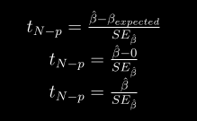
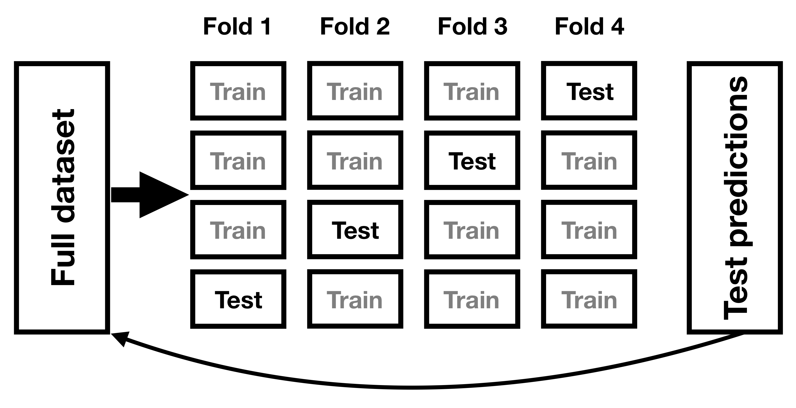
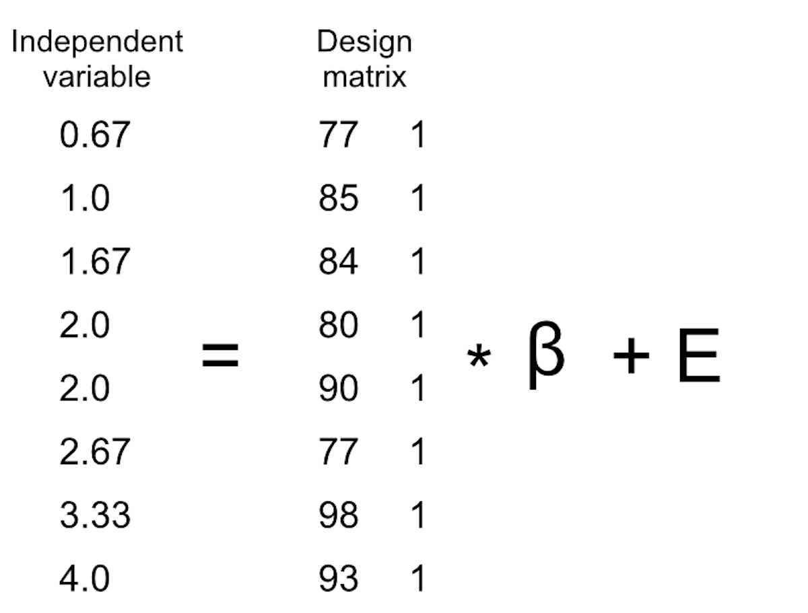

# 14 通用线性模型

请记住，在本书的前面，我们描述了统计学的基本模型:数据=模型+误差。

在这一章中，我们将关注这种方法的一种特殊实现，它被称为*通用线性模型*(或 GLM)。您已经在前面关于将模型与数据拟合的章节中看到了通用的线性模型，其中我们将 NHANES 数据集中的身高建模为年龄的函数；在这里，我们将对 GLM 的概念和它的许多用途提供一个更一般的介绍。统计中使用的几乎每一个模型都可以用通用线性模型或它的扩展来描述。</mi></mrow></semantics></math>

在我们讨论通用线性模型之前，让我们首先定义两个对我们的讨论很重要的术语:

*   *因变量*:这是我们的模型旨在解释的结果变量(通常称为 *Y*
*   *自变量*:这是我们希望用来解释因变量的变量(通常称为 *X* )。

可能有多个自变量，但在本课程中，我们将主要关注在我们的分析中只有一个因变量的情况。

通用线性模型是这样一种模型，其中因变量的模型由独立变量的*线性组合*组成，每个独立变量都乘以一个权重(通常称为希腊字母β-<math display="inline"><semantics><mi>β</mi><annotation encoding="application/x-tex">\β</annotation></semantics></math>)，该权重确定独立变量对模型预测的相对贡献。


图 14.1:学习时间和成绩之间的关系

举个例子，我们来生成一些学习时间与考试成绩关系的模拟数据(见图 [14.1](#fig:StudytimeGrades) )。鉴于这些数据，我们希望统计工作能回答下面三个问题:

*   *描述*:成绩和学习时间的关系有多强？
*   *决定*:成绩和学习时间有统计学意义上的关系吗？
*   *预测*:给定一段特定的学习时间，我们期望的分数是多少？

在前一章中，我们学习了如何用相关系数来描述两个变量之间的关系。让我们使用我们统计软件来计算这些数据的关系，并测试相关性是否与零显著不同:

```
## 
##  Pearson's product-moment correlation
## 
## data:  df$grade and df$studyTime
## t = 2, df = 6, p-value = 0.09
## alternative hypothesis: true correlation is not equal to 0
## 95 percent confidence interval:
##  -0.13  0.93
## sample estimates:
##  cor 
## 0.63
```

相关性非常高，但是请注意，估计值的置信区间非常宽，几乎跨越了从 0 到 1 的整个范围，这在一定程度上是由于样本量小。


## 14.1 线性回归

我们可以使用一般线性模型来描述两个变量之间的关系，并确定这种关系是否具有统计显著性；此外，该模型允许我们在给定自变量的一些新值的情况下预测因变量的值。最重要的是，一般线性模型将允许我们建立包含多个独立变量的模型，而相关系数只能描述两个独立变量之间的关系。

我们为此使用的 GLM 的具体版本被称为*线性回归*。术语*回归*是由弗朗西斯·高尔顿创造的，他注意到当他比较父母和他们的孩子的某些特征(如身高)时，显眼父母(即非常高或非常矮的父母)的孩子通常比他们的父母更接近平均值。这是一个极其重要的问题，我们将在下面讨论。

线性回归模型的最简单版本(具有单个独立变量)可以表示如下:


截距<math xmlns:epub="http://www.idpf.org/2007/ops" display="inline"><semantics><msub><mi>β</mi><mn>0</mn></msub><annotation encoding="application/x-tex">\β_ 0</annotation></semantics></math>是一个整体偏移量，它告诉我们当<math xmlns:epub="http://www.idpf.org/2007/ops" display="inline"><semantics><mrow><mi>x</mi><mo>=</mo><mn>0</mn></mrow><annotation encoding="application/x-tex">x = 0【0】时，我们期望 y 具有什么值您可能还记得，在我们早期的建模讨论中，即使<math xmlns:epub="http://www.idpf.org/2007/ops" display="inline"><semantics><mi>x</mi><annotation encoding="application/x-tex">x</annotation></semantics></math>实际上从未达到零值，对数据的总体大小建模也很重要。误差术语<math xmlns:epub="http://www.idpf.org/2007/ops" display="inline"><semantics><mi>ϵ</mi><annotation encoding="application/x-tex">\ε</annotation></semantics></math>指的是模型拟合后剩下的东西；我们通常将这些称为模型的</annotation></semantics></math></annotation></annotation></semantics></math>*残差*。如果我们想知道如何预测 y(我们称之为<math xmlns:epub="http://www.idpf.org/2007/ops" display="inline"><semantics><mover><mi>y</mi><mo accent="true">̂</mo></mover><annotation encoding="application/x-tex">\ hat { y }</annotation></semantics></math>)在我们估计了<math xmlns:epub="http://www.idpf.org/2007/ops" display="inline"><semantics><annotation encoding="application/x-tex">\ beta</annotation></semantics></math>的值之后，那么我们可以去掉误差项:

<math xmlns:epub="http://www.idpf.org/2007/ops" display="block"><semantics><mrow><mover><mi>y</mi><mo accent="true">̂</mo></mover><mo>=</mo><mi>x</mi><mo>*</mo><mover><msub><mi>β</mi><mi>x</mi></msub><mo accent="true">̂</mo></mover><mo>+</mo><mover><msub><mi>β</mi></msub><mo accent="true">̂</mo> 其中<math xmlns:epub="http://www.idpf.org/2007/ops" display="inline"><semantics><mover><msub><mi>β</mi><mi>x</mi></msub><mo accent="true">̂</mo></mover><annotation encoding="application/x-tex">\ hat【beta _ x】</annotation></semantics></math>是我们对斜率的估计而<math xmlns:epub="http://www.idpf.org/2007/ops" display="inline"><semantics><mover><mn><mo accent="true">̂</mo></mn></mover>【T77】 图 <a xmlns:epub="http://www.idpf.org/2007/ops" href="#fig:LinearRegression">14.2</a> 显示了该模型应用于研究时间数据的示例。</semantics></math></mover></mrow></semantics></math>


图 14.2:研究时间数据的线性回归解以实线表示。当 x 变量等于零时，截距值相当于 y 变量的预测值；这用虚线表示。β的值等于直线的斜率，即 x 的单位变化对应 y 的变化量。虚线示意性地显示了这一点，它显示了学习时间每增加一个单位，成绩增加的程度。

我们不会详细讨论最佳拟合斜率和截距实际上是如何从数据中估算出来的；如果你感兴趣，请详读附录。


### 14.1.1 回归到平均值

回归平均值的概念是高尔顿对科学的重要贡献之一，当我们解释实验数据分析的结果时，这仍然是一个需要理解的关键点。假设我们想研究阅读对不良读者表现的影响大小。为了检验我们的假设，我们可以去一所学校，招募那些在阅读测试中能力处于最后面 25%的人，对这些人进行干预，然后在干预后检查他们在测试中的表现。假设干预实际上没有效果，每个人的阅读分数只是正态分布中的独立样本。这个假设实验的计算机模拟结果在表 [14.1](#tab:readingTable) 中给出。

<caption>Table 14.1: Reading scores for Test 1 (which is lower, because it was the basis for selecting the students) and Test 2 (which is higher because it was not related to Test 1).</caption>
|  | 得分 |
| --- | --- |
| 测试 1 | Eighty-eight |
| 测试 2 | One hundred and one |

如果我们看看第一次和第二次测试的平均成绩之间的差异，干预似乎对这些学生有很大的帮助，因为他们的分数在测试中上升了 10 多分！然而，我们知道，事实上学生们根本没有提高，因为在这两种情况下，分数只是从随机正态分布中选取的。所发生的情况是，一些学生在第一次考试中分数很低，仅仅是因为随机的机会。如果我们只根据他们的第一次测试分数来选择这些受试者，即使没有训练的影响，他们在第二次测试中肯定会回到整个群体的平均值。这就是为什么我们总是需要一个未经处理的对照组*来解释由于干预导致的任何性能变化；否则我们很可能被回归均值所欺骗。此外，需要将参与者随机分配到对照组或治疗组，以便各组之间不会有任何系统差异(平均而言)。


### 14.1.2 相关性和回归的关系

相关系数和回归系数之间有密切的关系。请记住，皮尔逊相关系数的计算方法是协方差与 x 和 y 的标准差乘积之比:


基于这两个方程，我们可以推导出


回归斜率等于相关值乘以 y 和 x 的标准偏差之比。这告诉我们，当 x 和 y 的标准偏差相同时(例如，当数据已转换为 Z 分数时)，则相关估计值等于回归斜率估计值。


### 14.1.3 回归模型的标准差

如果我们想对回归参数估计做出推论，那么我们也需要对它们的可变性进行估计。为了计算这一点，我们首先需要计算模型的*残差方差*或*误差方差*——也就是说，模型没有解释因变量的多少可变性。我们可以如下计算模型残差:


是通过减去估计参数的数量确定的(本例中为 2:<math xmlns:epub="http://www.idpf.org/2007/ops" display="inline"><semantics><mover><msub><mi>β</mi><mi>x</mi> 一旦有了均方误差，我们就可以计算模型的标准误差，如下所示:</msub></mover></semantics></math>


为了得到特定回归参数估计值的标准误差，<math display="inline"><semantics><mrow><mi>S</mi><msub><mi>E</mi><msub><mi>β</mi><mi>X</mi></msub></msub></mrow><annotation encoding="application/x-tex">SE _【beta _ X】</annotation></semantics></math>，我们需要通过 X 变量平方和的平方根来重新调整模型的标准误差:


### 14.1.4 回归参数的统计测试

一旦我们有了参数估计值和它们的标准误差，我们就可以计算一个 *t* 统计量来告诉我们观察到的参数估计值与零假设下的某个期望值相比的可能性。在这种情况下我们将针对无效的零假设进行检验



一般来说，我们会使用统计软件来计算这些，而不是手工计算。以下是 R 中线性模型函数的结果:

```
## 
## Call:
## lm(formula = grade ~ studyTime, data = df)
## 
## Residuals:
##     Min      1Q  Median      3Q     Max 
## -10.656  -2.719   0.125   4.703   7.469 
## 
## Coefficients:
##             Estimate Std. Error t value Pr(>|t|)    
## (Intercept)    76.16       5.16   14.76  6.1e-06 ***
## studyTime       4.31       2.14    2.01    0.091 .  
## ---
## Signif. codes:  0 '***' 0.001 '**' 0.01 '*' 0.05 '.' 0.1 ' ' 1
## 
## Residual standard error: 6.4 on 6 degrees of freedom
## Multiple R-squared:  0.403,  Adjusted R-squared:  0.304 
## F-statistic: 4.05 on 1 and 6 DF,  p-value: 0.0907
```

在这种情况下，我们看到截距明显不同于零(这并不十分有趣)，学习时间对成绩的影响是微小的(p = .09)，与我们之前进行的相关性测试的 p 值相同。


### 14.1.5 量化模型的拟合优度

有时，量化模型与数据的总体拟合程度是很有用的，一种方法是询问模型考虑了多少数据的可变性。这是用一个叫做<math display="inline"><semantics><msup><mi>r</mi><mn>2</mn></msup><annotation encoding="application/x-tex">r^2</annotation></semantics></math>的值来量化的(也称为*决定系数*)。如果只有一个 x 变量，那么只需计算相关系数的平方就很容易计算出来:

<math xmlns:epub="http://www.idpf.org/2007/ops" display="block"><semantics><mrow><msup><mi>r</mi><mn>2</mn></msup><mo>=</mo><msup><mi>r</mi><mn>2</mn></msup></mrow><annotation encoding="application/x-tex">r^2 = r^2</annotation></semantics></math>就我们学习时间的例子来说，<math xmlns:epub="http://www.idpf.org/2007/ops" display="inline"><semantics><msup><mi>r</mi><mn>2</mn></msup></semantics></math>=时间

更一般地，我们可以将<math display="inline"><semantics><msup><mi>r</mi><mn>2</mn></msup><annotation encoding="application/x-tex">r^2</annotation></semantics></math>视为模型所考虑的数据中方差分数的度量，可以通过将方差分解为多个分量来计算:

**这令人困惑，改为残差而不是误差**


利用这一点，我们可以将决定系数计算为:


这告诉我们，即使模型拟合具有统计显著性，也可能只能解释数据中的少量信息。


## 14.2 拟合更复杂的模型

我们通常希望了解多个变量对某些特定结果的影响，以及它们之间的关系。在我们的学习时间与成绩关系的示例中，假设我们发现一些学生以前上过关于该主题的课程。如果我们绘制他们的成绩图(见图 [14.3](#fig:LinearRegressionByPriorClass) )，我们可以看到，在相同的学习时间内，那些上过课程的人比那些没有上过课程的人表现得好得多。我们希望建立一个考虑到这一点的统计模型，这可以通过扩展我们在上面建立的模型来实现:


我们使用我们称之虚拟编码，其中我们创建了一个新变量，该变量的值为 1，表示以前有过一个类，否则为 0。 这意味着对于之前有过该类的人，我们会简单地将<math xmlns:epub="http://www.idpf.org/2007/ops" display="inline"><semantics><mover><msub><mi>β</mi><mn>2</mn></msub><mo accent="true">̂</mo></mover><annotation encoding="application/x-tex">\ hat【beta _ 2】</annotation></semantics></math>的值加到我们为他们预测的值上——也就是说，使用哑编码<math xmlns:epub="http://www.idpf.org/2007/ops" display="inline"><semantics><mover><msub><mi>β【t111 我们对<math xmlns:epub="http://www.idpf.org/2007/ops" display="inline"><semantics><mover><msub><mn>1</mn></msub><mo accent="true">̂</mo></mover><annotation encoding="application/x-tex">\ hat { \ beta _ 1 }</annotation></semantics></math>的估计反映了所有数据点的回归斜率——我们假设回归斜率是相同的，不管是否有人以前上过课(见图[14.3【t141](#fig:LinearRegressionByPriorClass)</mi></msub></mover></semantics></math>

```
## 
## Call:
## lm(formula = grade ~ studyTime + priorClass, data = df)
## 
## Residuals:
##       1       2       3       4       5       6       7       8 
##  3.5833  0.7500 -3.5833 -0.0833  0.7500 -6.4167  2.0833  2.9167 
## 
## Coefficients:
##             Estimate Std. Error t value Pr(>|t|)    
## (Intercept)    70.08       3.77   18.60  8.3e-06 ***
## studyTime       5.00       1.37    3.66    0.015 *  
## priorClass1     9.17       2.88    3.18    0.024 *  
## ---
## Signif. codes:  0 '***' 0.001 '**' 0.01 '*' 0.05 '.' 0.1 ' ' 1
## 
## Residual standard error: 4 on 5 degrees of freedom
## Multiple R-squared:  0.803,  Adjusted R-squared:  0.724 
## F-statistic: 10.2 on 2 and 5 DF,  p-value: 0.0173
```


图 14.3:学习时间和年级之间的关系，包括以前的经验作为模型中的一个附加部分。实线表示没有工作经验的学生的学习时间与成绩的关系，虚线表示有工作经验的学生的成绩与学习时间的关系。虚线对应于两组之间平均值的差异。


## 14.3 变量之间的相互作用

在之前的模型中，我们假设两组的学习时间对成绩的影响(即回归斜率)是相同的。然而，在某些情况下，我们可能会想象一个变量的影响可能会因另一个变量的值而不同，我们称之为变量之间的*交互性*。

让我们用一个新的例子来问这个问题:咖啡因对公众演讲有什么影响？首先让我们生成一些数据并绘制它们。查看图 [14.4](#fig:CaffeineAnxietyInteraction) 的面板 A，似乎没有关系，我们可以通过对数据进行线性回归来确认:

```
## 
## Call:
## lm(formula = speaking ~ caffeine, data = df)
## 
## Residuals:
##    Min     1Q Median     3Q    Max 
## -33.10 -16.02   5.01  16.45  26.98 
## 
## Coefficients:
##             Estimate Std. Error t value Pr(>|t|)
## (Intercept)   -7.413      9.165   -0.81     0.43
## caffeine       0.168      0.151    1.11     0.28
## 
## Residual standard error: 19 on 18 degrees of freedom
## Multiple R-squared:  0.0642, Adjusted R-squared:  0.0122 
## F-statistic: 1.23 on 1 and 18 DF,  p-value: 0.281
```

但是现在让我们说，我们发现研究表明焦虑和不焦虑的人对咖啡因有不同的反应。首先让我们分别绘制焦虑和非焦虑人群的数据。

正如我们在图 [14.4](#fig:CaffeineAnxietyInteraction) 的子图 B 中所看到的，似乎演讲效果和咖啡因之间的关系对于两组来说是不同的，咖啡因改善了没有焦虑的人的表现，而降低了焦虑的人的表现。我们想创建一个统计模型来解决这个问题。首先，让我们看看如果我们把焦虑纳入模型会发生什么。

```
## 
## Call:
## lm(formula = speaking ~ caffeine + anxiety, data = df)
## 
## Residuals:
##    Min     1Q Median     3Q    Max 
## -32.97  -9.74   1.35  10.53  25.36 
## 
## Coefficients:
##                   Estimate Std. Error t value Pr(>|t|)
## (Intercept)        -12.581      9.197   -1.37     0.19
## caffeine             0.131      0.145    0.91     0.38
## anxietynotAnxious   14.233      8.232    1.73     0.10
## 
## Residual standard error: 18 on 17 degrees of freedom
## Multiple R-squared:  0.204,  Adjusted R-squared:  0.11 
## F-statistic: 2.18 on 2 and 17 DF,  p-value: 0.144
```

这里我们看到咖啡因和焦虑都没有显著的影响，这可能看起来有点令人困惑。问题是这个模型试图对两组人使用相同的关于咖啡因的斜率。如果我们想要使用具有单独斜率的线来拟合它们，我们需要在模型中包括一个*交互*，这相当于为两组中的每一组拟合不同的线；这通常通过在模型中使用星号符号来表示。

```
## 
## Call:
## lm(formula = speaking ~ caffeine + anxiety + caffeine * anxiety, 
##     data = df)
## 
## Residuals:
##     Min      1Q  Median      3Q     Max 
## -11.385  -7.103  -0.444   6.171  13.458 
## 
## Coefficients:
##                            Estimate Std. Error t value Pr(>|t|)    
## (Intercept)                 17.4308     5.4301    3.21  0.00546 ** 
## caffeine                    -0.4742     0.0966   -4.91  0.00016 ***
## anxietynotAnxious          -43.4487     7.7914   -5.58  4.2e-05 ***
## caffeine:anxietynotAnxious   1.0839     0.1293    8.38  3.0e-07 ***
## ---
## Signif. codes:  0 '***' 0.001 '**' 0.01 '*' 0.05 '.' 0.1 ' ' 1
## 
## Residual standard error: 8.1 on 16 degrees of freedom
## Multiple R-squared:  0.852,  Adjusted R-squared:  0.825 
## F-statistic: 30.8 on 3 and 16 DF,  p-value: 7.01e-07
```

从这些结果中，我们看到咖啡因和焦虑都有显著的影响(我们称之为*主要影响*)以及咖啡因和焦虑之间的相互作用。图 [14.4](#fig:CaffeineAnxietyInteraction) 中的面板 C 显示了每组的独立回归线。


图 14.4: A:咖啡因和公众演讲的关系。b:咖啡因和公开演讲之间的关系，数据点的形状代表焦虑。c:公众演讲和咖啡因之间的关系，包括与焦虑的相互作用。这导致两条线分别模拟每组的斜率(横杠虚线代表焦虑，点虚线代表不焦虑)。

需要注意的重要一点是，如果存在显著的交互作用，我们必须非常小心地解释显著的主效应，因为交互作用表明主效应根据另一个变量的值变化而变化，因此让模型变得不容易解释。

有时我们希望比较两个不同模型的相对拟合度，以确定哪个是更好的模型；我们称之为*模型比较*。对于上面的模型，我们可以使用所谓的*方差分析*来比较有交互和没有交互的模型的拟合优度:

```
## Analysis of Variance Table
## 
## Model 1: speaking ~ caffeine + anxiety
## Model 2: speaking ~ caffeine + anxiety + caffeine * anxiety
##   Res.Df  RSS Df Sum of Sq    F Pr(>F)    
## 1     17 5639                             
## 2     16 1046  1      4593 70.3  3e-07 ***
## ---
## Signif. codes:  0 '***' 0.001 '**' 0.01 '*' 0.05 '.' 0.1 ' ' 1
```

这告诉我们，有充分的证据表明，有交互作用的模型比没有交互作用的模型更受欢迎。在这种情况下，模型比较相对简单，因为两个模型是*嵌套的*——其中一个模型是另一个模型的简化版本，这样简单模型中的所有变量都包含在更复杂的模型中。与非嵌套模型的模型比较会变得更加复杂。


## 14.4 超线性预测和结果

值得注意的是，尽管它被称为一般的*线性*模型，但我们实际上可以使用相同的机制来模拟不遵循直线的效果(如曲线)。一般线性模型中的“线性”不是指响应的形状，而是指模型在其参数中是线性的，也就是说，模型中的预测器只与参数相乘，而不是像参数的幂那样的非线性关系。分析结果是二元的而不是连续的数据也很常见，就像我们在分类结果那一章中看到的那样。有多种方法可以调整通用线性模型(称为*广义线性模型*)来进行这种分析。我们将在本书的后面探索这些模型。


## 14.5 批评我们的模型并检查假设

“吃的是垃圾，拉出来的也是垃圾”这句话对统计学和其他领域一样适用。在统计模型的情况下，我们必须确保我们的模型能比较好的拟合数据，并且我们的数据适合于该模型。

当我们说模型是“适当指定的”时，我们的意思是我们已经在模型中包括了适当的一组独立变量。在图 [5.3](#fig:childHeightLine) 中，我们已经看到了错误指定模型的例子。请记住，我们看到了几个模型未能正确解释数据的情况，例如未能包括截距。当建立一个模型时，我们需要确保它包括所有适当的变量。

我们还需要担心我们的模型是否满足我们的统计方法的假设。使用一般线性模型时，我们做出的一个最重要的假设是残差(即模型预测和实际数据之间的差异)是正态分布的。失败的原因有很多，要么是因为模型没有正确指定，要么是因为我们正在建模的数据不合适。

我们可以用一个叫做 *Q-Q* (分位数-分位数)的图来看看我们的残差是否是正态分布的。你已经遇到了*分位数*——它们是截掉累积分布中特定比例的值。Q-Q 图显示了两个分布的分位数；在这种情况下，我们将给出实际数据的分位数，与符合相同数据的正态分布的分位数进行比较。图 [14.5](#fig:qqplots) 显示了两个这样的 Q-Q 图的例子。左图显示了正态分布数据的 Q-Q 图，而右图显示了非正态数据的 Q-Q 图。右图中的数据点明显偏离直线，反映出它们不是正态分布的。

```
qq_df <- tibble(norm=rnorm(100),
 unif=runif(100))

p1 <- ggplot(qq_df,aes(sample=norm)) + 
 geom_qq() + 
 geom_qq_line() + 
 ggtitle('Normal data')

p2 <- ggplot(qq_df,aes(sample=unif)) + 
 geom_qq() + 
 geom_qq_line()+ 
 ggtitle('Non-normal data')

plot_grid(p1,p2)
```


图 14.5:正常(左)和非正常(右)数据的 Q-Q 图。这条线表示 x 轴和 y 轴相等的点。

模型诊断将在后面的章节中更详细地探讨。


## 14.6 “预测”到底是什么意思？

当我们在日常生活中谈论“预测”时，我们通常指的是在看到数据之前估计某个变量的值的能力。然而，该术语通常在线性回归的上下文中使用，指模型与数据的拟合；估计值(<math display="inline"><semantics><mover><mi>y</mi><mo accent="true">̂</mo></mover><annotation encoding="application/x-tex">\ hat { y }</annotation></semantics></math>)有时被称为“预测值”，自变量被称为“预测值”。这有一个不好的含义，因为它意味着我们的模型还应该能够预测未来新数据点的值。实际上，模型与用于获取参数的数据集的拟合几乎总是比模型与新数据集的拟合好 —— 即模型容易过拟合( [Copas 1983](ch020.xhtml#ref-copa:1983) ) 。

例如，让我们从 NHANES 的 48 名儿童中抽取一个样本，并拟合一个体重回归模型，该模型包括几个变量因素(年龄、身高、看电视和使用电脑的时间以及家庭收入)及其相互作用。

<caption>Table 14.2: Root mean squared error for model applied to original data and new data, and after shuffling the order of the y variable (in essence making the null hypothesis true)</caption>

| 数据类型 | RMSE(原始数据) | RMSE(新数据) |
| --- | --- | --- |
| 真实数据 | Three | Twenty-five |
| 混洗数据 | Seven point eight | Fifty-nine |

在这里，我们看到，尽管模型对原始数据的拟合显示出非常好的效果(每个人仅相差几公斤)，但同一模型在预测从同一人群中取样的新儿童的体重值方面做得差得多(每个人相差超过 25 公斤)。发生这种情况是因为我们指定的模型非常复杂，因为它不仅包括每个单独的变量，还包括它们所有可能的组合(即它们的*相互作用*),导致模型有 32 个参数。由于这几乎与数据点(即 48 个孩子的身高)一样多，模型*对数据进行了过拟合*，就像我们在第 [5.4 节](#overfitting)中的初始过拟合示例中的复杂多项式曲线一样。

查看过度拟合效果的另一种方法是，看看如果我们随机打乱权重变量的值会发生什么(如表中第二行所示)。随机改变数值应该使得不可能从其他变量预测重量，因为它们应该没有系统的关系。表中的结果表明，即使没有要建模的真实关系(因为混洗应该已经消除了关系)，复杂模型在拟合数据的预测中仍然显示出非常低的误差，因为它符合特定数据集中的噪声。然而，当该模型应用于新的数据集时，我们看到误差要大得多，这也是意料之中的。


### 14.6.1 交叉验证

一种被开发出来帮助解决过度拟合问题的方法被称为*交叉验证*。这种技术通常用于机器学习领域，它专注于增强模型的泛化能力，即使我们没有新的数据集来测试模型。交叉验证背后的想法是，我们反复拟合我们的模型，每次都留下一个数据子集，然后测试模型预测每个保留子集中的值的能力。



图 14.6:交叉验证程序的示意图。

让我们看看这对于我们的体重预测示例是如何工作的。在这种情况下，我们将执行 12 重交叉验证，这意味着我们将把数据分成 12 个子集，然后对模型进行 12 次拟合，每次拟合时忽略一个子集，然后测试模型准确预测这些保留数据点的因变量的值的能力。大多数统计软件都提供了对数据进行交叉验证的工具。使用此函数，我们可以对 NHANES 数据集中的 100 个样本进行交叉验证，并计算交叉验证的 RMSE，以及原始数据和新数据集的 RMSE，如上面计算的那样。

<caption>Table 14.3: R-squared from cross-validation and new data, showing that cross-validation provides a reasonable estimate of the model’s performance on new data.</caption>

|  | r 平方 |
| --- | --- |
| 原始数据 | Zero point nine five |
| 新数据 | Zero point three four |
| 交叉验证 | Zero point six |

在这里，我们看到交叉验证为我们提供了一个预测准确性的估计，它更接近于我们在一个全新的数据集上看到的，而不是我们在原始数据集上看到的夸大的准确性-事实上，它甚至比一个新数据集的平均值更悲观，这可能是因为只有部分数据用于训练每个模型。

请注意，正确使用交叉验证是很棘手的，建议您在实际使用之前咨询专家。然而，这一部分已经向您展示了三件事情:

*   “预测”并不总是意味着你认为它意味着什么
*   复杂的模型可能会非常严重地过度拟合数据，以至于即使没有真正的信号可以预测，人们也可以观察到看似良好的预测
*   你应该非常怀疑关于预测准确性的声明，除非它们是用适当的方法完成的。


## 14.7 学习目标

阅读完本章后，您应该能够:

*   描述线性回归的概念并将其应用于数据集
*   描述一般线性模型的概念，并举例说明其应用
*   描述交叉验证如何让我们评估模型对新数据的预测性能


## 14.8 建议读物

*   [统计学习的要素:数据挖掘、推理和预测(第二版)](https://web.stanford.edu/~hastie/Papers/ESLII.pdf)——机器学习方法的“圣经”，网上免费提供。


## 14.9 附录


### 14.9.1 估计线性回归参数

我们通常使用*线性代数*从数据中估计线性模型的参数，线性代数是应用于向量和矩阵的代数形式。如果你不熟悉线性代数，不要担心——你实际上不需要在这里使用它，因为 R 会为我们做所有的工作。然而，线性代数中的一个简短的游览可以提供一些关于在实践中如何估计模型参数的见解。

首先，我们来介绍一下向量和矩阵的思想；您已经在 R 的上下文中遇到过它们，但是我们将在这里回顾它们。矩阵是一组排列成正方形或长方形的数字，这样矩阵就有一个或多个维度*和*变化。习惯上将不同的观察单位(比如人)放在行中，将不同的变量放在列中。让我们来看看上面的学习时间数据。我们可以将这些数字排列成一个矩阵，这个矩阵有八行(每个学生一行)和两列(一列表示学习时间，一列表示成绩)。如果您认为“这听起来像 R 中的数据帧”，那么您完全正确！事实上，数据帧是矩阵的一个特殊版本，我们可以使用`as.matrix()`函数将数据帧转换成矩阵。

```
df <-
 tibble(
 studyTime = c(2, 3, 5, 6, 6, 8, 10, 12) / 3,
 priorClass = c(0, 1, 1, 0, 1, 0, 1, 0)
 ) %>%
 mutate(
 grade = 
 studyTime * betas[1] + 
 priorClass * betas[2] + 
 round(rnorm(8, mean = 70, sd = 5))
 )

df_matrix <- 
 df %>%
 dplyr::select(studyTime, grade) %>%
 as.matrix()
```

我们可以用线性代数写出一般的线性模型如下:

<math display="block"><semantics><mrow><mi>Y</mi><mo>=</mo><mi>X</mi><mo>*</mo><mi>β</mi><mo>+</mo><mi>E</mi></mrow><annotation encoding="application/x-tex">Y = X * \ beta+E</annotation></semantics></math>这看起来很像我们之前用的方程，只不过字母都是大写的，这是为了表示它们是矢量的事实。

我们知道成绩数据进入了 Y 矩阵，但是什么进入了<math display="inline"><semantics><mi>X</mi><annotation encoding="application/x-tex">X</annotation></semantics></math>矩阵呢？请记住，在我们对线性回归的最初讨论中，除了我们感兴趣的自变量之外，我们还需要添加一个常数，因此我们的<math display="inline"><semantics><mi>X</mi><annotation encoding="application/x-tex">X</annotation></semantics></math>矩阵(我们称之为*设计矩阵*)需要包括两列:一列代表研究时间变量，一列代表每个个体的相同值(我们通常用全 1 填充)。我们可以图形方式查看最终的设计矩阵(见图 [14.7](#fig:GLMmatrix) )。



图 14.7:用矩阵代数描述研究时间数据的线性模型。

矩阵乘法的规则告诉我们，矩阵的维数必须彼此匹配；在这种情况下，设计矩阵的尺寸为 8(行)X 2(列)，Y 变量的尺寸为 8 X 1。因此，<math display="inline"><semantics><mi>β</mi><annotation encoding="application/x-tex">\β</annotation></semantics></math>矩阵需要具有 2×1 的维度，因为 8×2 矩阵乘以 2×1 矩阵得到 8×1 矩阵(匹配的中间维度被删除)。对<math display="inline"><semantics><mi>β</mi><annotation encoding="application/x-tex">\β</annotation></semantics></math>矩阵中的两个值的解释是，它们是分别乘以学习时间和 1 以获得每个个体的估计分数的值。我们也可以将线性模型视为每个个体的一组独立方程:

<semantics><mrow><msub><mover><mi>和</mi></mover><mo>=</mo></msub></mrow></semantics>

<semantics><mrow><msub><mo>=</mo></msub></mrow></semantics>

…

<semantics><mrow><msub><mo>=</mo></msub></mrow></semantics>

请记住，我们的目标是在已知值<math display="inline"><semantics><mi>X</mi><annotation encoding="application/x-tex">X</annotation></semantics></math>和<math display="inline"><semantics><mi>Y</mi><annotation encoding="application/x-tex">Y</annotation></semantics></math>的情况下，确定<math display="inline"><semantics><mi>β</mi><annotation encoding="application/x-tex">\β</annotation></semantics></math>的最佳拟合值。一个简单的方法是使用简单的代数来求解<math display="inline"><semantics><mi>β</mi><annotation encoding="application/x-tex">\β</annotation></semantics></math>-这里我们去掉了错误项<math display="inline"><semantics><mi>E</mi><annotation encoding="application/x-tex">E</annotation></semantics></math>，因为它超出了我们的控制范围:

<semantics><mrow><mover><mi>【β】</mi></mover><mo>=<mfrac><mi>和</mi></mfrac></mo></mrow></semantics>

这里的挑战是<math xmlns:epub="http://www.idpf.org/2007/ops" display="inline"><semantics><mi>x</mi><annotation encoding="application/x-tex">x</annotation></semantics></math>和<math xmlns:epub="http://www.idpf.org/2007/ops" display="inline"><semantics><mi>β</mi><annotation encoding="application/x-tex">\β</annotation></semantics></math>现在是矩阵，而不是单个数字——但是线性代数的规则告诉我们如何除以矩阵，这与乘以矩阵的*逆*是一样的(称为<math xmlns:epub="http://www.idpf.org/2007/ops" display="inline"><semantics><msup><mi>x</mi><mrow><mrow>我们可以在 R:</mrow></mrow></msup></semantics></math>

```
# compute beta estimates using linear algebra

#create Y variable 8 x 1 matrix
Y <- as.matrix(df$grade) 
 #create X variable 8 x 2 matrix
X <- matrix(0, nrow = 8, ncol = 2)
#assign studyTime values to first column in X matrix
X[, 1] <- as.matrix(df$studyTime) 
#assign constant of 1 to second column in X matrix
X[, 2] <- 1 

# compute inverse of X using ginv()
# %*% is the R matrix multiplication operator

beta_hat <- ginv(X) %*% Y #multiple the inverse of X by Y
print(beta_hat)
```

```
##      [,1]
## [1,]  8.2
## [2,] 68.0
```

强烈建议任何对统计方法严谨性感兴趣的人应多花些时间去学习线性代数，因为它为标准统计中使用的所有工具提供了基础理论支撑。


