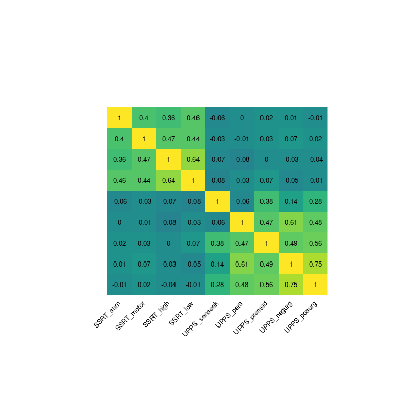
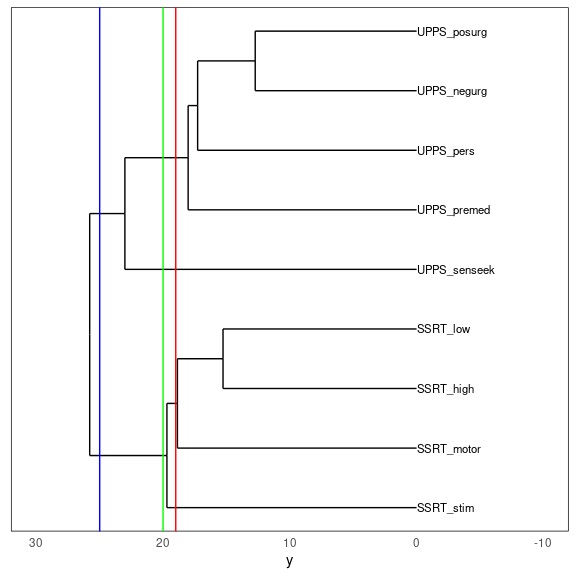
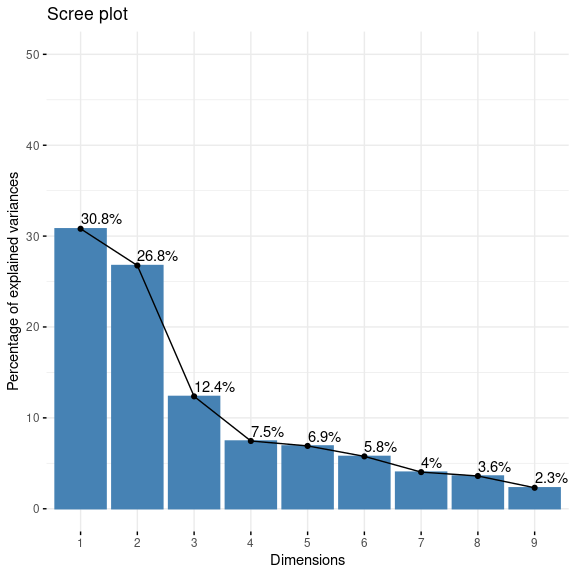
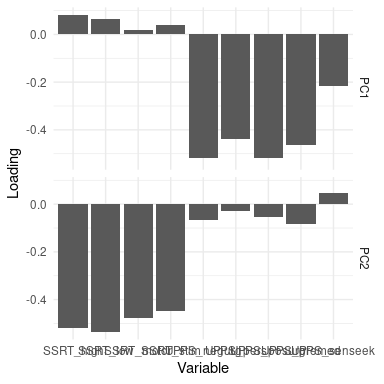

# 16 多元统计

术语*多元*指的是涉及一个以上随机变量的分析。虽然我们已经看到了之前的例子，其中模型包括多个变量(如线性回归)，但在那些情况下，我们特别感兴趣的是如何用一个或多个通常由实验者指定而不是测量的*自变量*来解释*因变量*的变化。在多变量分析中，我们通常平等地对待所有变量，并试图理解它们作为一个整体是如何相互关联的。

多变量分析有许多不同的种类，但在这一章中我们将集中讨论两种主要的方法。首先，我们可能只是想理解和可视化数据中存在的结构，我们通常指的是哪些变量或观察值与其他变量或观察值相关。我们通常将“相关”定义为一些度量，这些度量表示变量之间的距离。属于这一类别的一个重要方法被称为*聚类*，其目的是找到变量或变量间相似的观察值的聚类。

第二，我们可能希望获取大量变量，并以尽可能保留更多信息的方式将它们减少到更少的变量。这被称为*维度缩减*，其中“维度”是指数据集中变量的数量。我们将讨论两种常用的降维技术，称为*主成分分析*和*因子分析*。

聚类和降维通常被归类为*无监督学习*的形式；这与*监督学习*形成了对比，监督学习描述了你目前所学的线性回归等模型的特征。我们认为线性回归是“受监督的”原因是，我们知道我们试图预测的事物(即因变量)的值，并且我们试图找到最佳预测这些值的模型。在非服务学习中，我们没有试图预测的特定值；相反，我们试图在数据中发现可能对理解正在发生的事情有用的结构，这通常需要一些关于我们想要找到哪种结构的假设。

在这一章中，你会发现，虽然在监督学习中通常有一个“正确”的答案(一旦我们就如何确定“最佳”模型达成一致，如误差平方和)，但在无监督学习中通常没有一致同意的“正确”答案。不同的无监督学习方法可以对相同的数据给出非常不同的答案，并且通常在原则上没有办法确定其中哪个是“正确的”，因为它取决于分析的目标和人们愿意对产生数据的机制做出的假设。一些人觉得这令人沮丧，而另一些人觉得这令人振奋；这将由你来决定你属于哪一个阵营。


## 16.1 多元数据:一个例子

作为多变量分析的一个例子，我们将看一个由我的小组收集并由艾森伯格等人发表的数据集 ( [**艾森伯格:2019um？**](#ref-Eisenberg:2019um) ) 。这个数据集是有用的，因为它有大量有趣的变量，这些变量是从相对大量的个人身上收集的，也因为它可以在网上免费获得，所以你可以自己探索它。

进行这项研究是因为我们有兴趣了解心理功能的几个不同方面是如何相互联系的，特别关注自我控制的心理测量和相关概念。参与者在一周的时间里进行了长达十小时的认知测试和调查；在第一个例子中，我们将关注与自我控制的两个具体方面相关的变量。*反应抑制*被定义为快速停止一个动作的能力，在这项研究中，使用一组被称为*停止信号任务*的任务进行测量。这些任务感兴趣的变量是对一个人停止自己需要多长时间的估计，称为*停止信号反应时间* ( *SSRT* )，在数据集中有四种不同的测量方法。*冲动性*定义为凭冲动做出决定的倾向，不考虑潜在后果和长期目标。这项研究包括许多测量冲动性的不同调查，但我们将重点关注UPPS-P调查，该调查评估了冲动性的五个不同方面。

在艾森伯格的研究中，计算了522名参与者的分数后，我们得出了每个人的9个数字。虽然多元数据有时可能有数千甚至数百万个变量，但先看看这些方法如何处理少量变量是很有用的。


## 16.2 可视化多元数据

多元数据的一个基本挑战是，人类的眼睛和大脑根本不具备可视化三维以上数据的能力。我们可以使用各种工具来尝试可视化多元数据，但随着变量数量的增加，所有这些工具都会失效。一旦变量的数量变得太大而不能直接可视化，一种方法是首先减少维度的数量(如下面进一步讨论的)，然后可视化减少的数据集。


### 16.2.1 矩阵分布图

将少量变量可视化的一个有用方法是将每一对变量相对于另一个绘制成图，有时称为“矩阵散点图”；示例如图 [16.1](#fig:pairpanel) 所示。面板中的每一行/每一列指的是一个变量——在这个例子中，是我们在前面例子中的一个心理变量。图上的对角线元素以直方图的形式显示了每个变量的分布。对角线下方的元素显示了每对矩阵的散点图，上面覆盖了描述变量之间关系的回归线。对角线上方的元素显示每对变量的相关系数。当变量数量相对较少(约10或更少)时，这可能是深入了解多变量数据集的有效方法。


图16.1:自身对照数据集中九个变量的矩阵散点图。矩阵中的对角线元素显示了每个变量的直方图。左下面板显示每对变量之间关系的散点图，右上面板显示每对变量的相关系数。


### 16 . 2 . 2热图

在某些情况下，我们希望一次可视化大量变量之间的关系，通常侧重于相关系数。一种有用的方法是将相关值绘制成*热图*，其中热图的颜色与相关值相关。图 [16.2](#fig:hmap) 显示了一个变量相对较少的例子，使用了我们上面的心理学例子。在这种情况下，热图有助于数据的结构向我们“突出”;我们看到SSRT变量和UPPS变量之间有很强的相关性，而两组变量之间的相关性相对较小。



图16.2:九个自控变量的相关矩阵热图。左上方和右下方较亮的黄色区域突出显示了这两个变量子集内较高的相关性。

热图对于可视化大量变量之间的相关性变得特别有用。我们可以用脑成像数据作为例子。神经科学研究人员通常使用功能性磁共振成像(fMRI)从大脑中的大量位置收集关于大脑功能的数据，然后评估这些位置之间的相关性，以测量这些区域之间的“功能连接性”。例如，图 [16.3](#fig:parcelheatmap) 显示了一个大型相关矩阵的热图，该热图基于单个个体(你的真实)大脑中300多个区域的活动。只需查看热图，数据中清晰结构的存在就会显现出来。具体来说，我们看到有大量大脑区域的活动彼此高度相关(在沿着相关矩阵对角线的大黄色块中可见)，而这些块也与其他块强烈负相关(在对角线外的大蓝色块中可见)。热图是一个强大的工具，可以轻松地可视化大型数据矩阵。


图16.3:显示一个人左半球316个区域之间大脑活动相关系数的热图。黄色单元反映了强正相关，而蓝色单元反映了强负相关。沿着矩阵对角线的大块正相关对应于大脑中的主要连接网络


## 16.3 聚类

聚类是指基于观察值的相似性来识别数据集中相关观察值或变量组的一组方法。通常，这种相似性将根据多元值之间的*距离*的某种度量来量化。然后，聚类方法会找到成员间距离最小的组。

一种常用的聚类距离度量是*欧几里德距离*，它基本上是连接两个数据点的线的长度。图 [16.4](#fig:eucdist) 显示了一个有两个数据点和两个维度(X和Y)的数据集的例子。这两点之间的欧几里得距离是连接空间中的点的虚线的长度。


图16.4:两点(1，2)和(4，3)之间欧几里得距离的描述。这两个点沿X轴相差3 °,沿Y轴相差1°。

欧几里德距离的计算方法是，对每个维度上的点的位置差求平方，将这些平方差相加，然后求平方根。当有两个维度<math display="inline"><semantics><mi>x</mi><annotation encoding="application/x-tex">x</annotation></semantics></math>和<math display="inline"><semantics><mi>y</mi><annotation encoding="application/x-tex">y</annotation></semantics></math>时，这将被计算为:

<math xmlns:epub="http://www.idpf.org/2007/ops" display="block"><semantics><mrow><mi>【d】</mi><mrow><mo stretchy="true" form="prefix">(</mo><mo>，</mo> <mi>和</mi><mo stretchy="true" form="postfix">)</mo></mrow><mo>=</mo></mrow></semantics></math>

插入我们示例数据中的值:

<semantics><mrow><mi>【d】</mi><mrow><mo stretchy="true" form="prefix">(</mo><mi>【x】</mi><mo>、</mo></mrow></mrow></semantics>

如果欧几里得距离的公式看起来有点熟悉，这是因为它与我们大多数人在几何课上学到的*勾股定理*相同，勾股定理根据两条边的长度计算直角三角形斜边的长度。在这种情况下，三角形各边的长度对应于两个维度上各点之间的距离。虽然这个例子是二维的，但是我们经常会处理比二维多得多的数据，但是同样的想法可以扩展到任意数量的维度。

欧几里德距离的一个重要特征是，它对数据的总体平均值和可变性很敏感。从这个意义上说，它不同于相关系数，相关系数以一种对总体均值或变异性不敏感的方式来衡量变量之间的线性关系。出于这个原因，通常在计算欧几里德距离之前对数据进行缩放，这相当于将每个变量转换成其Z得分版本。


### 16 . 3 . 1K-均值聚类

一种常用的数据聚类方法是 *K-means聚类*。该技术识别一组聚类中心，然后将每个数据点分配给其中心离该数据点最近(即，具有最低欧几里得距离)的聚类。举个例子，我们以全球多个国家的经纬度作为我们的数据点，看看K-means聚类是否能有效识别世界各大洲。

大多数统计软件包都有一个内置函数，可以使用一个命令来执行K-means聚类，但是一步一步地理解它是如何工作的是很有用的。我们必须首先确定一个特定的K值，即数据中的聚类数。需要指出的是，集群数量没有唯一的“正确”值；人们可以使用各种技术来尝试确定哪个解决方案是“最佳”的，但它们通常会给出不同的答案，因为它们包含不同的假设或权衡。尽管如此，聚类技术(如K-means)是理解数据结构的重要工具，尤其是当数据变得高维时。

在选择了我们希望找到的聚类数( *K* )之后，我们必须得出K个位置，这将是我们对聚类中心的开始猜测(因为我们最初不知道中心在哪里)。一种简单的开始方式是随机选择K个实际数据点，并使用它们作为我们的起点，它们被称为*质心*。然后，我们计算每个数据点到每个质心的欧几里德距离，并根据每个点最近的质心将其分配到一个聚类中。使用这些新的聚类分配，我们通过平均分配给该聚类的所有点的位置来重新计算每个聚类的质心。然后重复这一过程，直到找到稳定的解决方案；我们称之为*迭代*过程，因为它会迭代直到答案不变，或者直到达到某种其他限制，比如最大可能迭代次数。


图16.5:世界各国纬度和经度聚类的二维描述。黑色方形符号显示每个聚类的起始质心，线条显示该聚类的质心在算法迭代过程中的移动。

将K-means聚类应用于纬度/经度数据(图 [16.5](#fig:kmeans) )，我们看到得到的聚类和大陆之间有合理的匹配，尽管没有一个大陆与任何聚类完全匹配。我们可以通过绘制一个表来进一步检验这一点，该表将每个聚类的成员与每个国家的实际大陆进行比较；这种表格通常被称为*混淆矩阵*。

```
##       
## labels AF AS EU NA OC SA
##      1  5  1 36  0  0  0
##      2  3 24  0  0  0  0
##      3  0  0  0  0  0  7
##      4  0  0  0 15  0  4
##      5  0 10  0  0  6  0
##      6 35  0  0  0  0  0
```

*   第一组包括所有欧洲国家，以及北非和亚洲国家。
*   第二组包括亚洲国家和几个非洲国家。
*   第三组包括南美洲南部的国家。
*   聚类4包含所有北美国家以及南美北部国家。
*   第5组包括大洋洲和几个亚洲国家
*   第6组包括所有其余的非洲国家。

虽然在这个例子中我们知道实际的聚类(即世界的大陆)，但一般来说，我们实际上不知道无监督学习问题的基本事实，所以我们只能相信聚类方法已经在数据中找到了有用的结构。然而，关于K-means聚类和迭代过程的一个要点是，它们不能保证每次运行时都给出相同的答案。使用随机数来确定起点意味着起点每次都可能不同，并且根据数据，这有时会导致找到不同的解决方案。对于这个例子，K-means聚类有时会找到包含北美和南美的单个聚类，有时会找到两个聚类(就像这里使用的随机种子的特定选择一样)。每当使用涉及迭代解决方案的方法时，使用不同的随机种子多次重新运行该方法是很重要的，以确保运行之间的答案不会相差太大。如果是这样，那么我们应该避免根据不稳定的结果做出强有力的结论。事实上，在更普遍的聚类结果的基础上避免强有力的结论可能是一个好主意；它们主要用于直观地了解数据集中可能存在的结构。


图16.6:K = 3的K均值聚类算法的10次运行的聚类结果的可视化。图中的每一行代表聚类算法的不同运行(具有不同的随机起点)，共享相同颜色的变量是同一聚类的成员。

我们可以将K-means聚类应用于自控变量，以确定哪些变量彼此关系最密切。对于K=2，K-means算法始终挑选出一个包含SSRT变量的聚类和一个包含冲动性变量的聚类。K值越高，结果越不一致；例如，当K=3时，该算法有时会识别出仅包含UPPS感觉寻求变量的第三个聚类，而在其他情况下，它会将SSRT变量分成两个独立的聚类(如图 [16.6](#fig:kmeansSro) 所示)。K=2的聚类的稳定性表明，这可能是这些数据的最稳健的聚类，但这些结果也突出了多次运行算法以确定任何特定聚类结果是否稳定的重要性。


### 16.3.2 层次聚类

检查多变量数据集结构的另一种有用方法称为*层次聚类*。这种技术也使用数据点之间的距离来确定聚类，但它也提供了一种以树状结构(称为*树状图*)来可视化数据点之间关系的方法。

最常用的层次聚类过程被称为*凝聚聚类*。该过程首先将每个数据点视为其自己的聚类，然后通过组合两个聚类之间距离最小的两个聚类来逐步创建新的聚类。它继续这样做，直到只剩下一个集群。这需要计算集群之间的距离，有许多方法可以做到这一点；在本例中，我们将使用*平均关联*方法，该方法简单地取两个聚类中每个数据点之间所有距离的平均值。例如，我们将检查上述自控变量之间的关系。



图16.7:描述九个自控变量相对相似性的树状图。三条彩色垂直线代表三个不同的截止点，产生两个(蓝线)、三个(绿线)或四个(红线)聚类。

图 [16.7](#fig:dendro) 显示了自调节数据集生成的树状图。这里我们看到，变量之间的关系是有结构的，可以通过“切割”树来创建不同数量的集群，从而在不同的级别上理解:如果我们以25°切割树，我们会得到两个集群；如果我们在20度切割它，我们得到三个集群，在19度我们得到四个集群。

有趣的是，通过自身对照数据的分层聚类分析发现的解决方案与在大多数K-means聚类运行中发现的解决方案是相同的，这是令人欣慰的。

我们对此分析的解释是，与变量集之间相比，每个变量集(SSRT和UPPS)内部都有高度的相似性。在UPPS变量中，感觉寻求变量似乎独立于其他变量，而其他变量彼此更加相似。在SSRT变量中，刺激选择性SSRT变量似乎不同于其他三个更相似的变量。这些是可以从聚类分析中得出的结论。再次重要的是指出不存在单一的“正确的”集群数量；不同的方法依赖于不同的假设或启发，可以给出不同的结果和解释。一般来说，最好在几个不同的级别上呈现数据集群，并确保这不会显著改变数据的解释。


## 16.4 降维

多变量数据的情况通常是，许多变量彼此高度相似，因此它们在很大程度上测量的是同一事物。思考这个问题的一种方式是，虽然数据有特定数量的变量，我们称之为其*维度*，但实际上，潜在的信息来源并没有变量那么多。*降维*背后的想法是减少变量的数量，以创建反映数据中潜在信号的复合变量。


### 16.4.1 主成分分析

主成分分析背后的思想是找到一组变量的低维描述，该描述说明了完整数据集中最大可能的信息量。深入理解主成分分析需要对线性代数有所了解，这不在本书范围内；请参阅本章末尾的参考资料，获取有关该主题的有用指南。在这一节中，我将概述这个概念，希望能激起你学习更多的兴趣。

我们将从一个只有两个变量的简单例子开始，以便直观地了解它是如何工作的。首先，我们为变量X和Y生成一些合成数据，这两个变量之间的相关性为0.7。主成分分析的目标是找到数据集中观察变量的线性组合，它将解释最大的方差；这里的想法是，数据中的方差是信号和噪声的组合，我们希望找到变量之间最强的共同信号。第一个主成分是解释最大方差的组合。第二个分量解释了最大剩余方差，同时也与第一个分量无关。有了更多的变量，我们可以继续这个过程，以获得与变量一样多的分量(假设观测值多于变量)，尽管在实践中，我们通常希望找到少量的分量来解释大部分的方差。

在我们的二维例子中，我们可以计算主成分，并将它们绘制在数据上(图 [16.8](#fig:pcaPlot) )。我们看到的是，第一个主成分(显示为绿色)遵循最大方差的方向。这条线与线性回归线相似，但不完全相同；当线性回归解决方案最小化在相同X值的每个数据点和回归线之间的距离(即垂直距离)时，主成分最小化数据点和表示该成分的线之间的欧几里德距离(即垂直于该成分的距离)。第二个分量指向与第一个分量垂直的方向(相当于不相关)。


图16.8:合成数据图，第一个主成分标为绿色，第二个标为红色。

通常使用主成分分析来降低更复杂数据集的维数。例如，假设我们想知道早期数据集中所有四个停止信号任务变量的表现是否与五个冲动性调查变量相关。我们可以分别对这些数据集执行PCA，并检查数据中有多少方差是由第一主成分解释的，这将作为我们对数据的总结。


图16.9:五氯苯甲醚的方差图(或 *scree图*)分别应用于艾森伯格数据集的反应抑制和冲动性变量。

我们在图 [16.9](#fig:VAF) 中看到，对于停止信号变量，第一主成分约占数据方差的60%，而对于UPPS，它约占方差的55%。然后，我们可以计算使用第一个主成分从每组变量获得的分数之间的相关性，以确定两组变量之间是否存在关系。两个汇总变量之间的相关性为-0.014，表明在该数据集中，反应抑制和冲动性之间没有总体关系。

```
## 
##  Pearson's product-moment correlation
## 
## data:  pca_df$SSRT and pca_df$UPPS
## t = -0.3, df = 327, p-value = 0.8
## alternative hypothesis: true correlation is not equal to 0
## 95 percent confidence interval:
##  -0.123  0.093
## sample estimates:
##    cor 
## -0.015
```

我们也可以一次对所有这些变量进行主成分分析。查看图 [16.7](#fig:dendro) 中的方差图(也称为*scree图)，我们可以看到前两个分量占数据中方差的很大一部分。然后，我们可以查看这两个组件上每个单独变量的负载，以了解每个特定变量如何与不同的组件相关联。



(#fig:imp_pc_scree)根据全套自控变量计算的PCA成分的方差图。



图16.10:包含所有自控变量的PCA溶液中的可变负荷图。每个变量都以其在两个分量上的载荷来表示；分别反映在两排。

对冲动性数据集(图 [16.10](#fig:pcaVarPlot) )这样做，我们看到第一个分量(在图的第一行)对大多数UPPS变量具有非零载荷，对每个SSRT变量几乎为零载荷，而第二个主分量则相反，它主要加载SSRT变量。这告诉我们，第一主成分主要捕获与冲动性测量相关的方差，而第二主成分主要捕获与反应抑制测量相关的方差。你可能会注意到，对于这些变量中的大多数，载荷实际上是负的；载荷的符号是任意的，所以我们应该确保看到大的正负载荷。


### 16.4.2 因素分析

虽然主成分分析可用于将数据集减少到较少数量的复合变量，但PCA的标准方法有一些局限性。最重要的是，它确保组件是不相关的；虽然这有时很有用，但在很多情况下，我们希望提取可能相互关联的维度。第二个限制是PCA不考虑被分析变量的测量误差，这会导致难以解释部件上的最终载荷。虽然PCA的修改可以解决这些问题，但在一些领域(如心理学)更常见的是使用一种称为*探索性因子分析*(或EFA)的技术来降低数据集的维度。 [1](#fn1)

全民教育背后的想法是，每个观察到的变量都是通过一组潜在变量(即无法直接观察到的变量)的贡献组合而成的，同时每个变量都有一定的测量误差。出于这个原因，全民教育模型通常被称为属于一类被称为*潜在变量模型*的统计模型。

例如，假设我们想要了解几个不同变量的度量与产生这些度量的潜在因素之间的关系。我们将首先生成一个合成数据集来展示这可能是如何工作的。我们将产生一组个体，我们将对他们假装我们知道几个潜在的心理变量的值:冲动性、工作记忆能力和流畅的推理。我们将假设工作记忆能力和流畅的推理是相互关联的，但两者都不与冲动性相关。然后，我们将从这些潜在变量中为每个个体生成一组八个观察变量，这些变量是潜在变量与随机噪声的简单线性组合，随机噪声用于模拟测量误差。

我们可以通过显示与所有这些变量相关的关联矩阵的热图来进一步检查数据(图 [16.7](#fig:dendro) )。我们由此看到，有三组变量对应我们的三个潜变量，这是理所应当的。


(#fig:efa_cor_hmap)热图显示了从三个潜在变量生成的变量之间的相关性。

我们可以认为EFA是一次性估计一组线性模型的参数，其中每个模型将每个观察变量与潜在变量相关联。对于我们的例子，这些方程看起来如下。在这些等式中，<math display="inline"><semantics><annotation encoding="application/x-tex">\ beta</annotation></semantics></math>字符有两个下标，一个表示任务，另一个表示潜在变量，还有一个变量<math display="inline"><semantics><mi>【ϵ】</mi><annotation encoding="application/x-tex">\ε</annotation></semantics></math>表示误差。这里我们将假设一切都有一个零均值，所以我们不需要为每个方程包括一个额外的截距项。

<math display="block"><semantics><mtable><mtr><mtd columnalign="left"><mi>n</mi><mi>b</mi><mi>a</mi><mi>c</mi><mi>k</mi></mtd><mtd columnalign="center"><mo>=</mo></mtd><mtd columnalign="left"><mi>b</mi><mi>e</mi><mi>t</mi><msub><mi>a</mi><mrow><mo stretchy="true" form="prefix">[</mo><mn>1</mn><mo>,</mo><mn>1</mn><mo stretchy="true" form="postfix">]</mo></mrow></msub><mo>*</mo><mi>W</mi><mi>M</mi><mo>+</mo><msub><mi>β</mi><mrow><mo stretchy="true" form="prefix">[</mo><mn>1</mn><mo>,</mo><mn>2</mn><mo stretchy="true" form="postfix">]</mo></mrow></msub><mo>*</mo><mi>F</mi><mi>R</mi><mo>+</mo><msub><mi>β</mi><mrow><mo stretchy="true" form="prefix">[</mo><mn>1</mn><mo>,</mo><mn>3</mn><mo stretchy="true" form="postfix">]</mo></mrow></msub><mo>*</mo><mi>I</mi><mi>M</mi><mi>P</mi><mo>+</mo><mi>ϵ</mi></mtd></mtr><mtr><mtd columnalign="left"><mi>d</mi><mi>s</mi><mi>p</mi><mi>a</mi><mi>n</mi></mtd><mtd columnalign="center"><mo>=</mo></mtd><mtd columnalign="left"><mi>b</mi><mi>e</mi><mi>t</mi><msub><mi>a</mi><mrow><mo stretchy="true" form="prefix">[</mo><mn>2</mn><mo>,</mo><mn>1</mn><mo stretchy="true" form="postfix">]</mo></mrow></msub><mo>*</mo><mi>W</mi><mi>M</mi><mo>+</mo><msub><mi>β</mi><mrow><mo stretchy="true" form="prefix">[</mo><mn>2</mn><mo>,</mo><mn>2</mn><mo stretchy="true" form="postfix">]</mo></mrow></msub><mo>*</mo><mi>F</mi><mi>R</mi><mo>+</mo><msub><mi>β</mi><mrow><mo stretchy="true" form="prefix">[</mo><mn>2</mn><mo>,</mo><mn>3</mn><mo stretchy="true" form="postfix">]</mo></mrow></msub><mo>*</mo><mi>I</mi><mi>M</mi><mi>P</mi><mo>+</mo><mi>ϵ</mi></mtd></mtr><mtr><mtd columnalign="left"><mi>o</mi><mi>s</mi><mi>p</mi><mi>a</mi><mi>n</mi></mtd><mtd columnalign="center"><mo>=</mo></mtd><mtd columnalign="left"><mi>b</mi><mi>e</mi><mi>t</mi><msub><mi>a</mi><mrow><mo stretchy="true" form="prefix">[</mo><mn>3</mn><mo>,</mo><mn>1</mn><mo stretchy="true" form="postfix">]</mo></mrow></msub><mo>*</mo><mi>W</mi><mi>M</mi><mo>+</mo><msub><mi>β</mi><mrow><mo stretchy="true" form="prefix">[</mo><mn>3</mn><mo>,</mo><mn>2</mn><mo stretchy="true" form="postfix">]</mo></mrow></msub><mo>*</mo><mi>F</mi><mi>R</mi><mo>+</mo><msub><mi>β</mi><mrow><mo stretchy="true" form="prefix">[</mo><mn>3</mn><mo>,</mo><mn>3</mn><mo stretchy="true" form="postfix">]</mo></mrow></msub><mo>*</mo><mi>I</mi><mi>M</mi><mi>P</mi><mo>+</mo><mi>ϵ</mi></mtd></mtr><mtr><mtd columnalign="left"><mi>r</mi><mi>a</mi><mi>v</mi><mi>e</mi><mi>n</mi><mi>s</mi></mtd><mtd columnalign="center"><mo>=</mo></mtd><mtd columnalign="left"><mi>b</mi><mi>e</mi><mi>t</mi><msub><mi>a</mi><mrow><mo stretchy="true" form="prefix">[</mo><mn>4</mn><mo>,</mo><mn>1</mn><mo stretchy="true" form="postfix">]</mo></mrow></msub><mo>*</mo><mi>W</mi><mi>M</mi><mo>+</mo><msub><mi>β</mi><mrow><mo stretchy="true" form="prefix">[</mo><mn>4</mn><mo>,</mo><mn>2</mn><mo stretchy="true" form="postfix">]</mo></mrow></msub><mo>*</mo><mi>F</mi><mi>R</mi><mo>+</mo><msub><mi>β</mi><mrow><mo stretchy="true" form="prefix">[</mo><mn>4</mn><mo>,</mo><mn>3</mn><mo stretchy="true" form="postfix">]</mo></mrow></msub><mo>*</mo><mi>I</mi><mi>M</mi><mi>P</mi><mo>+</mo><mi>ϵ</mi></mtd></mtr><mtr><mtd columnalign="left"><mi>c</mi><mi>r</mi><mi>t</mi></mtd><mtd columnalign="center"><mo>=</mo></mtd><mtd columnalign="left"><mi>b</mi><mi>e</mi><mi>t</mi><msub><mi>a</mi><mrow><mo stretchy="true" form="prefix">[</mo><mn>5</mn><mo>,</mo><mn>1</mn><mo stretchy="true" form="postfix">]</mo></mrow></msub><mo>*</mo><mi>W</mi><mi>M</mi><mo>+</mo><msub><mi>β</mi><mrow><mo stretchy="true" form="prefix">[</mo><mn>5</mn><mo>,</mo><mn>2</mn><mo stretchy="true" form="postfix">]</mo></mrow></msub><mo>*</mo><mi>F</mi><mi>R</mi><mo>+</mo><msub><mi>β</mi><mrow><mo stretchy="true" form="prefix">[</mo><mn>5</mn><mo>,</mo><mn>3</mn><mo stretchy="true" form="postfix">]</mo></mrow></msub><mo>*</mo><mi>I</mi><mi>M</mi><mi>P</mi><mo>+</mo><mi>ϵ</mi></mtd></mtr><mtr><mtd columnalign="left"><mi>U</mi><mi>P</mi><mi>P</mi><mi>S</mi></mtd><mtd columnalign="center"><mo>=</mo></mtd><mtd columnalign="left"><mi>b</mi><mi>e</mi><mi>t</mi><msub><mi>a</mi><mrow><mo stretchy="true" form="prefix">[</mo><mn>6</mn><mo>,</mo><mn>1</mn><mo stretchy="true" form="postfix">]</mo></mrow></msub><mo>*</mo><mi>W</mi><mi>M</mi><mo>+</mo><msub><mi>β</mi><mrow><mo stretchy="true" form="prefix">[</mo><mn>6</mn><mo>,</mo><mn>2</mn><mo stretchy="true" form="postfix">]</mo></mrow></msub><mo>*</mo><mi>F</mi><mi>R</mi><mo>+</mo><msub><mi>β</mi><mrow><mo stretchy="true" form="prefix">[</mo><mn>6</mn><mo>,</mo><mn>3</mn><mo stretchy="true" form="postfix">]</mo></mrow></msub><mo>*</mo><mi>I</mi><mi>M</mi><mi>P</mi><mo>+</mo><mi>ϵ</mi></mtd></mtr><mtr><mtd columnalign="left"><mi>B</mi><mi>I</mi><mi>S</mi><mn>11</mn></mtd><mtd columnalign="center"><mo>=</mo></mtd><mtd columnalign="left"><mi>b</mi><mi>e</mi><mi>t</mi><msub><mi>a</mi><mrow><mo stretchy="true" form="prefix">[</mo><mn>7</mn><mo>,</mo><mn>1</mn><mo stretchy="true" form="postfix">]</mo></mrow></msub><mo>*</mo><mi>W</mi><mi>M</mi><mo>+</mo><msub><mi>β</mi><mrow><mo stretchy="true" form="prefix">[</mo><mn>7</mn><mo>,</mo><mn>2</mn><mo stretchy="true" form="postfix">]</mo></mrow></msub><mo>*</mo><mi>F</mi><mi>R</mi><mo>+</mo><msub><mi>β</mi><mrow><mo stretchy="true" form="prefix">[</mo><mn>7</mn><mo>,</mo><mn>3</mn><mo stretchy="true" form="postfix">]</mo></mrow></msub><mo>*</mo><mi>I</mi><mi>M</mi><mi>P</mi><mo>+</mo><mi>ϵ</mi></mtd></mtr><mtr><mtd columnalign="left"><mi>d</mi><mi>i</mi><mi>c</mi><mi>k</mi><mi>m</mi><mi>a</mi><mi>n</mi></mtd><mtd columnalign="center"><mo>=</mo></mtd><mtd columnalign="left"><mi>b</mi><mi>e</mi><mi>t</mi><msub><mi>a</mi><mrow><mo stretchy="true" form="prefix">[</mo><mn>8</mn><mo>,</mo><mn>1</mn><mo stretchy="true" form="postfix">]</mo></mrow></msub><mo>*</mo><mi>W</mi><mi>M</mi><mo>+</mo><msub><mi>β</mi><mrow><mo stretchy="true" form="prefix">[</mo><mn>8</mn><mo>,</mo><mn>2</mn><mo stretchy="true" form="postfix">]</mo></mrow></msub><mo>*</mo><mi>F</mi><mi>R</mi><mo>+</mo><msub><mi>β</mi><mrow><mo stretchy="true" form="prefix">[</mo><mn>8</mn><mo>,</mo><mn>3</mn><mo stretchy="true" form="postfix">]</mo></mrow></msub><mo>*</mo><mi>I</mi><mi>M</mi><mi>P</mi><mo>+</mo><mi>ϵ</mi></mtd></mtr></mtable> <annotation encoding="application/x-tex">\begin{array}{lcl} nback & = &beta_{[1, 1]} * WM + \beta_{[1, 2]} * FR + \beta_{[1, 3]} * IMP + \epsilon \\ dspan & = &beta_{[2, 1]} * WM + \beta_{[2, 2]} * FR + \beta_{[2, 3]} * IMP + \epsilon \\ ospan & = &beta_{[3, 1]} * WM + \beta_{[3, 2]} * FR + \beta_{[3, 3]} * IMP + \epsilon \\ ravens & = &beta_{[4, 1]} * WM + \beta_{[4, 2]} * FR + \beta_{[4, 3]} * IMP + \epsilon \\ crt & = &beta_{[5, 1]} * WM + \beta_{[5, 2]} * FR + \beta_{[5, 3]} * IMP + \epsilon \\ UPPS & = &beta_{[6, 1]} * WM + \beta_{[6, 2]} * FR + \beta_{[6, 3]} * IMP + \epsilon \\ BIS11 & = &beta_{[7, 1]} * WM + \beta_{[7, 2]} * FR + \beta_{[7, 3]} * IMP + \epsilon \\ dickman & = &beta_{[8, 1]} * WM + \beta_{[8, 2]} * FR + \beta_{[8, 3]} * IMP + \epsilon \\ \end{array}</annotation></semantics></math>

实际上，我们使用EFA想要做的是估计系数(betas)的*矩阵*，该矩阵将潜在变量映射到观察变量。对于我们正在生成的数据，我们知道这个矩阵中的大多数贝塔系数为零，因为我们是这样创建它们的；对于每个任务，只有一个权重设置为1，这意味着每个任务是单个潜在变量的有噪声的测量。

我们可以将EFA应用于我们的合成数据集来估计这些参数。除了提到重要的一点之外，我们不会详细讨论全民教育实际上是如何实施的。本书中之前的大多数分析都依赖于试图最小化观测数据值和模型预测值之间差异的方法。用于估计EFA参数的方法试图最小化观察变量间的观察到的*协方差*和模型参数隐含的协方差之间的差异。为此，这些方法通常被称为*协方差结构模型*。

让我们对我们的综合数据进行探索性因素分析。与聚类方法一样，我们需要首先确定我们想要在模型中包含多少潜在因素。在这种情况下，我们知道有三个因素，所以让我们从这一点开始；稍后，我们将研究直接从数据中估计因子数量的方法。这是我们的统计软件对此模型的输出:

```
## 
## Factor analysis with Call: fa(r = observed_df, nfactors = 3)
## 
## Test of the hypothesis that 3 factors are sufficient.
## The degrees of freedom for the model is 7  and the objective function was  0.04 
## The number of observations was  200  with Chi Square =  8  with prob <  0.34 
## 
## The root mean square of the residuals (RMSA) is  0.01 
## The df corrected root mean square of the residuals is  0.03 
## 
## Tucker Lewis Index of factoring reliability =  0.99
## RMSEA index =  0.026  and the 10 % confidence intervals are  0 0.094
## BIC =  -29
##  With factor correlations of 
##      MR1  MR2  MR3
## MR1 1.00 0.03 0.47
## MR2 0.03 1.00 0.03
## MR3 0.47 0.03 1.00
```

我们想问的一个问题是，我们的模型实际上有多符合数据。这个问题没有单一的答案；相反，研究人员开发了许多不同的方法，为模型与数据的拟合程度提供了一些见解。例如，一个常用的标准是基于近似的 (RMSEA)统计的*均方根误差，其量化了预测的协方差与实际协方差有多远；小于0.08的RMSEA值通常被认为反映了充分适合的模型。在这里的例子中，RMSEA值是0.026，这表明模型非常适合。*

我们还可以检查参数估计，以查看模型是否恰当地识别了数据中的结构。通常将其绘制成图表，从潜在变量(表示为椭圆)指向观察变量(表示为矩形)，其中箭头表示潜在变量上观察变量的实际负载；这种图形通常被称为*路径图*，因为它反映了与变量相关的路径。如图 [16.11](#fig:faDiagram) 所示。在这种情况下，EFA程序正确地识别了数据中存在的结构，既识别了哪些观察变量与每个潜在变量相关，又识别了潜在变量之间的相关性。


图16.11:探索性因素分析模型的路径图。


### 16.4.3 确定因素的数量

应用全民教育的主要挑战之一是确定因素的数量。一种常见的方法是在改变因素数量的同时检查模型的拟合度，然后选择给出最佳拟合度的模型。这不是万无一失的，有多种方法可以量化模型的拟合度，有时会给出不同的答案。

有人可能会认为，我们可以简单地看看模型的拟合程度，然后挑选出最拟合的因素数量，但这是行不通的，因为更复杂的模型总是会更好地拟合数据(正如我们在前面关于过度拟合的讨论中看到的)。出于这个原因，我们需要使用一个模型拟合的度量标准，它对模型中的参数数量进行惩罚。出于这个例子的目的，我们将选择一种用于量化模型拟合的常用方法，它被称为*样本大小调整贝叶斯信息标准*(或 *SABIC* )。这种方法量化了模型与数据的拟合程度，同时还考虑了模型中的参数数量(在这种情况下与因子数量相关)以及样本大小。虽然SABIC的绝对值是不可解释的，但当使用相同的数据和相同类型的模型时，我们可以使用SABIC来比较模型，以确定哪个模型最适合该数据。关于SABIC和类似的其他指标(被称为*信息标准*)需要知道的一件重要事情是，较低的值代表模型更好的拟合，因此在这种情况下，我们希望找到具有最低SABIC的因子的数量。在图 [16.12](#fig:sabicPlot) 中，我们看到具有最低SABIC的模型有三个因子，这表明这种方法能够准确地确定用于生成数据的因子的数量。


图16.12:不同因素的SABIC图。

现在，让我们看看当我们将该模型应用于来自Eisenberg等人的数据集的真实数据时会发生什么，该数据集包含在上述示例中模拟的所有八个变量的测量值。对于这些真实数据，具有三个因素的模型也具有最低的SABIC。


图16.13:艾森伯格等人数据的三因素模型的路径图。

绘制路径图(图 [16.13](#fig:faDiagramSro) )我们看到，真实数据展示了一个与模拟数据非常相似的因素结构。这并不奇怪，因为模拟数据是基于对这些不同任务的了解而生成的，但令人欣慰的是，人类行为足够系统化，我们可以可靠地识别这些类型的关系。主要区别在于工作记忆因子(MR3)和流畅推理因子(MR1)之间的相关性甚至比模拟数据中的更高。这一结果在科学上是有用的，因为它向我们表明，虽然工作记忆和流畅推理密切相关，但将它们分开建模是有用的。


## 16.5 学习目标

阅读完本章后，您应该能够:

*   描述监督学习和非监督学习的区别。
*   采用包括热图在内的可视化技术来可视化多元数据的结构。
*   理解聚类的概念以及如何用它来识别数据中的结构。
*   理解降维的概念。
*   描述如何使用主成分分析和因子分析进行降维。


## 16.6 建议读数

*   托马斯·威肯斯的《多元统计的几何学》
*   伊凡·萨沃夫所著的《线性代数指南》


* * *

1.  因子分析的另一个应用被称为*验证性因子分析*(或CFA)，我们在此不做讨论；在实践中，它的应用可能会有问题，最近的工作已经开始转向修改全民教育，可以回答经常使用综合行动框架解决的问题。 ( [**马什:2014？**](#ref-Marsh:2014th) ) [↩︎](#fnref1)

