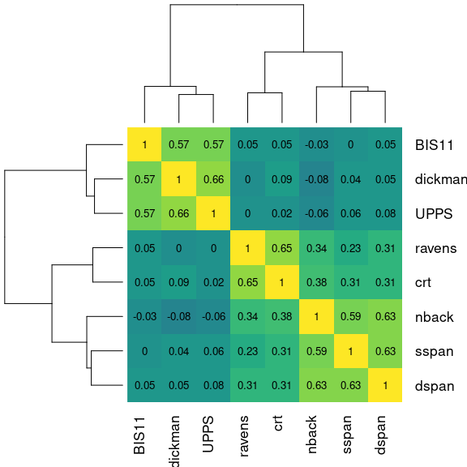

# 16 统计建模过程：一个实例

在这一章中，我们将汇集我们所学的一切，将我们的知识应用到一个实际的例子中。

## 16.1 统计建模过程

当我们想要使用我们的统计模型来检验一个科学假设时，我们通常要经历一系列的步骤：

1.  指定您感兴趣的问题
2.  识别或收集适当的数据
3.  准备数据进行分析
4.  确定合适的模型
5.  使模型适合数据
6.  批评模型以确保它适合
7.  检验假设和量化效应大小

让我们来看一个真正的例子。2007 年，斯坦福大学的克里斯托弗·加德纳和他的同事在美国医学协会（HTG1）的杂志上发表了一项研究，题为“比较阿特金斯、Zone、Ornish 和学习饮食对超重绝经前妇女体重变化和相关危险因素的影响，A-toZ 减肥研究：一项随机试验”（Gardner 等人 2007 年）。

#

## 16.1.1 1：指定您感兴趣的问题

据作者介绍，他们的研究目标是：

> 比较 4 种代表低到高碳水化合物摄入谱的减肥饮食对减肥和相关代谢变量的影响。

#

## 16.1.2 2：识别或收集适当的数据

为了回答他们的问题，研究人员随机将 311 名超重/肥胖女性中的每一位分为四种不同的饮食（阿特金斯、Zone、Ornish 或 Learn），并随着时间的推移跟踪她们的体重和其他健康指标。

作者记录了大量的变量，但对于主要的问题，让我们关注一个变量：体重指数（bmi）。此外，由于我们的目标是测量体重指数的持续变化，我们将只观察饮食开始后 12 个月的测量结果。

#

## 16.1.3 3：准备分析数据

A 到 Z 研究的实际数据并不公开，因此我们将使用他们论文中报告的摘要数据生成一些与他们研究中获得的数据大致匹配的合成数据。

```r
# generate a dataset based on the results of Gardner et al. Table 3

set.seed(123456)
dietDf <- 
  data.frame(diet=c(rep('Atkins',77),
                    rep('Zone',79),
                    rep('LEARN',79),
                    rep('Ornish',76))) %>%
  mutate(
    BMIChange12Months=ifelse(diet=='Atkins',
                             rnorm(n=77,mean=-1.65,sd=2.54),
                      ifelse(diet=='Zone',
                             rnorm(n=79,mean=-0.53,sd=2.0),
                      ifelse(diet=='LEARN',
                             rnorm(n=79,mean=-0.92,sd=2.0),
                      rnorm(n=76,mean=-0.77,sd=2.14)))),
    physicalActivity=ifelse(diet=='Atkins',
                            rnorm(n=77,mean=34,sd=6),
                     ifelse(diet=='Zone',
                            rnorm(n=79,mean=34,sd=6.0),
                     ifelse(diet=='LEARN',
                            rnorm(n=79,mean=34,sd=5.0),
                      rnorm(n=76,mean=35,sd=7) )))
  )

summaryDf <- 
  dietDf %>% 
  group_by(diet) %>% 
  summarize(
    n=n(),
    meanBMIChange12Months=mean(BMIChange12Months),
    varBMIChange12Months=var(BMIChange12Months)
  ) %>%
  mutate(
    crit_val_lower = qt(.05, n - 1),
    crit_val_upper = qt(.95, n - 1),
    ci.lower=meanBMIChange12Months+(sqrt(varBMIChange12Months)*crit_val_lower)/sqrt(n),
    ci.upper=meanBMIChange12Months+(sqrt(varBMIChange12Months)*crit_val_upper)/sqrt(n)
  )

summaryDf %>%
  dplyr::select(-crit_val_lower,-crit_val_upper) %>%
  pander()
```

<colgroup><col style="width: 10%"> <col style="width: 6%"> <col style="width: 28%"> <col style="width: 27%"> <col style="width: 13%"> <col style="width: 13%"></colgroup> 
| 饮食 | N 号 | 平均质量变化 12 个月 | varbmichange12 个月 | CI.下 | CI.上部 |
| --- | --- | --- | --- | --- | --- |
| 阿特金斯 | 77 | -1.62 条 | 6.52 条 | -第 2.11 条 | -1.14 条 |
| 学习 | 79 | -0.85 分 | 3.77 条 | -1.21 条 | -0.49 分 |
| 尼什 | 76 | -0.69 分 | 5.36 条 | -1.13 条 | -0.25 分 |
| 区域 | 79 | -0.57 分 | 3.76 条 | -0.93 分 | -0.21 分 |



图 16.1 每种情况下的小提琴图，第 50 百分位（即中位数）显示为每组的黑线。

现在我们有了数据，让我们可视化它们，以确保没有异常值。小提琴图有助于观察分布的形状，如图[16.1](#fig:AtoZBMIChangeDensity)所示。这些数据看起来相当合理——特别是，似乎没有任何严重的异常值。然而，我们可以看到，分布似乎在方差上有点变化，阿特金斯和欧尼斯比其他分布显示出更大的变异性。这意味着任何假设组间方差相等的分析都可能是不适当的。

#

## 16.1.4 4.确定合适的模型

为了确定适合我们分析的统计模型，我们需要问几个问题。

*   什么样的因变量？
*   bmi：连续，大致正态分布
*   我们在比较什么？
*   四个饮食组的平均体重指数
*   方差分析是合适的
*   观察是否独立？
*   随机分配和使用差分应确保独立和相同分布（IID）误差的假设是适当的。

#

## 16.1.5 5.使模型适合数据

让我们做一个关于体重指数变化的方差分析来比较这四种饮食。事实证明，我们实际上不需要自己生成伪编码变量；如果我们给`lm()`一个分类变量，它将自动为我们生成它们。

```r
# perform ANOVA and print result

lmResult <- lm(BMIChange12Months ~ diet, data = dietDf)
lmResult
```

```r
## 
## Call:
## lm(formula = BMIChange12Months ~ diet, data = dietDf)
## 
## Coefficients:
## (Intercept)    dietLEARN   dietOrnish     dietZone  
##      -1.622        0.772        0.932        1.050
```

请注意，lm 会自动生成与四种饮食中的三种相对应的虚拟变量，使 atkins 饮食没有虚拟变量。这意味着拦截模型阿特金斯饮食，其他三个变量模型的差异，这些饮食和阿特金斯饮食。

#

## 16.1.6 6.批评模型以确保它适合


图 16.2 分别绘制各组模型的残差。

我们要做的第一件事就是批评这个模型，以确保它是适当的。我们可以做的一件事是从模型中观察残差。在图[16.2](#fig:residPlot)中，我们将绘制按饮食分组的每个个体的残差。我们已经把这些要点抖了抖，以便能看到所有的要点。不同条件下的残差没有明显差异，这表明我们可以向前推进并解释模型输出。

#

## 16.1.7 7.检验假设和量化效应大小

首先，让我们看一下方差分析的结果总结：

```r
# print summary of ANOVA statistics

summary(lmResult)
```

```r
## 
## Call:
## lm(formula = BMIChange12Months ~ diet, data = dietDf)
## 
## Residuals:
##    Min     1Q Median     3Q    Max 
##  -8.14  -1.37   0.07   1.50   6.33 
## 
## Coefficients:
##             Estimate Std. Error t value Pr(>|t|)    
## (Intercept)   -1.622      0.251   -6.47  3.8e-10 ***
## dietLEARN      0.772      0.352    2.19   0.0292 *  
## dietOrnish     0.932      0.356    2.62   0.0092 ** 
## dietZone       1.050      0.352    2.98   0.0031 ** 
## ---
## Signif. codes:  0 '***' 0.001 '**' 0.01 '*' 0.05 '.' 0.1 ' ' 1
## 
## Residual standard error: 2.2 on 307 degrees of freedom
## Multiple R-squared:  0.0338, Adjusted R-squared:  0.0243 
## F-statistic: 3.58 on 3 and 307 DF,  p-value: 0.0143
```

有意义的 F 检验表明，饮食之间有显著的差异，但我们也应该注意，模型实际上并不能解释数据的很大差异；R 平方值仅为 0.03，表明模型只占体重差异的百分之几。t 损失。因此，我们不想曲解这个结果。

显著的结果也不能告诉我们哪些饮食与其他饮食不同。我们可以通过使用`emmeans()`（“估计边际平均值”）函数比较不同条件下的平均值来了解更多信息：

```r
# compute the differences between each of the means
leastsquare <- emmeans(lmResult, 
                      pairwise ~ diet,
                      adjust="tukey")

# display the results by grouping using letters

CLD(leastsquare$emmeans, 
    alpha=.05,  
    Letters=letters)
```

```r
##  diet   emmean    SE  df lower.CL upper.CL .group
##  Atkins  -1.62 0.251 307    -2.11    -1.13  a    
##  LEARN   -0.85 0.247 307    -1.34    -0.36  ab   
##  Ornish  -0.69 0.252 307    -1.19    -0.19   b   
##  Zone    -0.57 0.247 307    -1.06    -0.08   b   
## 
## Confidence level used: 0.95 
## P value adjustment: tukey method for comparing a family of 4 estimates 
## significance level used: alpha = 0.05
```

最右边一列中的字母显示了哪些组之间存在差异，使用的方法是根据正在执行的比较数量进行调整。这表明 Atkins 和 Learn 饮食没有区别（因为它们共享字母 A），Learn、Ornish 和 Zone 饮食也没有区别（因为它们共享字母 B），但 Atkins 饮食不同于 Ornish 和 Zone 饮食（因为它们不共享字母）。

##

## 16.1.7.1 贝叶斯系数

假设我们希望有更好的方法来描述数据提供的证据数量。我们可以这样做的一种方法是计算贝叶斯因子，我们可以通过拟合完整模型（包括饮食）和简化模型（不包括饮食），然后比较它们的拟合度来实现这一点。对于简化模型，我们只包含一个 1，它告诉拟合程序只适合一个截距。

```r
brmFullModel <- brm(BMIChange12Months ~ diet, data = dietDf,
                    save_all_pars = TRUE)

brmReducedModel <- brm(BMIChange12Months ~ 1, data = dietDf,
                      save_all_pars = TRUE)
```

```r
bayes_factor(brmFullModel,brmReducedModel)
```

```r
## Iteration: 1
## Iteration: 2
## Iteration: 3
## Iteration: 4
## Iteration: 1
## Iteration: 2
## Iteration: 3
## Iteration: 4
## Iteration: 5
```

```r
## Estimated Bayes factor in favor of bridge1 over bridge2: 99.86593
```

这表明，对于饮食之间的差异，有非常有力的证据（Bayes 因子接近 100）。

#

## 16.1.8 可能的混淆怎么办？

如果我们更仔细地看加德的论文，我们会发现他们还报告了每组中有多少人被诊断为代谢综合征（htg0），这是一种以高血压、高血糖、腰部脂肪过多为特征的综合征。胆固醇水平异常与心血管疾病风险增加有关。让我们首先将这些数据添加到摘要数据框中：

```r
summaryDf <- 
  summaryDf %>% 
  mutate(
    nMetSym=c(22,20,29,27),
    nNoMetSym=n-nMetSym,
    pMetSym=nMetSym/(nMetSym+nNoMetSym)
  )

summaryDf %>%
  dplyr::select(diet,n,pMetSym) %>%
  pander()
```

<colgroup><col style="width: 12%"> <col style="width: 6%"> <col style="width: 12%"></colgroup> 
| diet | n | PMETSYM 公司 |
| --- | --- | --- |
| Atkins | 77 | 0.29 分 |
| LEARN | 79 | 0.25 分 |
| Ornish | 76 | 0.38 分 |
| Zone | 79 | 0.34 分 |

从数据来看，似乎不同组之间的发病率略有不同，在华丽的饮食和区域性饮食中出现更多代谢综合征病例——这正是结果较差的饮食。假设我们有兴趣测试两组之间的代谢综合征发生率是否有显著差异，因为这可能使我们担心这些差异可能会影响饮食结果。

##

## 16.1.8.1 确定适当的模型

*   什么样的因变量？
*   比例
*   我们在比较什么？
*   四个饮食组与代谢综合征的比例
*   拟合优度的卡方检验适用于零差假设。

让我们使用`chisq.test()`函数计算该统计：

```r
chisq.test(summaryDf$nMetSym,summaryDf$nNoMetSym)
```

```r
## 
##  Pearson's Chi-squared test
## 
## data:  summaryDf$nMetSym and summaryDf$nNoMetSym
## X-squared = 10, df = 9, p-value = 0.2
```

这项测试表明，平均值之间没有显著差异。然而，它并没有告诉我们有多确定我们是没有区别的；记住，在 NHST 下，我们总是在假设无效为真的前提下工作，除非数据向我们展示足够的证据，使我们拒绝这个无效假设。

如果我们想要量化支持或反对空值的证据呢？我们可以使用贝叶斯因子来实现这一点。

```r
bf <- contingencyTableBF(as.matrix(summaryDf[,9:10]), 
                         sampleType = "indepMulti", 
                         fixedMargin = "cols")
bf
```

```r
## Bayes factor analysis
## --------------
## [1] Non-indep. (a=1) : 0.058 ±0%
## 
## Against denominator:
##   Null, independence, a = 1 
## ---
## Bayes factor type: BFcontingencyTable, independent multinomial
```

这表明，假设的概率比假设的概率高 0.058 倍，这意味着假设的概率比假设的概率高 1/0.058~17 倍。这是相当有力的证据，即使不是完全压倒性的证据。

##

## 16.1.8.2 解决模型中的混淆问题

我们通常使用随机分配治疗（如 Gardner 等人是的），因为我们认为，平均而言，它将阻止其他变量（我们称之为 _ 混淆 _）对结果的影响。然而，正如我们在本例中看到的，在任何特定的研究中，可能会出现随机发生的混淆。重要的是要确保条件之间的差异不是由于存在代谢综合征的组之间的差异造成的，为此，我们可以在我们的统计模型中包括代谢综合征变量。通过这样做，任何与代谢综合征相关的变异都将从饮食的影响中消除，这样我们就可以更清楚地测量饮食的影响。

在这种情况下，我们没有原始数据，因此无法直接测试它。如果我们有原始数据，我们可以在我们的模型中包括代谢综合征变量，看看饮食和体重减轻之间的关系是否仍然有效；如果确实如此，那么我们可以更加确信，这种关系不是由代谢综合征的任何差异所驱动的。