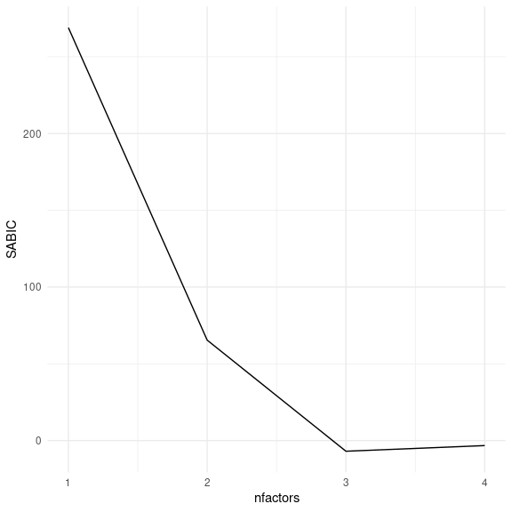
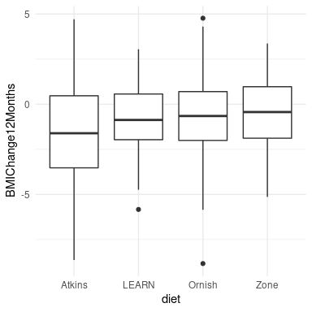

# 17 做重复性研究

大多数人认为科学是回答世界问题的可靠方法。当我们的医生开出治疗处方时，我们相信通过研究已经证明它是有效的，我们也有类似的信念，即我们乘坐的飞机不会从天上掉下来。然而，自 2005 年以来，人们越来越担心科学可能不会一直像我们长久以来认为的那样有效。在本章中，我们将讨论这些关于科学研究再现性的问题，并概述可以采取的步骤，以确保我们的统计结果尽可能具有再现性。

## 17.1 我们认为科学应该如何运作

假设我们对一个关于孩子如何选择吃什么的研究项目感兴趣。这是著名的饮食研究者布莱恩·万辛克和他的同事在 2012 年的一项研究中提出的一个问题。标准（正如我们将看到的，有些幼稚）的观点是这样的：

*   你从一个假设开始
*   用流行人物做品牌应该能让孩子们更频繁地选择“健康”食品。
*   你收集了一些数据
*   让孩子们在饼干和苹果之间做出选择，要么贴上 Elmo 品牌的标签，要么贴上控制标签，并记录下他们的选择。
*   你做统计来检验无效假设
*   “预先计划的比较显示，Elmo 品牌的苹果与儿童选择苹果的比例从 20.7%增加到 33.8%（htg0=5.158；p=0.02）”（Wansink、Just 和 Payne 2012）
*   你根据这些数据得出结论*“这项研究表明，使用品牌或吸引人的品牌特征可能比使用放纵的、经过高度加工的食品更有益于健康的食品。正如吸引人的名字已经被证明可以增加学校午餐室对健康食品的选择一样，品牌和卡通人物对幼儿也有同样的作用。”（Wansink，Just 和 Payne 2012）

## 17.2 科学（有时）是如何工作的

布莱恩·万辛克以他的《无意识饮食》一书而闻名，他参加公司演讲会的费用是几万美元。2017 年，一组研究人员开始仔细研究他发表的一些研究，从一组关于人们在自助餐厅吃多少比萨饼的论文开始。研究人员要求 Wansink 分享这些研究的数据，但他拒绝了，所以他们仔细研究了他的论文，发现论文中存在大量的不一致和统计问题。围绕这一分析的宣传导致了其他一些人深入研究了 Wansink 的过去，包括在 Wansink 和他的合作者之间获取电子邮件。正如 Stephanie Lee 在 BuzzFeed 上报道的那样，这些电子邮件显示了 Wansink 的实际研究实践与幼稚模型的差距：

> …早在 2008 年 9 月，佩恩在收集数据后不久就开始查看数据，但他没有发现任何强大的苹果和埃尔莫链接——至少目前还没有。……佩恩在给他的合作者的信中说：“我已经把孩子研究的一些初步结果附在这封信上，以供你的报告。”“不要绝望。看起来水果上的贴纸可能会起作用（用更多的魔法）。Wansink 也承认这篇论文很差，因为他正准备将其提交给期刊。P 值为 0.06，略低于黄金标准 0.05 的临界值。正如他在 2012 年 1 月 7 日的一封电子邮件中所说，这是一个“症结”。……“在我看来应该更低，”他写道，并附上了一份草案。“你想看看它，看看你的想法吗？如果你能得到数据，它需要一些镊子，最好是得到低于 0.05 的一个值。2012 年晚些时候，这项研究出现在久负盛名的牙买加儿科，0.06 p 值完好无损。但在 2017 年 9 月，它被收回并替换为一个版本，该版本的 p 值为 0.02。一个月后，它又被收回了，原因完全不同：Wansink 承认，这项实验并没有像他最初声称的那样在 8 到 11 岁的孩子身上进行，而是在学龄前儿童身上进行。

这种行为最终赶上了 Wansink；[他的 15 项研究被撤回](https://www.vox.com/science-and-health/2018/9/19/17879102/brian-wansink-cornell-food-brand-lab-retractions-jama)，2018 年他辞去了康奈尔大学的教职。

## 17.3 科学中的再现性危机

人们可能希望布莱恩·万辛克是一个罕见的异类，但越来越清楚的是，在科学中，再现性问题比以前想象的要普遍得多。这一点在 2015 年变得清晰起来，当时一大群研究人员在名为“评估心理科学的再现性”的杂志 _Science_ 上发表了一项研究（开放科学合作 2015）。在这项研究中，研究者们选取了 100 项已发表的心理学研究成果，并试图复制论文最初报道的结果。他们的发现令人震惊：尽管 97%的原始论文报告了具有统计学意义的发现，但在复制研究中只有 37%的这些影响具有统计学意义。尽管心理学中的这些问题受到了广泛关注，但它们似乎存在于几乎所有科学领域，从癌症生物学（Errington 等人 2014 年）和化学（Baker 2017 年）到经济学（Christensen 和 Miguel 2016 年）和社会科学（Camerer 等人 2018 年）。

2010 年之后出现的再现性危机实际上是由斯坦福大学的一位医生约翰·伊奥尼迪斯预测的，他在 2005 年写了一篇题为“为什么大多数发表的研究结果都是错误的”（伊奥尼迪斯，2005 年）的论文。在本文中，伊奥尼迪斯认为，在现代科学的背景下使用零假设统计检验必然会导致高水平的错误结果。

#

## 17.3.1 阳性预测值及统计意义

ioannidis 的分析侧重于一个被称为 _ 阳性预测值 _ 的概念，定义为阳性结果（通常翻译为“统计显著结果”）的比例，这是正确的：

假设我们知道我们的假设是正确的概率（），那么一个真正的正结果的概率就是乘以研究的统计能力：

were为假阴性率。假阳性结果的概率由和假阳性率决定：

PPV 的定义如下：

我们先举一个例子，假设为真的概率很高，比如说 0.8——但是请注意，一般来说，我们不能真正知道这个概率。假设我们使用标准值和进行研究。我们可以将 ppv 计算为：

这意味着，如果我们在一项假设很可能是真实的、权力很高的研究中发现一个积极的结果，那么它成为真实的可能性很高。然而，请注意，假设具有如此高的真实可能性的研究领域可能不是一个非常有趣的研究领域；当研究告诉我们一些新的东西时，它是最重要的！

让我们对一个字段进行相同的分析，其中——也就是说，测试的大多数假设都是错误的。在这种情况下，PPV 是：

这意味着，在一个大多数假设都可能是错误的领域（也就是说，一个有趣的科学领域，研究人员正在测试风险假设），即使我们发现了一个积极的结果，也更可能是错误的，而不是真的！事实上，这只是我们在假设检验中讨论的基础利率效应的另一个例子——当结果不太可能出现时，几乎可以肯定的是，大多数积极的结果将是假阳性。

我们可以模拟这一点，以显示 ppv 与统计功率的关系，作为假设为真的先验概率的函数（参见图[17.1](#fig:PPVsim)）

图 17.1 后验预测值作为统计功率函数（绘制在 x 轴上）的模拟，假设的前验概率为真（绘制为单独的线）。

不幸的是，许多科学领域的统计能力仍然很低（Smaldino 和 McElreath，2016 年），这表明许多已发表的研究结果都是错误的。

#

## 17.3.2 胜利者的诅咒

另一种错误也可能发生在统计能力较低的时候：我们对影响大小的估计将被夸大。这种现象经常被称为“赢家的诅咒”，它来自经济学，它指的是，对于某些类型的拍卖（每个人的价值都是一样的，就像一罐 25 美分的硬币，而竞拍是私人的），赢家几乎总是支付比好的东西更高的价格。.在科学中，赢家的诅咒是指根据重大结果（即赢家）估计的效果大小几乎总是高估真实效果大小的事实。

我们可以对此进行模拟，以了解重要结果的估计效果大小与实际潜在效果大小之间的关系。让我们生成真实效果大小为 0.2 的数据，并在检测到显著效果的情况下估计这些结果的效果大小。图[17.2](#fig:CurseSim)显示，当功率较低时，与实际效果大小相比，显著结果的估计效果大小可能会大大膨胀。

图 17.2 胜利者诅咒作为统计幂函数（x 轴）的模拟。黑线显示估计的效果大小，红色虚线显示实际的效果大小。

图 17.3 一个柱状图，显示数据集中若干样本的样本大小，显著结果以蓝色显示，非显著结果以红色显示。

我们可以通过一个模拟来了解为什么会出现这种情况。在图[17.3](#fig:curseSimSingle)中，您可以看到 1000 个样本的估计效果大小的柱状图，通过测试是否具有统计意义来分隔。从图中可以清楚地看到，如果我们仅仅根据显著的结果来估计效果大小，那么我们的估计就会膨胀；只有当大多数结果都是显著的（即功率高，效果相对较大）时，我们的估计才会接近实际的效果大小。

## 17.4 有问题的研究实践

美国心理协会（Darley，Zanna，and Roediger 2004）出版了一本名为《完整的学术：职业指南》的畅销书，旨在为有抱负的研究人员提供如何建立职业生涯的指导。在著名社会心理学家 DarylBem 撰写的题为“撰写实证期刊文章”的一章中，Bem 就如何撰写研究论文提出了一些建议。不幸的是，他所建议的实践存在严重的问题，并被称为 _ 有问题的研究实践 _（QRPS）。

> **你应该写哪篇文章？**你可以写两篇文章：（1）你计划在设计你的研究时写的文章，或（2）你已经看到结果后最有意义的文章。它们很少相同，正确答案是（2）。

BEM 在这里提出的建议被称为 _Harking_（在结果已知后进行假设）（Kerr 1998）。这可能看起来无害，但有问题，因为它允许研究重新构建一个事后结论（我们应该用一点盐）作为先验预测（我们会有更强的信心）。从本质上讲，它允许研究人员根据事实重写他们的理论，而不是使用该理论进行预测，然后测试它们——类似于移动球门柱，以便球在任何地方移动。因此，很难推翻错误的想法，因为始终可以移动门柱来匹配数据。

> **分析数据**从各个角度检查数据。分别分析性别。组成新的综合指数。如果一个数据表明了一个新的假设，试着在数据的其他地方找到进一步的证据。如果您看到有趣模式的模糊痕迹，请尝试重新组织数据，使其变得更大胆。如果有你不喜欢的参与者，或是试验、观察者或是面试官给了你不正常的结果，暂时放弃他们。去钓鱼探险，寻找一些有趣的东西。不，这不是不道德的。

BEM 在这里建议的是 _p-hacking_，它指的是尝试许多不同的分析，直到找到显著的结果。BEM 是正确的，如果一个人报告对数据所做的每一个分析，那么这种方法就不会是“不道德的”。然而，很少有论文讨论对数据集执行的所有分析；相反，论文通常只提供 _ 起作用的分析 _——这通常意味着他们发现了一个具有统计意义的结果。有许多不同的方法，一个人可以 p-hack：

*   分析每个主题后的数据，一旦 p&lt；.05 停止收集数据。
*   分析许多不同的变量，但只报告具有 P&lt；.05 的变量。
*   收集许多不同的实验条件，但只报告那些与 P&lt；.05
*   排除参与者以获取 P&lt；.05
*   转换数据以获取 P&lt；.05

Simmons、Nelson 和 Simonsohn（2011）的一篇著名论文表明，使用这些 P-hacking 策略可以大大提高实际的假阳性率，从而导致大量的假阳性结果。

#

## 17.4.1 ESP 或 QRP？

2011 年，DarylBem 发表了一篇文章（Bem2011），声称发现了超感官知觉的科学证据。文章指出：

> 本文报告了 9 个实验，涉及 1000 多名参与者，通过“时间倒转”确定的心理效应来测试追溯影响，以便在假定的因果刺激事件发生之前获得个体的反应。…在所有 9 个实验中，psi 性能的平均效应大小（d）为 0.22，除一个实验外，所有实验都产生了统计上显著的结果。

当研究人员开始研究 bem 的文章时，很明显他参与了他在上面讨论的章节中推荐的所有 qrps。正如 TalYarkoni 在[一篇博客文章中指出的那样，文章](http://www.talyarkoni.org/blog/2011/01/10/the-psychology-of-parapsychology-or-why-good-researchers-publishing-good-articles-in-good-journals-can-still-get-it-totally-wrong/)：

*   不同研究的样本量不同
*   不同的研究似乎被集中在一起或分开。
*   这些研究允许许多不同的假设，还不清楚提前计划了哪些假设。
*   BEM 使用了单尾测试，即使还不清楚是否有方向性预测（因此 alpha 实际上是 0.1）
*   大多数 p 值非常接近 0.05。
*   目前还不清楚还有多少其他的研究在进行，但没有报道。

## 17.5 进行重复性研究

在再现性危机爆发的几年里，有一个强有力的运动来开发工具来帮助保护科学研究的再现性。

#

## 17.5.1 预注册

获得最大吸引力的想法之一是 _ 预注册 _，其中一个将研究的详细描述（包括所有数据分析）提交给受信任的存储库（如[开放科学框架](http://osf.io)或[aspredected.org](http://aspredicted.org)）。通过在分析数据之前详细说明一个人的计划，预注册提供了更大的信心，即分析不会受到 P-Hacking 或其他可疑的研究实践的影响。

预注册的效果已经在医学临床试验中看到。2000 年，国家心脏、肺和血液研究所（NHLBI）开始要求使用[clinical trials.gov](http://clinicaltrials.gov)上的系统对所有临床试验进行预注册。这为观察研究预注册的效果提供了一个自然的实验。当 Kaplan 和 Irvin（2015）研究了随着时间推移的临床试验结果时，他们发现 2000 年后临床试验的阳性结果数量比以前减少了。虽然有许多可能的原因，但似乎在研究注册之前，研究人员能够改变他们的方法，以找到一个积极的结果，这在注册后变得更加困难。

#

## 17.5.2 可复制实践

Simmons、Nelson 和 Simonsohn（2011）的论文提出了一套建议做法，以使研究更具可重复性，所有这些做法都应成为研究人员的标准：

> *   作者必须在数据收集开始之前决定终止数据收集的规则，并在文章中报告此规则。
> *   操作者必须为每个单元收集至少 20 个观察结果，否则将产生命令人信任服务的数据收集成成本。
> *   作者必须列出研究中收集的所有变量。
> *   操作者必须报告所有实验条件，包括失败的操作。
> *   如果消除了观察结果，则操作者还必须报告统计结果（如果包括这些观察结果）。
> *   如果分析包含协变量，则操作者必须报告分析的统计结果而不包含协变量。【htg12】【htg13】

#

## 17.5.3 复制

科学的一个标志就是复制（htg0）的思想，也就是说，其他研究人员应该能够进行相同的研究并获得相同的结果。不幸的是，正如我们在前面讨论的复制项目的结果中看到的，许多发现是不可复制的。确保研究的可复制性的最好方法是首先自己复制它；对于某些研究来说，这是不可能的，但只要有可能，就应该确保在新的样本中可以找到它。新的样本应该有足够的能量来找到感兴趣的效果大小；在许多情况下，这实际上需要比原始样本更大的样本。

在复制方面记住一些事情是很重要的。首先，复制尝试失败并不一定意味着原始发现是错误的；请记住，在 80%功率的标准水平下，仍然有五分之一的机会结果是无意义的，即使有真正的效果。出于这个原因，在我们开始相信任何重要发现之前，我们通常希望看到它的多重复制。不幸的是，包括心理学在内的许多领域在过去都未能遵循这一建议，导致“教科书”的发现很可能是错误的。关于 Daryl Bem 的 ESP 研究，涉及 7 项研究的大规模复制尝试未能复制他的发现（Galak 等人 2012 年）。

第二，记住，p 值并不能为我们提供一个发现复制可能性的度量。正如我们之前讨论过的，p 值是一个关于在特定的空假设下一个人的数据的可能性的陈述；它没有告诉我们关于发现实际上是真的概率的任何事情（正如我们在贝叶斯分析一章中所了解的）。为了知道复制的可能性，我们需要知道发现是真的概率，而我们通常不知道。

## 17.6 进行重复性数据分析

到目前为止，我们专注于在新的实验中复制其他研究人员的发现的能力，但再现性的另一个重要方面是能够根据某人自己的数据复制分析，我们称之为 _ 计算再现性。_ 这要求研究人员共享他们的数据和分析代码，这样其他研究人员就可以尝试复制结果，也可以对相同的数据测试不同的分析方法。心理学朝着开放共享代码和数据的方向发展的趋势越来越多；例如，《心理科学》杂志（HTG2）现在为共享研究材料、数据和代码以及预注册的论文提供了“徽章”。

重现分析的能力是我们强烈提倡使用脚本化分析（例如那些使用 R 的分析）而不是使用“点击式”软件包的一个原因。这也是我们提倡使用免费和开源软件（如 R）而不是商业软件包的原因，商业软件包将要求其他人购买软件以复制任何分析。

有很多方法可以共享代码和数据。共享代码的一种常见方式是通过支持 _ 版本控制 _ 软件的网站，如[github](http://github.com)。小数据集也可以通过这些相同的站点共享；大数据集可以通过数据共享门户（如[Zenodo](https://zenodo.org/)）共享，或者通过专门的门户（如[OpenNeuro](http://openneuro.org)用于神经成像数据）共享。

## 17.7 结论：提高科学水平

每一位科学家都有责任改进他们的研究实践，以提高他们研究的再现性。重要的是要记住，研究的目的不是找到一个重要的结果；相反，它是以最真实的方式询问和回答关于自然的问题。我们的大多数假设都是错误的，我们应该对此感到欣慰，这样当我们找到一个正确的假设时，我们会对它的真实性更加自信。

## 17.8 阅读建议

*   [理查德哈里斯（Richard Harris）的《僵尸：草率的科学如何创造毫无价值的治疗、粉碎希望和浪费数十亿美元》（Rigor Mortis:How Sloppy Science Creates Worless Cures，Crushes Hope，and Wasters Billiums）](https://www.amazon.com/dp/B01K3WN72C)
*   [改进统计推断](https://www.coursera.org/learn/statistical-inferences)——关于如何更好地进行统计分析的在线课程，包括本章提出的许多观点。