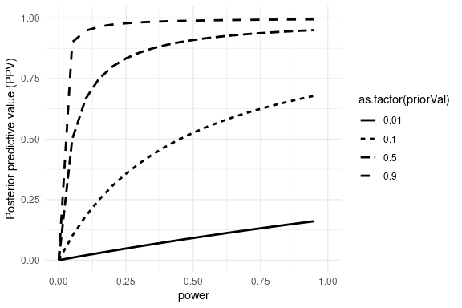

# 18 做可重复的研究

大多数人认为科学是回答世界问题的可靠方法。当我们的医生开出一种疗法时，我们相信它已经被研究证明是有效的，我们也同样相信我们乘坐的飞机不会从天上掉下来。然而，自2005年以来，越来越多的人担心，科学可能并不总是像我们长期以来认为的那样有效。在这一章中，我们将讨论这些关于科学研究可再现性的问题，并概述确保我们的统计结果尽可能可再现的步骤。

## 我们认为科学应该如何运作

假设我们对一个关于儿童如何选择吃什么的研究项目感兴趣。这是知名饮食研究者布莱恩·万辛克及其同事在2012年的一项研究中提出的问题。标准的(我们将看到，有些天真的)观点是这样的:

*   你从一个假设开始
    *   用受欢迎的人物做品牌应该会让孩子们更经常地选择“健康”食品
*   你收集一些数据
    *   让孩子们在贴有Elmo品牌标签或对照标签的饼干和苹果之间进行选择，并记录他们的选择
*   你做统计来检验零假设
    *   “预先计划的比较显示，Elmo品牌的苹果与儿童选择苹果而不是饼干的比例增加有关，从20.7%增加到33.8%(<math display="inline"><semantics><msup><mi>χ</mi><mn>2</mn></msup><annotation encoding="application/x-tex">\chi^2</annotation></semantics></math>= 5.158；p = . 02)([Wansink，Just，and Payne 2012](ch020.xhtml#ref-wans:just:payn:2012) )
*   你根据数据做出结论
    *   “这项研究表明，使用品牌或吸引人的品牌人物对健康食品的益处可能大于对放纵的、高度加工的食品的益处。就像有吸引力的名字可以增加学校餐厅健康食品的选择一样，品牌和卡通人物也可以对幼儿产生同样的效果。 ( [万辛克刚和佩恩2012](ch020.xhtml#ref-wans:just:payn:2012) )

## 科学(有时)实际上是如何运作的

布莱恩·万辛克因他的《无意识饮食》一书而闻名，他在公司演讲的费用一度高达数万美元。2017年，一组研究人员开始仔细审查他发表的一些研究，从一组关于人们在自助餐吃了多少披萨的论文开始。研究人员要求Wansink分享研究数据，但他拒绝了，因此他们深入研究了他发表的论文，并在论文中发现了大量的不一致和统计问题。围绕这一分析的公开报道导致许多其他人挖掘Wansink的过去，包括获得Wansink和他的合作者之间的电子邮件。正如斯蒂芬妮·李在Buzzfeed 上报道的那样，这些电子邮件显示了Wansink的实际研究实践离天真的模型有多远:

> …早在2008年9月，当佩恩在数据收集后不久查看数据时，他没有发现苹果和埃尔默之间有强有力的联系——至少目前没有。…“我已经将儿童研究的一些初步结果附在你的报告中，”佩恩给他的合作者写道。“不要绝望。看起来水果上的贴纸可能会有用(更神奇一点)。”… Wansink也承认这篇论文很薄弱，因为他正准备向期刊投稿。p值为0.06，略低于0.05的黄金标准临界值。正如他在2012年1月7日的电子邮件中所说，这是一个“症结”。…“在我看来应该更低，”他写道，并附上了一份草稿。“你要不要看一看，看看你有什么想法。如果你能得到数据，而且它需要一些调整，那么最好能得到一个低于0.05的值。”…2012年晚些时候，这项研究发表在著名的JAMA Pediatrics杂志上，p值为0.06。但在2017年9月，它被收回，并被一个列出p值为0.02的版本所取代。一个月后，它又因为一个完全不同的原因被收回:万辛克承认，该实验并没有像他最初声称的那样在8至11岁的儿童身上进行，而是在学龄前儿童身上进行。

这种行为终于赶上了万辛克；他的15项研究被撤回，2018年，他辞去了康奈尔大学的教职。

## 18.3 科学中的再现性危机

虽然我们认为Wansink案例中的欺诈行为相对罕见，但越来越清楚的是，重复性问题在科学界比以前想象的要普遍得多。这在2015年变得尤为明显，当时一大群研究人员在杂志 *Science* 上发表了一项研究，题为“估计心理科学的可重复性” ( [开放科学合作2015](ch020.xhtml#ref-open:2015) ) 。在这篇论文中，研究人员选取了100项已发表的心理学研究，并试图重现论文中最初报道的结果。他们的发现令人震惊:尽管97%的原始论文报告了具有统计学意义的发现，但在重复研究中，只有37%的效果具有统计学意义。尽管心理学中的这些问题受到了极大的关注，但它们似乎存在于几乎每个科学领域，从癌症生物学 ( [Errington等人2014](ch020.xhtml#ref-erri:iorn:gunn:2014) ) 和化学 ( [Baker 2017](ch020.xhtml#ref-bake:2017) ) 到经济学 ( [Christensen和Miguel 2016](19.html#ref-NBERw22989) ) 和社会科学 ( [Camerer等人2017)](19.html#ref-Camerer2018EvaluatingTR)

2010年后出现的再现性危机实际上是由约翰·约安尼迪斯预测的，他是一位来自斯坦福的医生，在2005年写了一篇题为“为什么大多数发表的研究结果都是假的”的论文。在这篇文章中，约安尼迪斯认为，在现代科学的背景下使用零假设统计测试必然会导致高水平的错误结果。

### 18.3.1 阳性预测值和统计显著性

Ioannidis的分析侧重于一个被称为*阳性预测值*的概念，它被定义为真实的阳性结果(通常被翻译为“具有统计显著性的发现”)的比例:

<math xmlns:epub="http://www.idpf.org/2007/ops" display="block"><semantics><mrow><mi>P</mi><mi>P</mi><mi>V</mi><mo>=</mo><mfrac><mrow><mi>P</mi><mrow><mo stretchy="true" form="prefix">(</mo><mi>t</mi><mi>r</mi><mi>u</mi><mi>e</mi><mi>P</mi><mi>s</mi><mi>I</mi> )</mrow></mrow><mrow><mi>p</mi><mrow><mo stretchy="true" form="prefix">(</mo><mi>t</mi><mi>r</mi><mi><mi>e</mi><mspace width="0.222em"><mi>p</mi><mi>o</mi><mi>I</mi><mi>t</mi></mspace></mi></mrow><mo>+</mo><mi>p</mi><mrow><mo stretchy="true" form="prefix">(</mo><mi>f</mi><mi>a</mi><mi>l</mi><mi>s</mi><mi>e</mi><mi>p</mi><mi>o</mi><mi>s</mi></mrow></mrow></mfrac></mrow><annotation encoding="application/x-tex">PPV = \ frac { p(true \ positive \ result)} { p(true \ positive \ result)+p(false \ positive \ result)}</annotation></semantics></math>假设我们知道我们的假设为真的概率(<math xmlns:epub="http://www.idpf.org/2007/ops" display="inline"><semantics><mrow><mi>p</mi><mrow><mo stretchy="true" form="prefix">(</mo> <mi>那么一个真阳性结果的概率简单来说就是<math xmlns:epub="http://www.idpf.org/2007/ops" display="inline"><semantics><mrow><mi>p</mi><mrow><mo stretchy="true" form="prefix">(</mo><mi>h</mi><mi>I</mi><mi>s</mi><mi>T</mi><mi>r</mi><mi>u</mi><mi>e</mi></mrow></mrow></semantics></math></mi></mrow></mrow></semantics></math>

<math xmlns:epub="http://www.idpf.org/2007/ops" display="block"><semantics><mrow><mi>p</mi><mrow><mo stretchy="true" form="prefix">(</mo><mi>t</mi><mi>r</mi><mi>u</mi><mi>e</mi><mi>p</mi><mi>o</mi>s<mi>I</mi><mi>t</mi>T27】I<mi>v</mi><mi>e</mi><mi>r</mi></mrow> <mo>=</mo><mi>p</mi><mrow><mo stretchy="true" form="prefix">(</mo><mi>h</mi><mi>I</mi><mi>s</mi><mi>T</mi><mi>r</mi><mi>e</mi></mrow><mo>*</mo> 假阳性结果的概率由<math xmlns:epub="http://www.idpf.org/2007/ops" display="inline"><semantics><mrow><mi>p</mi><mrow><mo stretchy="true" form="prefix">(</mo><mi>h</mi><mi>I</mi><mi>s</mi><mi>T</mi><mi>r</mi><mi>u</mi><mi>e</mi><mo stretchy="true" form="postfix">)</mo></mrow></mrow></semantics></math></mrow></semantics></math>

<semantics><mrow><mi>【p】</mi><mrow><mo stretchy="true" form="prefix">(</mo><mi>【f】</mi><mi>【l13】</mi></mrow><mo>=</mo><mrow><mo stretchy="true" form="prefix"><mn><semantics></semantics></mn></mo></mrow></mrow></semantics>

PPV的定义是:

<semantics><mrow><mi>【p】</mi><mi>【p】</mi><mi>【v】</mi><mo>=<mfrac><mi>p</mi></mfrac></mo></mrow> <mrow><mi><mrow><mo stretchy="true" form="prefix"><mi><mi>【I】</mi></mi></mo></mrow><mo>+</mo><mrow><mo stretchy="true" form="prefix"><mn><semantics></semantics></mn></mo></mrow></mi></mrow></semantics>

让我们首先举一个例子，假设为真的概率很高，比如说0.8——尽管注意，一般来说我们实际上无法知道这个概率。假设我们用<math xmlns:epub="http://www.idpf.org/2007/ops" display="inline"><semantics><mrow><mi>α</mi><mo>=</mo><mn>0.05</mn></mrow><annotation encoding="application/x-tex">\ alpha = 0.05</annotation></semantics></math>和<math xmlns:epub="http://www.idpf.org/2007/ops" display="inline"><semantics><mrow><mi>β</mi><mo>=</mo></mrow><annotation encoding="application/x-tex">\ beta = 0.2</annotation></semantics></math>的标准值进行一项研究。我们可以将PPV计算为:

<math xmlns:epub="http://www.idpf.org/2007/ops" display="block"><semantics><mrow><mi>P</mi><mi>P</mi><mi>V</mi><mo>=</mo><mfrac><mrow><mn>0.8</mn><mo>*</mo><mrow><mo stretchy="true" form="prefix">(</mo><mn>1</mn><mo>—</mo><mn>0.2</mn></mrow></mrow><mrow><mn>0.8</mn><mo>*</mo></mrow><mo>+</mo><mrow><mo stretchy="true" form="prefix">(</mo><mn>1</mn>—T56】0.8<mo stretchy="true" form="postfix">)</mo></mrow><mo>*</mo><mn>0.05</mn></mfrac></mrow><mo>=</mo><mn>0.98</mn> <annotation encoding="application/x-tex">然而，请注意，假设为真的可能性如此之高的研究领域可能不是一个非常有趣的研究领域；当研究告诉我们意想不到的事情时，它是最重要的！</annotation></semantics></math>

让我们对一个字段做同样的分析，其中<math xmlns:epub="http://www.idpf.org/2007/ops" display="inline"><semantics><mrow><mi>p</mi><mrow><mo stretchy="true" form="prefix">(</mo><mi>h</mi><mi>I</mi><mi>s</mi><mi>T</mi><mi>r</mi><mi>u</mi><mi>e</mi>【T22)</mrow><mo>=</mo><mn>0.1</mn></mrow><annotation encoding="application/x-tex">p(hIsTrue)在这种情况下，PPV是:</annotation></semantics></math>

<semantics><mrow><mi>【p】</mi><mi>【p】</mi><mi>【v】</mi><mo>=<mfrac><mn>【0.1】</mn></mfrac></mo></mrow> <mo>+</mo><mrow><mo stretchy="true" form="prefix">(</mo><mn><semantics></semantics></mn><mo><mn>【0.1】</mn><mo stretchy="true" form="postfix">)】</mo></mo></mrow></semantics>

这意味着在一个大多数假设都可能是错误的领域(也就是说，一个有趣的科学领域，研究人员正在测试有风险的假设)，即使我们发现一个积极的结果，它也更有可能是假的而不是真的！事实上，这只是我们在假设检验的背景下讨论的基础利率效应的另一个例子——当一个结果不太可能发生时，那么几乎可以肯定的是，大多数积极的结果都将是假阳性。

我们可以对此进行模拟，以显示PPV如何与统计功效相关，作为假设为真的先验概率的函数(见图 [18.1](#fig:PPVsim) )

图18.1:后验预测值作为统计功效(绘制在x轴上)和假设为真的先验概率(绘制为单独的线条)的函数的模拟。

不幸的是，在许多科学领域，统计能力仍然很低 ( [Smaldino和McElreath 2016](ch020.xhtml#ref-smal:mcel:2016) ) ，这表明许多已发表的研究结果是虚假的。

Jonathan Schoenfeld和John Ioannidis在一篇题为“我们吃的所有东西都与癌症有关吗？一份系统的食谱评论" ( [舍恩菲尔德和约安尼迪斯2013](ch020.xhtml#ref-scho:ioan:2013) ) 。他们检查了大量评估不同食物和癌症风险之间关系的论文，发现80%的成分与增加或降低癌症风险有关。在大多数情况下，统计证据是薄弱的，当跨研究的结果相结合，结果是无效的。

### 18.3.2 胜利者的诅咒

当统计能力较低时，还会出现另一种错误:我们对效应大小的估计会被夸大。这种现象通常被称为“赢家的诅咒”，它来自经济学，指的是这样一个事实，即对于某些类型的拍卖(价值对每个人来说都是一样的，就像一罐25美分的硬币，出价是私人的)，赢家肯定会支付高于商品价值的价格。在科学中，赢家的诅咒指的是这样一个事实，即从重大结果(即赢家)估计的效应大小几乎总是对真实效应大小的高估。

我们可以对此进行模拟，以了解显著结果的估计效应大小与实际潜在效应大小之间的关系。让我们生成真实效应大小为d = 0.2的数据，并估计那些检测到显著效应的结果的效应大小。图 [18.2](#fig:CurseSim) 的左图显示，当功率较低时，与实际效果大小相比，显著结果的估计效果大小可能被大大夸大。

图18.2:左图:作为统计能力(x轴)函数的赢家诅咒的模拟。实线表示估计的效果大小，虚线表示实际的效果大小。右图:一个直方图，显示了数据集内多个样本的效应大小估计值，显著结果显示为蓝色，不显著结果显示为红色。

我们可以通过单个模拟来了解为什么会出现这种情况。在图 [18.2](#fig:CurseSim) 的右侧面板中，您可以看到1000个样本的估计效应大小的直方图，根据测试是否具有统计显著性来区分。从图中可以清楚地看出，如果我们只根据显著的结果来估计效果的大小，那么我们的估计就会被夸大；只有当大多数结果是显著的(即功率高，效应相对大)时，我们的估计才会接近实际的效应大小。

## 18.4 可疑的研究实践

一本由美国心理学协会 ( [Darley、Zanna和Roediger 2004](ch020.xhtml#ref-darl:zann:roed:2004) ) 出版的名为《完整的学术:职业指南》的畅销书，旨在为有抱负的研究人员提供如何建立职业生涯的指导。在著名社会心理学家Daryl Bem题为“撰写实证期刊文章”的一章中，Bem提供了一些关于如何撰写研究论文的建议。不幸的是，他建议的实践存在很大问题，并被称为*有问题的研究实践* (QRPs)。

> 你应该写哪篇文章？您可以写两篇文章:(1)您在设计研究时计划写的文章，或者(2)您看到结果后最有意义的文章。它们很少相同，正确答案是(2)。

贝姆在这里建议的被称为*倾听*(在结果已知后的假设) ( [克尔1998](ch020.xhtml#ref-kerr:1998) ) 。这可能看起来无伤大雅，但有问题，因为它允许研究人员将事后结论(我们应该持保留态度)重新框定为先验预测(我们会对此更有信心)。从本质上讲，它允许研究人员根据事实改写他们的理论，而不是使用理论做出预测，然后进行测试——类似于移动球门柱，使球到达任何地方。因此，消除不正确的想法变得非常困难，因为目标总是可以移动以匹配数据。贝姆继续说道:

> **分析数据**从各个角度检查数据。分别分析性别。组成新的综合指数。如果一个数据提出了一个新的假设，试着在数据的其他地方找到进一步的证据。如果你看到有趣模式的模糊痕迹，尝试重新组织数据，使它们更加清晰。如果有你不喜欢的参与者，或者试验，观察者，或者给你异常结果的面试官，放弃他们(暂时)。为一些有趣的事情——任何事情——进行一次钓鱼探险。不，这不是不道德的。

Bem在这里建议的被称为 *p-hacking* ，指的是尝试许多不同的分析，直到发现一个重要的结果。贝姆是正确的，如果一个人要报告对数据进行的每一次分析，那么这种方法就不是“不道德的”。然而，很少看到论文讨论对数据集进行的所有分析；更确切地说，论文经常只呈现*起作用*的分析——这通常意味着他们发现了一个具有统计学意义的结果。有许多不同的方法可以用来破解:

*   每次受试后分析数据，一旦p < .05，停止收集数据
*   分析许多不同的变量，但只报告那些p < .05的变量
*   收集许多不同的实验条件，但只报告那些p<.05/>
*   排除参与者以获得p<.05/>
*   转换数据以获得p<.05/>

由 Simmons、Nelson和Simonsohn ( [2011](ch020.xhtml#ref-simm:nels:simo:2011) ) 撰写的一篇著名论文显示，使用这类p-hacking策略会大大增加实际的假阳性率，导致大量的假阳性结果。

### 18.4.1 ESP还是QRP？

2011年，同样是达里尔·贝姆发表了一篇文章 ( [贝姆2011](ch020.xhtml#ref-bem:2011) ) ，声称发现了超感知觉的科学证据。该文章指出:

> 这篇文章报道了9个实验，涉及1，000多名参与者，通过“时间反转”公认的心理效应来测试追溯影响，以便在假定的因果刺激事件发生之前获得个体的反应。…在所有9个实验中，psi性能的平均效应大小(d)为0.22，除一个实验外，所有实验都产生了具有统计学意义的结果。

随着研究人员开始检查Bem的文章，很明显他已经参与了他在上面讨论的章节中推荐的所有快速反应程序。正如Tal Yarkoni在一篇研究文章的博客文章中指出的:

*   不同研究的样本量不同
*   不同的研究似乎被混为一谈或割裂开来
*   这些研究允许许多不同的假设，不清楚哪些是事先计划好的
*   即使不清楚是否有方向预测，Bem也使用了单尾检验(所以alpha实际上是0.1)
*   大多数p值非常接近0.05
*   目前还不清楚有多少其他研究已经进行但没有报道

## 18.5 进行可重复研究

在再现性危机出现后的几年里，出现了一个强大的运动来开发工具，以帮助保护科学研究的再现性。

### 18.5.1 预注册

获得最大牵引力的一个想法是*预注册*，其中一个人将一项研究的详细描述(包括所有数据分析)提交给一个可信的存储库(如[开放科学框架](http://osf.io)或【AsPredicted.org】T4)。通过在分析数据之前详细说明自己的计划，预注册提供了更大的信心，即分析不会受到p-hacking或其他有问题的研究实践的影响。

预注册在医学临床试验中的作用是惊人的。2000年，美国国家心肺血液研究所(NHLBI)开始要求所有的临床试验在ClinicalTrials.gov使用该系统进行预注册。这为观察研究预注册的效果提供了一个自然的实验。当卡普兰和欧文( [2015](ch020.xhtml#ref-kapl:irvi:2015) ) 随着时间的推移检查临床试验结果时，他们发现2000年后临床试验的阳性结果数量与之前相比大大减少。虽然有许多可能的原因，但似乎有可能在研究注册之前，研究人员能够改变他们的方法或假设，以便找到阳性结果，这在要求注册后变得更加困难。

### 18.5.2 可重复的实践

由 Simmons、Nelson和Simonsohn ( [2011](ch020.xhtml#ref-simm:nels:simo:2011) ) 撰写的论文列出了一套使研究更具可重复性的建议实践，所有这些都应该成为研究人员的标准:

> 作者必须在数据收集开始前决定终止数据收集的规则，并在文章中报告该规则。*   The author must collect at least 20 observations per cell, otherwise provide a convincing proof of data collection cost.*   The author must list all variables collected in the study. The author must report all the experimental conditions, including the failed operation.*   If the observations are deleted, the author must also report the statistical results if they are included.*   If the analysis contains covariates, the author must report the statistical results of the analysis without covariates.T13】

### 18.5.3 复制

科学的标志之一是*复制*的理念——也就是说，其他研究人员应该能够进行相同的研究并获得相同的结果。不幸的是，正如我们在前面讨论的复制项目的结果中看到的，许多发现是不可复制的。确保一个人的研究的可复制性的最好方法是首先自己复制它；对于一些研究来说，这是不可能的，但只要有可能，就应该确保自己的发现在新的样本中成立。该新样本应该有足够的能量来找到感兴趣的效应大小；在许多情况下，这实际上需要比原来更大的样本。

关于复制，记住几件事很重要。首先，复制尝试失败的事实并不一定意味着最初的发现是错误的；请记住，在80%能量的标准水平下，即使真的有影响，结果仍有五分之一的可能不显著。出于这个原因，在我们决定是否相信之前，我们通常希望看到任何重要发现的多次重复。不幸的是，包括心理学在内的许多领域过去都没有遵循这个建议，导致“教科书”上的发现很可能是错误的。关于Daryl Bem对ESP的研究，一项涉及7项研究的大型复制尝试未能复制他的发现 ( [Galak et al. 2012](ch020.xhtml#ref-gala:lebo:nels:2012) ) 。

第二，请记住，p值并没有为我们提供一个发现复制可能性的度量。正如我们之前所讨论的，p值是在特定的零假设下关于一个人的数据的可能性的陈述；它没有告诉我们任何关于该发现实际上为真的概率(正如我们在贝叶斯分析一章中所学的)。为了知道复制的可能性，我们需要知道发现为真的概率，而我们通常不知道。

## 18.6 进行可再现的数据分析

到目前为止，我们一直专注于在新实验中复制其他研究人员发现的能力，但可重复性的另一个重要方面是能够复制某人对自己数据的分析，我们称之为*计算可重复性。*这要求研究人员共享他们的数据和分析代码，以便其他研究人员既可以尝试重现结果，也可以对相同的数据测试不同的分析方法。心理学越来越倾向于开放代码和数据共享；例如，期刊*心理科学*现在为共享研究材料、数据和代码的论文提供“徽章”，以及预注册。

重现分析的能力是我们强烈提倡使用脚本化分析(例如使用R的分析)而不是使用“点击式”软件包的一个原因。这也是我们提倡使用自由和开源软件(如R)而不是商业软件包的原因，商业软件包需要其他人购买软件才能复制任何分析。

有许多方法可以共享代码和数据。共享代码的一种常见方式是通过支持软件版本控制的网站，如T2 Github T3。小型数据集也可以通过这些相同的网站共享；更大的数据集可以通过数据共享门户共享，如[芝诺多](https://zenodo.org/)，或通过特定类型数据的专门门户共享(如[神经影像数据的OpenNeuro](http://openneuro.org) )。

## 结论:做更好的科学

每个科学家都有责任改进他们的研究实践，以增加他们研究的可重复性。重要的是要记住，研究的目标不是找到一个有意义的结果；相反，它是以最真实的方式询问和回答关于自然的问题。我们的大多数假设都是错误的，我们应该坦然接受这一点，这样当我们找到一个正确的假设时，我们会对它的真实性更有信心。

## 18.8 学习目标

*   描述P-hacking的概念及其对科学实践的影响
*   描述阳性预测值的概念及其与统计功效的关系
*   描述预注册的概念以及它如何有助于防范可疑的研究实践

## 18.9 建议读数

*   《尸僵:草率的科学如何创造无用的疗法，粉碎希望，浪费数十亿》,作者理查德·哈里斯
*   [提高你的统计推断](https://www.coursera.org/learn/statistical-inferences) -一个关于如何做更好的统计分析的在线课程，包括本章提出的许多观点。

