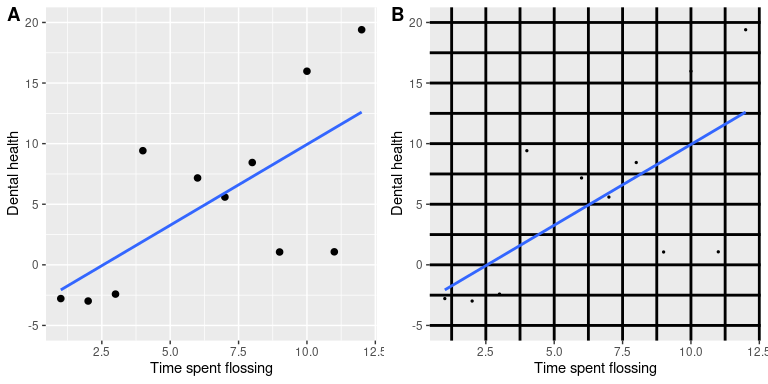
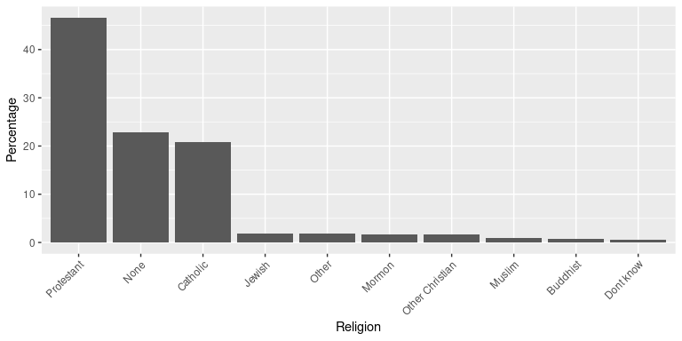
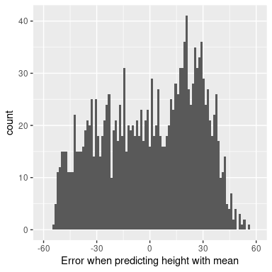
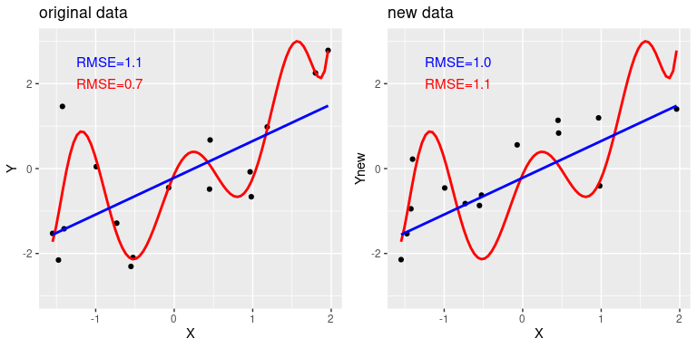
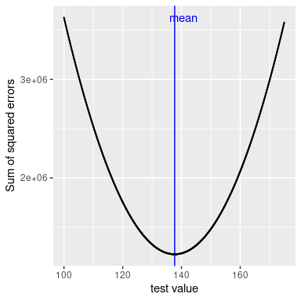

# 5 将模型拟合到数据

统计学中的一个基本活动是创建可以使用一组小数字汇总数据的模型，从而提供对数据的简洁描述。在本章中，我们将讨论统计模型的概念以及如何使用它来描述数据。

## 5.1 什么是模型？

在物理世界中，“模型”通常是对现实世界中事物的简化，尽管如此，它还是传达了被建模事物的本质。建筑物的模型传递建筑物的结构，同时又小又轻，足以用手拿起；生物学中的细胞模型比实际物体大得多，但又传递了细胞的主要部分及其关系。

在统计学中，模型的目的是提供一个类似的简明描述，但用于数据而不是物理结构。与物理模型一样，统计模型通常比所描述的数据简单得多；它旨在尽可能简单地捕获数据的结构。在这两种情况下，我们都意识到，模型是一种方便的虚构，它必然掩盖了被建模的实际事物的一些细节。正如统计学家乔治博克斯所说：“所有的模型都是错误的，但有些模型是有用的。”

统计模型的基本结构是：


这表明数据可以用一个统计模型来描述，这个模型描述了我们期望在数据中发生的事情，以及模型和数据之间的差异，我们称之为 _ 错误 _。

## 5.2 统计建模：示例

让我们来看一个使用 nhanes 中的数据将模型拟合到数据的示例。特别是，我们将尝试在 nhanes 样本中建立儿童身高的模型。首先，让我们加载数据并绘制它们（参见图[5.1](#fig:childHeight)）。



图 5.1 NHANES 儿童身高柱状图。

请记住，我们希望尽可能简单地描述数据，同时仍然捕获它们的重要特性。我们能想象的最简单的模型是什么，它仍然能够捕获数据的本质？数据集中最常见的值（我们称之为 _ 模式 _）如何？R 没有内置的模式函数，所以我们将首先创建一个，我们称之为`getmode()`。

```r
# create function to compute mode and apply to child height data from NHANES
getmode <- function(v) {
  uniqv <- unique(v)
  return(uniqv[which.max(tabulate(match(v, uniqv)))])
}

height_mode <- getmode(NHANES_child$Height)

paste("mode of children's height from NHANES:", height_mode)
```

```r
## [1] "mode of children's height from NHANES: 166.5"
```

鉴于此，我们针对单个数据点的模型将是：


这就用一个数字重新定义了 1691 个孩子的整个集合，如果我们想预测任何一个新孩子的身高，那么我们的猜测将是相同的数字：166.5 厘米。

这个模型有多好？一般来说，我们用误差来定义模型的优度，它代表了模型和数据之间的差异；所有事物都是相等的，产生较低误差的模型就是更好的模型。

```r
# compute error compared to the mode and plot histogram

error_mode <- NHANES_child$Height - height_mode
sprintf("average error from mode (cm): %0.2f", mean(error_mode))
```

```r
## [1] "average error from mode (cm): -28.80"
```

我们发现平均个体的误差相当大，为-28.8 厘米。我们想要一个平均误差为零的模型，结果是如果我们使用算术平均值（通常称为 _ 平均值 _）作为我们的模型，那么情况就是这样。

平均值（通常用变量上的条表示，如）定义为：


也就是说，它是所有值的总和，除以值的数目。我们可以证明平均误差（因此平均误差）之和为零：


考虑到平均误差为零，这似乎是一个更好的模型。让我们确认一下它是正确的。

```r
# compute error from mean

error_mean <- NHANES_child$Height - mean(NHANES_child$Height)
sprintf("average error for mean (cm): %e", mean(error_mean))
```

```r
## [1] "average error for mean (cm): -9.864171e-15"
```


图 5.2 平均值误差分布。

这里的平均误差是一个非常小的数字，虽然技术上不是零；我们稍后将在课程中讨论为什么会发生这种情况（这是由于计算机如何表示数字），但现在您可以将其视为接近零，称之为零。

尽管平均误差的平均值为零，但从图[5.2](#fig:meanError)中的柱状图可以看出，每个个体仍然存在一定程度的误差；有些是正的，有些是负的，而这些误差相互抵消。出于这个原因，我们通常用某种将正错误和负错误都算作坏的度量来总结错误。我们可以使用每个误差值的绝对值，但更常见的是使用平方误差，这是我们将在本课程后面看到的原因。

有几种常见的方法来总结在本书的不同点上会遇到的平方误差，因此了解它们之间的关系是很重要的。首先，我们可以简单地把它们加起来；这被称为 _ 平方误差之和 _。我们通常不使用它的原因是它的大小取决于数据点的数量，所以除非我们观察相同数量的观测结果，否则很难解释。其次，我们可以取平方误差值的平均值，即 _ 平均平方误差（mse）_。但是，由于我们在求平均值之前对这些值进行了平方处理，因此它们与原始数据的比例不同；它们位于中。由于这个原因，我们也经常采用 mse 的平方根，我们称之为 _ 均方根误差（rmse）_，因此它与原始值的单位相同（在本例中为厘米）。

```r
# compute and print RMSE for mean and mode
rmse_mean <- sqrt(mean(error_mean**2))

rmse_mode <- sqrt(mean(error_mode**2))

print(paste("Mode: root mean squared error (centimeters):", rmse_mode))
```

```r
## [1] "Mode: root mean squared error (centimeters): 39.4197926582947"
```

```r
print(paste("Mean: root mean squared error (centimeters):", rmse_mean))
```

```r
## [1] "Mean: root mean squared error (centimeters): 26.9116738708646"
```

这表明平均值有相当大的误差——任何数据点平均距离平均值大约 27 厘米——但它仍然比模式好得多。

#

## 5.2.1 改进我们的模型

我们能想象一个更好的模型吗？请记住，这些数据来自 NHANES 样本中的所有儿童，他们的年龄从 2 岁到 17 岁不等。鉴于年龄范围很广，我们可能期望我们的身高模型也包括年龄。让我们绘制身高和年龄的数据，看看这种关系是否真的存在。


图 5.3 NHANES 儿童的身高，未使用模型（a）绘制，线性模型仅包括年龄（b）或年龄和常数（c），线性模型适合男性和女性年龄的单独影响（d）。

图[5.3](#fig:childHeightLine)的面板 A 中的黑点显示了数据集中的个体，正如我们所期望的，身高和年龄之间似乎有着很强的关系。因此，我们可以建立一个高度与年龄相关的模型：


其中是一个 _ 参数 _，我们用年龄相乘得到最小的误差。您可能已经注意到，这只是一条斜率为的直线，为了看到这一点，让我们在数据顶部用蓝色绘制出最适合的直线（图[5.3](#fig:childHeightLine)中的面板 B）。这个模型显然有问题，因为这条线似乎没有很好地跟踪数据。事实上，这个模型（39.16）的 RMSE 实际上比只包含平均值的模型高！这个问题是因为我们的模型只包括年龄，这意味着当年龄为零时，模型的高度预测值必须为零。即使数据不包括任何年龄为零的子代，但当 x 为零时，该行在数学上被限制为 Y 值为零，这就解释了为什么该行被下拉到较年轻的数据点之下。我们可以通过在我们的模型中包含一个常量来解决这个问题，它基本上代表年龄等于零时高度的估计值；尽管在这个数据集中零岁的年龄是不合理的，但这是一个数学技巧，它将允许模型解释数据。模型为：


其中 _ 常数 _ 是对所有个体的预测增加的一个常量值（我们也称为 _ 截距 _，因为它映射到一条直线方程中的截距上）。稍后我们还将了解如何实际计算这些值；现在，我们将使用 r 中的`lm()`函数计算常量的值，并使用计算出最小的错误。图[5.3](#fig:childHeightLine)中的面板 C 显示了适合于 nhanes 数据的该模型，在该模型中，我们看到线条与数据的匹配比没有常量的要好得多。

```r
## [1] "model: height = 86.11 + 5.48*Age"
```

```r
## [1] "root mean squared error: 8.36"
```

使用这个模型，我们的误差要小得多——平均只有 8.36 厘米。你能想到其他可能与身高有关的变量吗？性别呢？在图[5.3](#fig:childHeightLine)的面板 D 中，我们用分别为男性和女性安装的线条绘制数据。从情节上看，男性和女性之间似乎存在差异，但相对较小，仅在青春期后出现。让我们估计一下这个模型，看看错误是什么样子的：

```r
# compute model fit for modeling with age and gender

model_age_gender <- lm(Height ~ Age + Gender, data = NHANES_child)

rmse_age_gender <-
  NHANES_child %>% 
  add_predictions(model_age_gender, var = "predicted_age_gender") %>% 
  summarise(
    sqrt(mean((Height - predicted_age_gender)**2))
  ) %>% 
  pull()

sprintf(
  "model: height = %0.2f + %0.2f*Age + %0.2f*Gender",
  model_age_gender$coefficients[1],
  model_age_gender$coefficients[2],
  model_age_gender$coefficients[3]
)
```

```r
## [1] "model: height = 84.37 + 5.48*Age + 3.28*Gender"
```

```r
print(sprintf("root mean squared error: %0.2f", rmse_age_gender))
```

```r
## [1] "root mean squared error: 8.20"
```

在图[5.4](#fig:msePlot)中，我们绘制了不同模型的均方根误差值。从这一点上，我们可以看到，从一种模式到另一种模式，从一种模式到另一种模式，从一种模式到另一种模式再到另一种模式+年龄，这个模式变得更好了一点，而且只通过将性别也包括在内，就可以说更好了。


图 5.4 为上述测试的每个模型绘制的均方误差。

## 5.3 什么使模型“良好”？

从我们的统计模型中，我们通常需要两种不同的东西。首先，我们希望它能够很好地描述我们的数据；也就是说，我们希望它在建模数据时具有尽可能低的错误。第二，我们希望它能够很好地概括为新的数据集；也就是说，当我们将其应用于新的数据集时，我们希望它的错误尽可能低。事实证明，这两个特性经常会发生冲突。

为了理解这一点，让我们考虑一下错误的来源。首先，如果我们的模型是错误的，就可能发生这种情况；例如，如果我们不准确地说身高随年龄而下降而不是上升，那么我们的错误将高于正确模型的错误。同样，如果我们的模型中缺少一个重要因素，这也会增加我们的误差（就像我们把年龄从模型中排除在身高之外时那样）。然而，即使模型是正确的，误差也可能发生，因为数据的随机变化，我们通常称之为“测量误差”或“噪声”。有时，这实际上是由于我们的测量误差造成的——例如，当测量值依赖于人时，例如使用秒表测量竞走中经过的时间。在其他情况下，我们的测量设备是高度精确的（像测量体重的数字秤），但被测量的东西受到许多不同因素的影响，这些因素导致它是可变的。如果我们知道所有这些因素，那么我们就可以建立一个更精确的模型，但事实上，这几乎不可能。

让我们用一个例子来说明这一点。我们不使用实际数据，而是为示例生成一些数据；我们将在本课程后面更详细地讨论模拟数据的生成。假设我们想了解一个人的血液酒精含量（BAC）和他们在模拟驾驶考试中的反应时间之间的关系。我们可以生成一些模拟数据并绘制关系图（参见图[5.5](#fig:BACrt)的面板 A）。


图 5.5 驾驶试验中血液酒精含量与反应时间的模拟关系，最佳拟合线性模型。A：线性关系，测量误差小。B：线性关系，测量误差较大。C：具有低测量误差和（不正确）线性模型的非线性关系

在这个例子中，反应时间随血液中的酒精含量而有系统地增加——蓝线表示最合适的模型，我们可以看到误差很小，这很明显，所有的点都非常接近这条线。

我们也可以想象数据显示相同的线性关系，但有更多的误差，如图[5.5](#fig:BACrt)的面板 B 所示。在这里，我们看到仍然有一个系统的反应时间增加与细菌，但它是更多的个人变量。

这两个例子都是 _ 线性模型 _ 似乎合适的，并且误差反映了我们测量中的噪声。线性模型规定两个变量之间的关系遵循直线。例如，在线性模型中，无论 BAC 的级别如何，BAC 的变化总是与反应时间的特定变化相关。

另一方面，还有其他情况下线性模型是不正确的，并且由于没有正确地指定模型，误差会增加。假设我们对咖啡因摄入量和测试表现之间的关系感兴趣。咖啡因等兴奋剂与测试成绩之间的关系往往是非线性的，也就是说，它不遵循直线。这是因为随着咖啡因含量的减少（当这个人变得更加警觉时），工作表现也会随之上升，但随着咖啡因含量的增加（当这个人变得紧张和紧张时），工作表现也会开始下降。我们可以模拟这种形式的数据，然后将线性模型拟合到数据中（参见图[5.5](#fig:BACrt)的面板 C）。蓝线表示最符合这些数据的直线；显然，存在高度错误。虽然在测试表现和咖啡因摄入量之间有着非常合法的关系，但它是一条曲线而不是一条直线。线性模型误差很大，因为它是这些数据的错误模型。

## 5.4 模型是否太好？

错误听起来像是一件坏事，通常我们更喜欢误差较低的模型，而不是误差较高的模型。然而，我们在上面提到，在模型精确地适应当前数据集的能力和它概括为新数据集的能力之间存在着一种张力，并且结果表明，误差最小的模型在概括为新数据集时往往更糟糕！

为了看到这一点，让我们再次生成一些数据，以便我们知道变量之间的真正关系。我们将创建两个模拟数据集，它们以完全相同的方式生成——它们只是添加了不同的随机噪声。

![An example of overfitting. Both datasets were generated using the same model, with different random noise added to generate each set.  The left panel shows the data used to fit the model, with a simple linear fit in blue and a complex (8th order polynomial) fit in red.  The root mean square error values for each model are shown in the figure; in this case, the complex model has a lower RMSE than the simple model.  The right panel shows the second dataset, with the same model overlaid on it and the RMSE values computed using the model obtained from the first dataset.  Here we see that the simpler model actually fits the new dataset better than the more complex model, which was overfitted to the first dataset.](img/file18.png)

图 5.6 过拟合示例。两个数据集都是使用相同的模型生成的，每个数据集都添加了不同的随机噪声。左面板显示了用于拟合模型的数据，简单的蓝色线性拟合和复杂的（8 阶多项式）红色拟合。每个模型的均方根误差值如图所示；在这种情况下，复杂模型的 RMSE 比简单模型低。右面板显示了第二个数据集，上面覆盖了相同的模型，并且使用从第一个数据集获得的模型计算了 RMSE 值。在这里，我们看到更简单的模型实际上比更复杂的模型更适合新的数据集，后者过度适合第一个数据集。

图[5.6](#fig:Overfitting)中的左面板显示，更复杂的模型（红色）比简单的模型（蓝色）更适合数据。然而，当相同的模型应用于以相同方式生成的新数据集时，我们看到了相反的情况——这里我们看到，较简单的模型比较复杂的模型更适合新数据。从直观上看，较复杂的模型受第一个数据集中特定数据点的影响较大；由于这些数据点的确切位置受随机噪声的驱动，导致较复杂的模型很难适应新的数据集。这是一个我们称之为 _ 过拟合 _ 的现象，我们将在本课程中反复讨论。稍后，我们将学习一些技术，我们可以使用这些技术来防止过度拟合，同时仍然对数据结构敏感。现在，重要的是要记住，我们的模型适合需要是好的，但不是太好。正如阿尔伯特爱因斯坦（1933）所说：“几乎不能否认，所有理论的最高目标是使不可约的基本要素尽可能简单和少，而不必放弃对单一经验数据的充分表示。”这通常被解释为：“一切应该尽可能简单，但不能简单。”

## 5.5 最简单的模型：平均值

我们已经遇到了平均值（或平均值），事实上，大多数人知道平均值，即使他们从未上过统计课。它通常用来描述我们称之为数据集“中心趋势”的东西——也就是说，数据以什么值为中心？大多数人不认为计算平均值是将模型与数据相匹配。然而，这正是我们计算平均值时要做的。

我们已经看到了计算数据样本平均值的公式：


注意，我说过这个公式是专门针对数据的 _ 样本 _ 的，它是从更大的人群中选择的一组数据点。我们希望通过一个样本来描述一个更大的群体——我们感兴趣的全套个体。例如，如果我们是一个政治民意测验者，我们感兴趣的人群可能都是注册选民，而我们的样本可能只包括从这个人群中抽取的几千人。在本课程的后面，我们将更详细地讨论抽样，但现在重要的一点是统计学家通常喜欢使用不同的符号来区分描述样本值的统计数据和描述总体值的参数；在这种情况下，公式 a 表示总体平均值（表示为）为：


其中 n 是整个人口的大小。

我们已经看到，平均值是保证给我们的平均误差为零的汇总统计。平均值还有另一个特点：它是最小化平方误差总和（SSE）的汇总统计。在统计学中，我们称之为“最佳”估计量。我们可以从数学上证明这一点，但我们将在图[5.7](#fig:MinSSE)中以图形方式证明这一点。


图 5.7 平均值作为统计值的证明，可使平方误差之和最小化。使用 nhanes 子高度数据，我们计算平均值（用蓝色条表示）。然后，我们测试其他值的范围，对于每个值，我们从该值计算每个数据点的平方误差之和，该值由黑色曲线表示。我们看到平均值降到平方误差图的最小值。

SSE 的最小化是一个很好的特性，这就是为什么平均值是最常用的统计数据汇总。然而，均值也有一个阴暗面。假设一个酒吧有五个人，我们检查每个人的收入：

```r
# create income data frame

incomeDf <- 
  tibble(
  income = c(48000, 64000, 58000, 72000, 66000),
  person = c("Joe", "Karen", "Mark", "Andrea", "Pat")
)
# glimpse(incomeDf)

panderOptions('digits',2)
pander(incomeDf)
```

<colgroup><col style="width: 12%"> <col style="width: 12%"></colgroup> 
| 收入 | 人 |
| --- | --- |
| 48000 个 | 乔 |
| 64000 个 | 凯伦 |
| 5.8 万 | 作记号 |
| 72000 个 | 安德莉亚 |
| 66000 个 | 拍打 |

```r
sprintf("Mean income: %0.2f", mean(incomeDf$income))
```

```r
## [1] "Mean income: 61600.00"
```

这个平均值似乎是这五个人收入的一个很好的总结。现在让我们看看如果碧昂斯·诺尔斯走进酒吧会发生什么：

```r
# add Beyonce to income data frame

incomeDf <- 
  incomeDf %>% 
  rbind(c(54000000, "Beyonce")) %>% 
  mutate(income = as.double(income))

pander(incomeDf)
```

<colgroup><col style="width: 13%"> <col style="width: 13%"></colgroup> 
| income | person |
| --- | --- |
| 48000 | Joe |
| 64000 | Karen |
| 58000 | Mark |
| 72000 | Andrea |
| 66000 | Pat |
| 5.4E+07 型 | 碧昂斯 |

```r
sprintf("Mean income: %0.2f", mean(incomeDf$income))
```

```r
## [1] "Mean income: 9051333.33"
```

平均值现在接近 1000 万美元，这并不能真正代表酒吧里的任何人——特别是，它受到了碧昂丝价值的巨大驱动。一般来说，平均值对极值非常敏感，这就是为什么在使用平均值汇总数据时，确保没有极值总是很重要的原因。

#

## 5.5.1 中间值

如果我们想以对异常值不太敏感的方式总结数据，我们可以使用另一种称为 _ 中位数 _ 的统计。如果我们按大小来排序所有的值，那么中值就是中间值。如果有一个偶数的值，那么中间会有两个值，在这种情况下，我们取这两个数字的平均值（即中间点）。

让我们来看一个例子。假设我们要总结以下值：

```r
# create example data frame
dataDf <- 
  tibble(
    values = c(8, 6, 3, 14, 12, 7, 6, 4, 9)
  )

pander(dataDf)
```

<colgroup><col style="width: 11%"></colgroup> 
| 价值观 |
| --- |
| 8 个 |
| 6 |
| 三 |
| 14 |
| 12 个 |
| 7 |
| 6 |
| 4 |
| 9 |

如果我们对这些值进行排序：

```r
# sort values and print
dataDf <-
  dataDf %>% 
  arrange(values)

pander(dataDf)
```

<colgroup><col style="width: 11%"></colgroup> 
| values |
| --- |
| 3 |
| 4 |
| 6 |
| 6 |
| 7 |
| 8 |
| 9 |
| 12 |
| 14 |

中间值是中间值，在本例中是 9 个值中的第 5 个。

平均值最小化平方误差之和，而中位数最小化一个微小的不同数量：绝对误差之和。这就解释了为什么它对异常值不那么敏感——与采用绝对值相比，平方化会加剧较大误差的影响。我们可以在收入示例中看到这一点：

```r
# print income table
pander(incomeDf)
```

<colgroup><col style="width: 13%"> <col style="width: 13%"></colgroup> 
| income | person |
| --- | --- |
| 48000 | Joe |
| 64000 | Karen |
| 58000 | Mark |
| 72000 | Andrea |
| 66000 | Pat |
| 5.4e+07 | Beyonce |

```r
sprintf('Mean income: %.2f',mean(incomeDf$income))
```

```r
## [1] "Mean income: 9051333.33"
```

```r
sprintf('Median income: %.2f',median(incomeDf$income))
```

```r
## [1] "Median income: 65000.00"
```

中位数更能代表整个群体，对一个大的离群值不太敏感。

既然如此，我们为什么要用平均数呢？正如我们将在后面的章节中看到的，平均值是“最佳”估计值，因为与其他估计值相比，它在样本之间的差异较小。这取决于我们是否值得考虑对潜在异常值的敏感性——统计数据都是关于权衡的。

## 5.6 模式

有时，我们希望描述非数字数据集的中心趋势。例如，假设我们想知道哪种型号的 iPhone 最常用。假设我们问一组 iPhone 用户他们拥有哪种型号，并得到以下结果：

```r
# compute mean of iPhone model numbers
iphoneDf <- 
  tribble(
    ~iPhoneModel, ~count,
    5, 325,
    6, 450,
    7, 700,
    8, 625
)

meanPhoneNumber <- 
  iphoneDf %>% 
  summarize(
    sum(iPhoneModel * count) / sum(count)
  ) %>% 
  pull()
```

如果我们取这些值的平均值，我们会发现平均的 iPhone 型号是 6.77，这显然是无稽之谈，因为 iPhone 型号是按顺序排列的。在这种情况下，对集中趋势更合适的度量是模式，这是数据集中最常见的值，正如我们前面讨论的那样。

## 5.7 变异性：平均值与数据的拟合程度如何？

一旦我们描述了数据的中心趋势，我们通常还想描述数据的变量——有时也称为“分散度”，这反映了一个事实，即它描述了数据的分散程度。

我们已经遇到了上面的平方误差之和，这是最常用的变异性度量的基础：方差 _ 和标准差 _。一个总体的方差（称为）只是平方误差除以观测次数的总和，也就是说，你之前遇到的 _ 平均平方误差 _。__


其中是人口平均数。标准差就是这个的平方根，也就是我们以前看到的 _ 均方根误差 _。标准偏差是有用的，因为误差的单位与原始数据相同（撤消我们应用于误差的平方）。

我们通常无法访问整个群体，因此我们必须使用一个样本来计算方差，我们称之为，其中“hat”表示这是一个基于样本的估计。的方程式与的方程式相似：


这两个方程之间的唯一区别是我们用 n-1 而不是 n 来除。这与一个基本的统计概念有关：_ 自由度 _。记住，为了计算样本方差，我们首先必须估计样本均值。在估计了这一点之后，数据中的一个值就不再是自由变化的了。例如，假设我们有以下数据点：

```r
# generate example data points

dfDf <- 
  tibble(
    x = c(3, 5, 7, 9, 11)
  )

pander(dfDf)
```

<colgroup><col style="width: 5%"></colgroup> 
| X |
| --- |
| 三 |
| 5 个 |
| 7 |
| 9 |
| 11 个 |

现在我们计算平均值：

```r
# compute mean

meanx <-
  dfDf %>% 
  summarize(
    mean(x)
  ) %>% 
  pull()

sprintf('%0.2f',meanx)
```

```r
## [1] "7.00"
```

因为我们知道这个数据集的平均值是 7，所以我们可以计算出如果缺少某个特定的值会是什么。例如，假设我们要模糊第一个值（3）。这样做之后，我们仍然知道它的值必须是 3，因为 7 的平均值意味着所有值的总和是和。

所以当我们说我们已经“失去”了一定程度的自由，这意味着有一个值在拟合模型后是不能自由改变的。在样本方差的背景下，如果我们不考虑失去的自由度，那么我们对样本方差的估计将是 _ 偏向 _——也就是说，它将小于真实（总体）值。

## 5.8 使用模拟了解统计数据

我非常了解使用计算机模拟来理解统计概念，在以后的课程中，我们将深入探讨这些概念的使用。在这里，我们将通过询问在计算样本方差时是否可以确认是否需要从样本大小中减去 1 来介绍这个想法。

让我们将来自 nhanes 数据的整个儿童样本视为我们的“群体”，并查看使用分母中的 n 或 n-1 计算样本方差对数据中大量模拟随机样本的群体方差有多好。现在不要担心细节——我们稍后会回到课程中。

```r
# compare variance estimates using N or N-1 in denominator

population_variance <- 
  NHANES_child %>% 
  summarize(
    var(Height)
  ) %>% 
  pull()

# take 100 samples and estimate the sample variance using both N or N-1  in the demoninator
sampsize <- 50
nsamp <- 1000
varhat_n <- array(data = NA, dim = nsamp)
varhat_nm1 <- array(data = NA, dim = nsamp)

for (i in 1:nsamp) {
  samp <- sample_n(NHANES_child, 1000)[1:sampsize, ]
  sampmean <- mean(samp$Height)
  sse <- sum((samp$Height - sampmean)**2)
  varhat_n[i] <- sse / sampsize
  varhat_nm1[i] <- sse / (sampsize - 1)
}

sprintf("population variance: %.2f", population_variance)
```

```r
## [1] "population variance: 724.67"
```

```r
sprintf("variance estimate(n): %.2f", mean(varhat_n))
```

```r
## [1] "variance estimate(n): 709.03"
```

```r
sprintf("variance estimate(n-1): %.2f", mean(varhat_nm1))
```

```r
## [1] "variance estimate(n-1): 723.50"
```

这表明上述理论是正确的：以为分母的方差估计与以全数据（即总体）为分母计算的方差非常接近，而以为分母计算的方差与真实的 v 值相比有偏差（较小）。值。

## 5.9 Z 分数

```r
crimeData <- 
  read.table(
    "data/CrimeOneYearofData_clean.csv", 
    header = TRUE, 
    sep = ","
  )

# let's drop DC since it is so small
crimeData <- 
  crimeData %>%
  dplyr::filter(State != "District of Columbia")

caCrimeData <- 
  crimeData %>%
  dplyr::filter(State == "California")
```

以分布的中心趋势和变异性为特征后，通常有助于根据个体分数相对于总体分布的位置来表示。假设我们有兴趣描述不同州犯罪的相对水平，以确定加利福尼亚是否是一个特别危险的地方。我们可以使用来自[FBI 统一犯罪报告网站](https://www.ucrdatatool.gov/Search/Crime/State/RunCrimeOneYearofData.cfm)的 2014 年数据来问这个问题。图[5.8](#fig:crimeHist)的左面板显示了每个州暴力犯罪数量的柱状图，突出了加州的价值。从这些数据来看，加利福尼亚州似乎非常危险，当年共有 153709 起犯罪。



图 5.8 左：暴力犯罪数量的柱状图。CA 的值以蓝色绘制。右图：一张相同数据的地图，用彩色绘制每个州的犯罪数量。

使用 r，还可以很容易地生成一个显示变量跨状态分布的地图，如图[5.8](#fig:crimeHist)右面板所示。

然而，你可能已经意识到加州在美国任何一个州的人口都是最多的，所以它也会有更多的犯罪是合理的。如果我们将这两种情况相提并论（参见图[5.9](#fig:popVsCrime)的左面板），我们就会发现人口与犯罪数量之间存在直接关系。


图 5.9 左：按州划分的犯罪数量与人口的关系图。对：人均犯罪率的柱状图，以每 10 万人的犯罪率表示。

我们不应使用犯罪的原始数量，而应使用人均暴力犯罪率，即犯罪数量除以国家人口所得的比率。FBI 的数据集已经包含了这个值（以每 100000 人的比率表示）。

```r
# print crime rate statistics, normalizing for population

sprintf("rate of 2014 violent crimes in CA: %.2f", caCrimeData$Violent.Crime.rate)
```

```r
## [1] "rate of 2014 violent crimes in CA: 396.10"
```

```r
sprintf("mean rate: %.2f", mean(crimeData$Violent.Crime.rate))
```

```r
## [1] "mean rate: 346.81"
```

```r
sprintf("std of rate: %.2f", sd(crimeData$Violent.Crime.rate))
```

```r
## [1] "std of rate: 128.82"
```

从右图[5.9](#fig:popVsCrime)中我们可以看出，加利福尼亚毕竟没有那么危险——它每 10 万人的犯罪率为 396.1，略高于 346.81 的平均值，但在许多其他州的范围内。但是，如果我们想更清楚地了解它与发行版的其他部分有多远呢？

_z-score_ 允许我们以一种方式表示数据，从而更深入地了解每个数据点与整体分布的关系。如果我们知道总体平均值和标准差的值，则计算数据点 z 得分的公式为：


直观地说，你可以把 z 值看作是告诉你离任何数据点的平均值有多远，以标准偏差为单位。我们可以根据犯罪率数据来计算，如图[5.10](#fig:crimeZplot)所示。

```r
## [1] "mean of Z-scored data: 1.4658413372004e-16"
```

```r
## [1] "std deviation of Z-scored data: 1"
```


图 5.10 原始犯罪率数据与 Z 评分数据的散点图。

散点图表明，z-得分的过程并没有改变数据点的相对分布（可以看到原始数据和 z-得分数据在相互作图时落在一条直线上），只是将它们移动到一个平均值为零和一个标准差。一个。然而，如果你仔细观察，你会发现平均值并不完全为零——只是非常小。这里所发生的是，计算机以一定的 _ 数字精度 _ 表示数字，这意味着有些数字不完全为零，但小到 R 认为它们为零。

```r
# examples of numerical precision

print(paste("smallest number such that 1+x != 1", .Machine$double.eps))
```

```r
## [1] "smallest number such that 1+x != 1 2.22044604925031e-16"
```

```r
# We can confirm this by showing that adding anything less than that number to
# 1 is treated as 1 by R
print((1 + .Machine$double.eps) == 1)
```

```r
## [1] FALSE
```

```r
print((1 + .Machine$double.eps / 2) == 1)
```

```r
## [1] TRUE
```

```r
# we can also look at the largest number
print(paste("largest number", .Machine$double.xmax))
```

```r
## [1] "largest number 1.79769313486232e+308"
```

```r
# similarly here, we can see that adding 1 to the largest possible number
# is no different from the largest possible number, in R's eyes at least.
print((1 + .Machine$double.xmax) == .Machine$double.xmax)
```

```r
## [1] TRUE
```

图[5.11](#fig:crimeZmap)显示了使用地理视图的 Z 评分犯罪数据。



图 5.11 呈现在美国地图上的犯罪数据，以 z 分数表示。

这为我们提供了一个稍微更具解释性的数据视图。例如，我们可以看到内华达州、田纳西州和新墨西哥州的犯罪率都比平均值高出大约两个标准差。

#

## 5.9.1 解释 z-分数

“z-得分”中的“z”源于标准正态分布（即平均值为零且标准偏差为 1 的正态分布）通常被称为“z”分布。我们可以使用标准正态分布来帮助我们了解相对于分布的其余部分，特定的 z 分数告诉我们数据点的位置。


图 5.12 标准正态分布的密度（顶部）和累积分布（底部），在平均值以上/以下的一个标准偏差处进行截止。

图[5.12](#fig:zDensityCDF)中的上面板显示，我们预计约 16%的值会落在中，同样的比例也会落在中。


图 5.13 标准正态分布的密度（顶部）和累积分布（底部），平均值以上/以下两个标准偏差处的截止值

图[5.13](#fig:zDensity2SD)显示了两个标准偏差的相同曲线图。在这里，我们看到只有约 2.3%的值落在中，同样的也落在中。因此，如果我们知道特定数据点的 z 值，我们可以估计找到一个值的可能性或可能性有多大，至少与该值一样极端，这样我们就可以将值放入更好的上下文中。

#

## 5.9.2 标准化评分

假设我们希望生成平均值为 100、标准差为 10 的标准化犯罪评分，而不是 Z 评分。这类似于用智力测验的分数来产生智力商数（IQ）的标准化。我们可以简单地将 z 分数乘以 10，然后再加 100。

```r
## [1] "mean of standardized score data: 100"
```

```r
## [1] "std deviation of standardized score data: 10"
```


图 5.14 犯罪数据以标准化分数呈现，平均值为 100，标准差为 10。

##

## 5.9.2.1 使用 z 分比较分布

z 值的一个有用的应用是比较不同变量的分布。假设我们想比较暴力犯罪和财产犯罪在各州的分布情况。在图[5.15](#fig:crimeTypePlot)的左面板中，我们将这些图形绘制在一起，用蓝色绘制 CA。正如你所看到的，财产犯罪的原始率远远高于暴力犯罪的原始率，所以我们不能直接比较数字。但是，我们可以将这些数据的 z 值相互绘制出来（图[5.15](#fig:crimeTypePlot)的右面板）——这里我们再次看到数据的分布没有改变。把每一个变量的数据放入 z 值后，就可以进行比较了，让我们看到加州实际上处于暴力犯罪和财产犯罪分布的中间。



图 5.15 暴力与财产犯罪率（左）和 Z 得分率（右）的曲线图。

让我们再给情节加一个因素：人口。在图[5.16](#fig:crimeTypePopPlot)的左面板中，我们使用绘图符号的大小来显示这一点，这通常是向绘图添加信息的一种有用方法。



图 5.16 左图：暴力犯罪率与财产犯罪率的对比图，人口规模以绘图符号的大小表示；加利福尼亚州以蓝色表示。对：针对人口的暴力和财产犯罪的得分差异。

因为 z 分数是直接可比的，所以我们也可以计算“暴力差异”分数，该分数表示各州暴力与非暴力（财产）犯罪的相对比率。然后我们可以将这些得分与人口进行对比（参见图[5.16](#fig:crimeTypePopPlot)的右面板）。这说明我们如何使用 z-分数将不同的变量放在一个共同的尺度上。

值得注意的是，最小的国家在两个方向上的差异似乎最大。虽然这可能会吸引我们去观察每一个状态，并试图确定为什么它有一个高或低的差异分数，但这可能反映了这样一个事实，即从较小的样本中获得的估计值必然会有更多的变量，正如我们将在几章中更详细地讨论的那样。