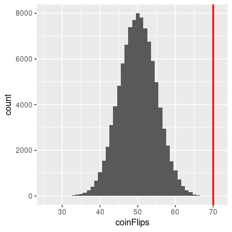
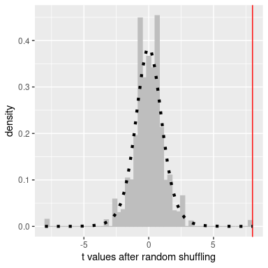
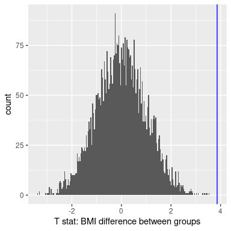

## 8.1 蒙特卡罗模拟

蒙特卡洛模拟的概念是由数学家斯坦·乌兰姆和尼古拉斯·大都会提出的，他们正致力于开发原子武器，作为曼哈顿项目的一部分（[https://en.wikipedia.org/wiki/manhattan_project](https://en.wikipedia.org/wiki/Manhattan_Project)）。他们需要计算中子与原子核碰撞前在物质中的平均移动距离，但是他们不能用标准数学计算这个距离。乌兰姆意识到这些计算可以用随机数模拟，就像赌场游戏一样。在赌场游戏中，数字是随机抽取的；为了估计特定结果的概率，您可以玩数百次游戏。乌兰姆的叔叔曾在摩纳哥的蒙特卡洛赌场赌博，很明显这项新技术的名字就是从那里来的。

执行蒙特卡洛模拟有四个步骤：

1.  定义可能值的域
2.  根据概率分布在该域内生成随机数
3.  使用随机数执行计算
4.  通过多次重复组合结果

作为一个例子，让我们假设我想计算出有多少时间来进行课堂测验。假设我们知道测验完成时间的分布是正常的，平均为 5 分钟，标准差为 1 分钟。考虑到这一点，测试周期需要多长时间才能让我们期望每个人完成 99%的时间？有两种方法可以解决这个问题。第一种方法是使用一种称为极值统计的数学理论来计算答案。然而，这在数学上是相当复杂的。或者，我们可以使用蒙特卡罗模拟。为此，我们需要从正态分布中生成随机样本。

## 8.2 统计的随机性

“随机”一词通常被通俗地用来指那些奇怪或意想不到的事物，但在统计学中，这个词有一个非常具体的含义：如果一个过程是不可预测的，它就是“随机的”。例如，如果我掷一枚公平硬币 10 次，一次掷硬币的结果值不会提供任何信息，让我预测下一次掷硬币的结果。重要的是要注意的是，有些事情是不可预测的，并不一定意味着它是不确定性的。例如，当我们抛硬币时，抛硬币的结果是由物理定律决定的；如果我们足够详细地知道所有的条件，我们应该能够预测抛硬币的结果。然而，许多因素结合起来，使得硬币翻转的结果在实践中是不可预测的。

心理学家已经证明，人类实际上对随机性的认识相当差。首先，当模式不存在时，我们倾向于看到它们。在极端情况下，这导致了 _pareidolia_ 现象，在这种现象中，人们会在随机的模式中感知到熟悉的物体（例如，将云视为人脸或在一片吐司中看到圣母玛利亚）。第二，人类倾向于将随机过程视为自我修正，这导致我们期望在一场游戏中输掉许多回合之后，我们会“赢得一场比赛”，这是一个被称为“赌徒谬论”的现象。

## 8.3 生成随机数

运行蒙特卡罗模拟需要我们生成随机数。只有通过物理过程才能生成真正的随机数（即完全不可预测的数），例如原子衰变或骰子滚动，这些过程很难获得和/或太慢，无法用于计算机模拟（尽管可以从[NIST 随机信标](https://www.nist.gov/programs-projects/nist-randomness-beacon%5D)）。

一般来说，我们使用计算机算法生成的 _ 伪随机 _ 数字来代替真正的随机数；从难以预测的意义上讲，这些数字看起来是随机的，但实际上这些数字序列在某一点上会重复出现。例如，R 中使用的随机数生成器将在个数之后重复。这远远超过了宇宙历史上的秒数，我们一般认为这对于统计分析的大多数目的来说都是好的。

在 R 中，有一个函数可以为每个主要概率分布生成随机数，例如：

*   `runif()`-均匀分布（0 和 1 之间的所有值相等）
*   `rnorm()`-正态分布
*   `rbinom()`-二项分布（如掷骰子、掷硬币）

图[8.1](#fig:rngExamples)显示了使用`runif()`和`rnorm()`函数生成的数字示例，这些函数使用以下代码生成：

```r
p1 <-
  tibble(
    x = runif(10000)
  ) %>% 
  ggplot((aes(x))) +
  geom_histogram(bins = 100) + 
  labs(title = "Uniform")

p2 <-
  tibble(
    x = rnorm(10000)
  ) %>% 
  ggplot(aes(x)) +
  geom_histogram(bins = 100) +
  labs(title = "Normal")

plot_grid(p1, p2, ncol = 3)
```



图 8.1 由均匀（左）或正态（右）分布生成的随机数示例。

如果您有一个 _ 分位数 _ 函数用于分发，您还可以为任何分发生成随机数。这是累积分布函数的倒数；分位数函数不是确定一组值的累积概率，而是确定一组累积概率的值。使用分位数函数，我们可以从均匀分布中生成随机数，然后通过它的分位数函数将其映射到兴趣分布中。

默认情况下，每次运行上面描述的随机数生成器函数之一时，R 都会生成一组不同的随机数。但是，通过将所谓的 _ 随机种子 _ 设置为特定值，也可以生成完全相同的随机数集。我们将在本书中的许多示例中这样做，以确保示例是可重复的。

```r
# if we run the rnorm() command twice, it will give us different sets of pseudorandom numbers each time
print(rnorm(n = 5))
```

```r
## [1]  1.48  0.18  0.21 -0.15 -1.72
```

```r
print(rnorm(n = 5))
```

```r
## [1] -0.691 -2.231  0.391  0.029 -0.647
```

```r
# if we set the random seed to the same value each time, then it will give us the same series of pseudorandom numbers each time.
set.seed(12345)
print(rnorm(n = 5))
```

```r
## [1]  0.59  0.71 -0.11 -0.45  0.61
```

```r
set.seed(12345)
print(rnorm(n = 5))
```

```r
## [1]  0.59  0.71 -0.11 -0.45  0.61
```

## 8.4 使用蒙特卡罗模拟

让我们回到考试结束时间的例子。假设我管理三个测验，并记录每个学生每次考试的完成时间，这可能类似于图[8.2](#fig:finishingTimes)所示的分布。


图 8.2 模拟完成时间分布。

然而，我们真正想知道的不是完成时间的分布是什么样子的，而是每个测验的 _ 最长 _ 完成时间的分布是什么样子的。为了做到这一点，我们可以模拟大量的测验（假设完成时间是正态分布的，如上所述）；对于每个模拟的测验，我们可以记录最长的完成时间。为此，我们在 r 中创建了一个名为`sampleMax()`的新函数，该函数从适当的分布（即正态分布）中模拟适当大小的样本（即班级中的学生数），并返回样本中的最大值。然后，我们使用`replicate()`函数重复此模拟大量次（应该足够 5000 次），该函数将所有输出存储到一个变量中。整理时间分布见图[8.3](#fig:finishTimeSim)。

```r
# sample maximum value 5000 times and compute 99th percentile
nRuns <- 5000
sampSize <- 150

sampleMax <- function(sampSize = 150) {
  samp <- rnorm(sampSize, mean = 5, sd = 1)
  return(max(samp))
}

maxTime <- replicate(nRuns, sampleMax())

cutoff <- quantile(maxTime, 0.99)
sprintf("99th percentile of maxTime distribution: %.2f", cutoff)
```

```r
## [1] "99th percentile of maxTime distribution: 8.81"
```



图 8.3 模拟中最大完成时间的分布。

这表明完成时间分布的第 99 个百分点下降到了 8.81，这意味着如果我们为测验留出这么多时间，那么每个人都应该完成 99%的时间。务必记住，我们的假设很重要——如果它们是错误的，那么模拟的结果是无用的。在这种情况下，我们假设完成时间分布为正态分布，具有特定的平均值和标准偏差；如果这些假设不正确（而且几乎可以肯定），那么真正的答案可能会非常不同。

## 8.5 使用模拟统计：引导程序

到目前为止，我们已经使用模拟来演示统计原理，但是我们也可以使用模拟来回答实际的统计问题。在本节中，我们将介绍一个称为 _ 引导程序 _ 的概念，它允许我们使用模拟来量化统计估计的不确定性。在本课程的后面部分，我们将看到模拟通常如何用于回答统计问题的其他示例，特别是当理论统计方法不可用或假设过于令人窒息时。

#

## 8.5.1 计算引导程序

在上面的章节中，我们利用我们对平均值抽样分布的了解来计算平均值和置信区间的标准误差。但是如果我们不能假设这些估计是正态分布的，或者我们不知道它们的分布呢？引导的思想是使用数据本身来估计答案。这个名字来自于用自己的力量把自己拉起来的想法，表达了这样一个想法：我们没有任何外部的杠杆来源，所以我们必须依靠数据本身。自举方法是由斯坦福统计局的布拉德利·埃夫隆构想的，他是世界上最有影响力的统计学家之一。

引导背后的想法是，我们从实际的数据集中重复采样；重要的是，我们用替换的对 _ 进行采样，这样同一个数据点通常会在一个样本中被多次表示。然后我们计算每个引导样本的兴趣统计，并使用这些估计的分布。_

让我们从使用引导程序来估计平均值的采样分布开始，这样我们就可以将结果与前面讨论的平均值的标准误差（sem）进行比较。

```r
# perform the bootstrap to compute SEM and compare to parametric method

nRuns <- 2500
sampleSize <- 32

heightSample <- 
  NHANES_adult %>%
  sample_n(sampleSize)

bootMeanHeight <- function(df) {
  bootSample <- sample_n(df, dim(df)[1], replace = TRUE)
  return(mean(bootSample$Height))
}

bootMeans <- replicate(nRuns, bootMeanHeight(heightSample))

SEM_standard <- sd(heightSample$Height) / sqrt(sampleSize)
sprintf("SEM computed using sample SD: %f", SEM_standard)
```

```r
## [1] "SEM computed using sample SD: 1.595789"
```

```r
SEM_bootstrap <- sd(bootMeans)
sprintf("SEM computed using SD of bootstrap estimates: %f", SEM_bootstrap)
```

```r
## [1] "SEM computed using SD of bootstrap estimates: 1.586913"
```



图 8.4 计算平均值标准误差的引导示例。柱状图显示平均值在引导样本之间的分布，红线显示基于样本平均值和标准差的正态分布。

图[8.4](#fig:bootstrapSEM)显示，基于正态性假设，引导样本的平均值分布与理论估计值相当接近。我们也可以使用引导样本计算平均值的置信区间，只需从引导样本的分布计算感兴趣的分位数。

```r
# compute bootstrap confidence interval

bootCI <- quantile(bootMeans, c(0.025, 0.975))
pander("bootstrap confidence limits:")
```

自举置信限：

```r
pander(bootCI)
```

<colgroup><col style="width: 13%"> <col style="width: 13%"></colgroup> 
| 2.5% | 98% |
| --- | --- |
| 164.634 年 | 170.883 个 |

```r
# now let's compute the confidence intervals using the sample mean and SD
sampleMean <- mean(heightSample$Height)

normalCI <- 
  tibble(
  "2.5%" = sampleMean - 1.96 * SEM_standard,
  "97.5%" = sampleMean + 1.96 * SEM_standard
)

print("confidence limits based on sample SD and normal distribution:")
```

```r
## [1] "confidence limits based on sample SD and normal distribution:"
```

```r
pander(normalCI)
```

<colgroup><col style="width: 13%"> <col style="width: 13%"></colgroup> 
| 2.5% | 97.5% |
| --- | --- |
| 164.575 年 | 170.831 个 |

我们通常不会使用引导程序来计算平均值的置信区间（因为我们通常可以假设正态分布适合平均值的抽样分布，只要我们的样本足够大），但是这个例子显示了该方法如何粗略地给出结果与基于正态分布的标准方法相同。在我们知道或怀疑正态分布不合适的情况下，引导程序更常被用来为其他统计数据的估计生成标准错误。

## 8.6 阅读建议

*   _ 计算机年龄统计推断：算法、证据和数据科学 _，作者：Bradley Efron 和 Trevor Hastie